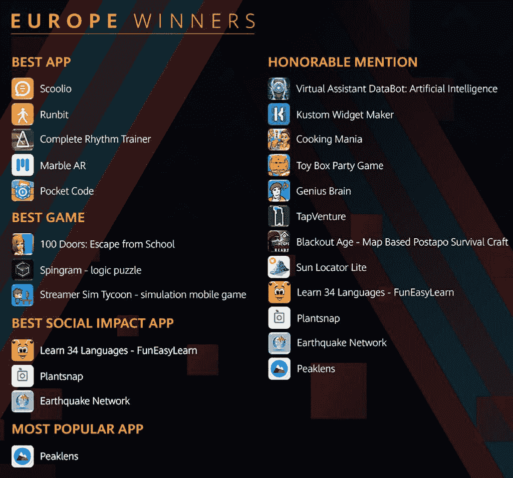

# 华为宣布全球应用大赛冠军

> 原文：<https://www.xda-developers.com/apps-up-2020-contest-winners/>

全球领先的科技公司华为今天宣布了年度 HMS 全球应用创新大赛 Apps UP 的获胜者。本次比赛邀请了来自世界各地的领先开发人员使用 HMS 和 HMS Core 全套工具和资源创建应用程序，以帮助华为设备用户更轻松地驾驭日常生活。

来自 170 多个国家和地区的 3，000 多个团队参加了比赛，比赛收到了近 1，000 个应用程序提交，所有应用程序都集成了 HMS 开放功能。HMS Core 是华为开发者套件和服务的集合，目前支持全球超过 200 万注册开发者和超过 10 万个 HMS Core 集成应用。这些套件无缝协作，确保华为设备开箱即可提供卓越的用户体验。

提交的参赛作品促进了身心健康、教育、农业、环境保护、交通和公共安全等领域的创新。华为云服务总裁张平安评论道:“我们将继续开放更多的能力、集成开发环境和工具，并努力进行软件和硬件创新，以使开发者能够创建创新的应用。我们欢迎更多的开发者加入 HMS 生态系统，将每一项创新带到全球舞台，帮助塑造技术的未来。”

这些是排名前 20 的应用程序，以及使它们成为可能的 HMS 套件。

*   **100 门游戏 2020:逃离学校** -整合:广告、账户、游戏、应用内购买
*   **黑暗时代-基于地图的后 apo 生存飞船** -集成:分析
*   **完整的节奏训练器** -集成:帐户、游戏、应用内购买
*   **烹饪狂热** -整合:应用内购买、账户、游戏、广告
*   **地震网络** -整合:应用内购买、广告、账户、位置
*   天才大脑——对你来说太棘手了？ -整合:分析、应用内购买、推送广告
*   Kustom Widget 制造商 -整合:位置、广告、应用内购买
*   学习 34 种语言- FunEasyLearn -集成:分析、游戏、应用内购买
*   **Marble AR** -集成:AR 引擎、账户、游戏服务、应用内购买、广告
*   **峰值** -集成:位置、分析
*   **Plantsnap** -集成:地图、应用内购买、账户、推送、位置
*   **袖珍代码** -集成:分析
*   **Runbit** -集成:账户、位置、扫描、应用内购买
*   **Scoolio** -集成:分析、扫描、推送、定位、动态标签管理器
*   **Spingram** -整合:账户、应用内购买
*   **流光模拟大亨-模拟手机游戏** -集成:账户、游戏、应用内购买
*   **Sun Locator Lite** -集成:应用内购买位置、地图、动态标签
*   整合:账户、游戏、广告、应用内购买、推送
*   **玩具盒派对游戏** -集成:账户、游戏、应用内购买
*   **虚拟助手 DataBot:人工智能** -集成:机器学习、定位、应用内购买

上面列出的每一位获奖者都是由评委团和公众投票选出的。获胜者每人可获得高达 2 万美元的现金奖励。华为还将在华为 AppGallery 上推广他们的应用，从而帮助这些开发者接触到数亿用户。

*   **【最佳 App】**入围:Scoolio(德国)、Pocket Code(奥地利)、Complete Rhythm Trainer(比利时)、Marble AR(德国)、Runbit(瑞典)。
*   **“最具社交影响力 App”**入围:Plantsnap(美国)、Learn 34 Languages(摩尔多瓦)、地震网(意大利)。
*   **【最佳游戏】**入围作品:Spingram(意大利)、Streamer Sim Tycoon(芬兰)、100 门:逃学(塞尔维亚)。

此外，“最受欢迎的应用程序”奖授予了 Peaklens(意大利)，他在公众评审阶段获得了最高的投票数和下载数。欧洲开发者提交的另外 12 款应用，包括虚拟助手 DataBot:人工智能(意大利)、Sun Locator Lite(瑞士)和 Blackout Age(波兰)，都获得了**“荣誉奖”**奖项。

## 获奖者的反馈

Apps UP 大赛的评委根据四个主要要求审查了提交的作品:积极的社会影响、优秀的视觉和功能设计、市场定位以及商业模式和技术特征。成功入围的决赛选手展示了他们的应用程序如何支持智能生活，为华为设备用户创造更好的全场景数字生活方式。

国际游戏开发者协会和 Apps UP judge 的执行董事 Renee Gittins 评论道:**“在决策过程中，应用或游戏对用户的功能和情感是至关重要的。”**

华为欧洲移动服务副总裁兼 Apps UP judge 表示:**“我们的目标是撼动应用开发行业，与来自世界各地的开发者互动，这些开发者还没有机会或平台来展示他们的才华。我们收到的申请数量以及提交的优秀质量给我们留下了深刻的印象。看到这些开发者的动力真的令人耳目一新，他们希望通过自己的应用在教育和健康等领域帮助社会。”**

Catrobat 是一个非营利项目，因口袋代码而获得“最佳应用程序”，他们开发的应用程序旨在激励青少年和成年人学习编码，为未来的数字世界做准备。Pocket Code 的创始人 Wolfgang Slany 评论道:**“我们相信通过对青少年进行编码教育来减轻贫困——特别是发展中国家的女孩、难民和青少年，使用一个有趣的应用程序，可以直接在他们的个人智能手机设备上使用。自 2014 年推出以来，Pocket Code 经历了巨大的增长，展望未来，我们计划为该应用程序添加更多 HMS 核心服务，以使用户能够享受其全部功能。”**

Runbit 获得了“最佳应用”类别的奖项。Runbit 的创建者被问及他们的应用背后的灵感。“我们想创建一个不考虑已加载号码的应用程序。针对跑步者和步行者的其他应用程序大量关注卡路里、速度和距离，这给他们的用户带来了很大压力。由于我们发现了市场上的这一差距，我们看到了一个机会，可以创建一个激励人们运动的应用程序，而不会感觉像一个负担。因此，在从创意到产品的过程中，游戏化是一个关键词。”

另一个入围“最佳应用”类别的 Marble AR 是第一个基于位置的增强现实平台，允许人们在现实世界中放置记忆和故事。Marble AR 的创始人兼首席执行官 Tom Brückner 表示:**“拥有一个坚实的 AR 框架对我们这样的应用程序来说绝对是关键，这就是为什么我们使用的最突出的 HMS 核心开放能力是 AR 引擎。我们惊喜地发现对 AR 引擎的适应是如此简单，到目前为止，结果非常好。大理石 AR 也是展示 5G 的完美应用，这是华为移动设备真正发光的地方，这要归功于他们在这一领域的丰富经验。”**

游戏也在本次大赛中大砍。Streamer Sim Tycoon 是一款游戏，用户可以随着业务的增长，作为在线内容流玩家进行游戏。这款应用的创建者能够通过使用账户工具包、游戏工具包和应用内购买工具包来充分利用他们的开发过程。当被问及这一过程时，开发人员说**“Unity 的分发门户负责实现所有需要的 HMS 核心功能，并使之成为可能，并且毫不费力地将游戏带到 HMS 环境和华为 AppGallery。”**

 <picture></picture> 

Apps Up 2020 Contest Winners

华为致力于鼓励开发者创新，在能力开放、政策支持和技术支持方面提供全面的激励。Apps UP 只是华为支持全球开发者的努力之一，上个月还宣布了华为 2020 DIGIX 全球人工智能挑战赛的获胜者，三十个本科生和研究生团队获得了 158，000 美元的集体基金奖励。此外，华为 DIGIX 极客创新竞赛平台自构思以来已经举办了近十场比赛，利用人工智能和 AR 等各种技术激发年轻开发者的创新。

点击了解更多有关华为 Apps UP 大赛和决赛选手[的信息。](https://bit.ly/3fED5qh)

###### 我们感谢华为赞助这篇文章。我们的赞助商帮助我们支付与运行 XDA 相关的许多费用，包括服务器成本、全职开发人员、新闻撰稿人等等。虽然您可能会在门户内容旁边看到赞助内容(这些内容将始终被标记为赞助内容),但门户团队对这些帖子不承担任何责任。赞助内容、广告和 XDA 仓库完全由一个独立的团队管理。XDA 绝不会通过接受金钱来赞扬一家公司，或以任何方式改变我们的观点或看法，从而损害其新闻诚信。我们的意见不能被收买。