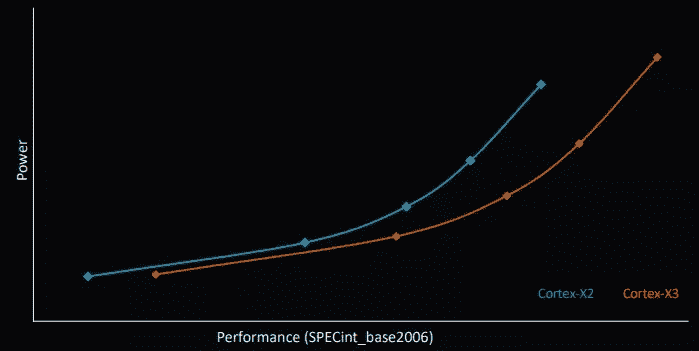

# Arm 推出了第二代 Armv9 处理器，以及光线跟踪 GPU

> 原文：<https://www.xda-developers.com/arm-second-generation-armv9-ray-tracing-gpu/>

在去年推出全新的 Armv9 架构后，Arm 刚刚宣布了第二代 Armv9 CPUs，由新的 Cortex-X3 旗舰 CPU 领导，以及 Cortex-A715 和经过修订的 Cortex-A510。此外，该公司推出了有史以来第一款旗舰 GPU Immortalis-G715，完全支持硬件级光线跟踪。这些新组件也支持 Arm 新的整体计算解决方案。

所有这些都将在 2023 年推出的产品中找到，所以在消费产品中看到这些好处还需要一段时间。

## 手臂皮质-X3 和皮质-A715

首先，基于第二代 Armv9 的新 CPU 带来了一些重大的性能改进，这往往是 Arm 的情况。从 Cortex-X3 开始，这是 Cortex-X 系列定制 CPU 的一部分，合作伙伴可以定制芯片的最终设计。在最新的 Android 智能手机中，Cortex-X3 承诺比 Cortex-X2 的性能提高 25%。新芯片的效率也更高，在达到相同性能水平的同时功耗更低，尽管 Arm 没有深入研究细节。

 <picture></picture> 

Image credit: Android Authority

它的单线程性能比最新的 Windows 笔记本电脑高 34%。正如 Android Authority 指出的那样，这是与英特尔酷睿 i7-1260P 相比的，英特尔酷睿 i7-1260 p 是一款耗电 28W 的处理器。

此外，DynamIQ 共享单元(DSU-110)平台也已升级，它现在可以扩展到 12 个内核和 16MB 三级高速缓存。这实现了更大的可扩展性，因此 Arm 处理器可以适用于从手机到更高端的笔记本电脑的所有产品。

Arm Cortex-A715 有相当多的升级，但主要集中在效率上。Arm 声称与之前的 Cortex-A710 CPU 相比，能效提高了 20%，这应该会延长使用它的设备的电池寿命。在性能方面，Arm 承诺比上一代产品提高 5%，实际上可以媲美 2020 年推出的 Cortex-X1 CPU 的性能。

最后，修改后的 Cortex-A510 没有任何性能变化，但它确实比上一代产品节省了 5%的电力，提供了更高的效率以延长电池寿命。此外，这种 CPU 内核不再支持 32 位，这是 [Arm 全面过渡到 64 位](https://www.xda-developers.com/arm-future-chips-32-bit-2023/)的路线图的一部分。

## Arm Immortalis-G715、Mali-G715 和 Mali-G615:光线跟踪来到移动设备

在 GPU 方面，Arm 不满足于升级现有的 Mali GPUs。这一次，我们得到了一个全新的旗舰 GPU，Immortalis-G715。这是第一个支持硬件加速光线跟踪的 Arm GPU，这使得它在移动设备上使用实际上是可行的。然而，该公司推出了两款新的 Mali GPUs，Mali-G715 和 Mali-G615。

如果你不知道什么是光线追踪，这是一种在游戏中生成光照和阴影的更真实的方法。这是因为 GPU 实际上计算了给定场景中的各个光路，模拟了现实生活中光线的传播方式。您可以在下面的操作中看到它。

\ r \ nht TPS://www . YouTube . com/watch？v=Oqq7wlu47-A\r\n

虽然在启用光线跟踪时，能耗和面积通常是大问题，但 Arm 表示，该功能仅使用了 Immortalis-A715 中 4%的着色器核心面积，但与基于软件的光线跟踪解决方案相比，性能提高了 300%，例如去年在 Mali-G710 GPU 上发现的。

其他改进类似于整个系列的新 GPU。与上一代产品相比，Arm 仅在架构层面上的性能就提升了 15%。新的 GPU 还都支持可变速率着色，可以通过调整场景不同部分的着色器质量来提高性能，因此渲染能力集中在所述场景的最重要部分。例如，它允许 GPU 在更精细的粒度级别上渲染场景中具有更多动作的部分图形，其中您专注于正在发生变化的内容，但在静态背景元素上使用不太详细的渲染。

Arm 还宣传对执行引擎和融合乘加(FMA)的改进，导致 FMA 功率提高了 2 倍，但面积仅增加了 27%。由于增加了矩阵乘法指令，ML 的性能也提高了一倍。最后，对命令流前端的改进使它比 previus 一代更快，峰值三角输出增加了三倍。Arm 还优化了纹理映射器中的细节层次(LOD)查找，从而将吞吐量提高了一倍，Mali-G510 中首次推出的 Arm 固定速率压缩技术有助于节省带宽。

虽然三种 GPU 都支持大多数功能，但在功能上自然存在差异。Immortalis-G715 具有 10 个或更多内核，而 Mali-G715 具有 7 至 9 个内核，Mali-G615 具有 6 个或更少内核。

## Arm 整体计算解决方案

正如我们在上文提到的，所有这些技术共同创造了第二代 Arm 整体计算机解决方案，简称 TCS。这些是统一的解决方案，包括为设备提供动力所需的所有计算组件，它们在不同的层中提供，以针对不同类型的设备。

例如，有一些高级解决方案，可能采用 Cortex-X3 内核以及 Cortex-A715 和 Cortex-A510，外加一个 Immortalis-G715 GPU，这些解决方案面向旗舰手机、笔记本电脑和台式机。然后是性能解决方案，专注于 Cortex-A715 和 Cortex-A510 内核，结合 Mali-G715 和 Mali-G615，旨在用于中端智能手机、Chromebooks 和电视。最后，效率解决方案侧重于 Cortex-A510 GPU 和低功耗 Mali-G310 GPU，它们适用于低端手机、智能手表、AR 眼镜等。

例如，与第一代 Arm TCS 相比，高级解决方案可以提供高达 28%的游戏性能，此外还可以将 DRAM 流量降低高达 23%，功耗降低高达 16%。使用新 CPU 内核和 Mali-G715 GPU 的解决方案也可以大幅提高机器学习性能，特别是在相机和视频功能方面。

新的 Arm TCS22 解决方案还在三个层面进行了安全性改进:进程内安全性、安全固件升级和可信执行环境(TEE)。进程内安全性现在附带了非对称内存标记扩展(MTE ),由新的 Armv9 CPUs 提供，加上增强的 PAN 以防止 JITed 代码攻击。TEE 还增强了控制流完整性和内存完整性保护。

所有这些都将在 2023 年出现在基于 Arm 的设备上，这看起来是重要的一年，除了通常的全面性能和效率改进之外，基于硬件的光线跟踪还将首次出现在移动设备上。

* * *

来源:[手臂](https://community.arm.com/arm-community-blogs/b/announcements/posts/compute-performance-unleashed)