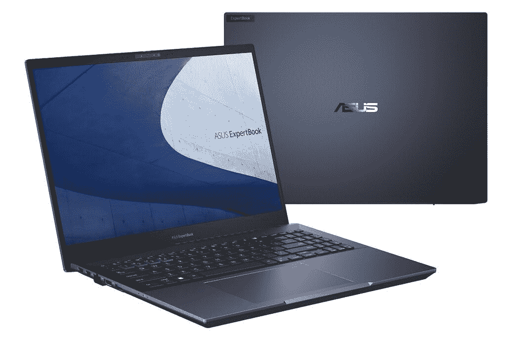
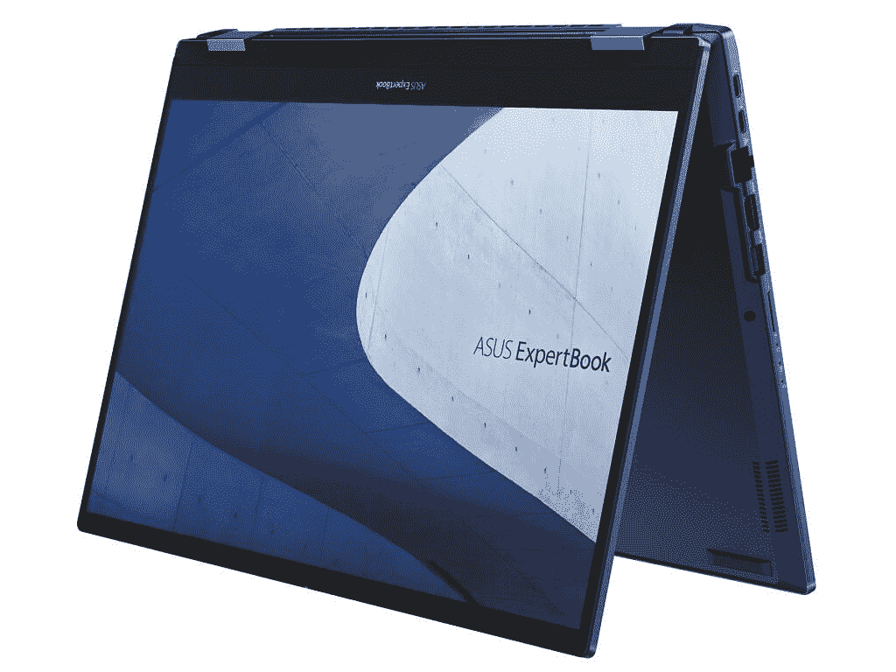

# 华硕宣布推出配备可选有机发光二极管显示屏的新型 ExpertBook 笔记本电脑

> 原文：<https://www.xda-developers.com/asus-expertbook-b5-flip-oled-b6-flip-ifa-2022/>

随着 IFA 2022 本周在柏林举行，华硕宣布了几款面向商业用户的新 ExpertBook 笔记本电脑。新的笔记本电脑包括新的 ExertBook B5 和 B5 Flip，以及该公司的第一个专家系列工作站 ExpertBook B6 Flip。

## 华硕 ExpertBook B5 和 B5 翻盖

ExpertBook B5 和 B5 Flip 彼此非常相似。这两款笔记本电脑采用英特尔 P 系列处理器，特别是支持博锐的英特尔酷睿 i7-1270P，主板上焊接了高达 40GB 的 RAM - 8GB，其余部分由 SODIMM 插槽填充。它们还配备了可选的独立显卡，如英特尔 Arc A350M，这是一款适用于较轻工作负载的入门级 GPU。存储方面，两个 M.2 插槽为您提供了充足的空间来存放文件。

 <picture></picture> 

Asus ExpertBook B5

这两款笔记本电脑的亮点是 16 英寸显示屏，长宽比为 16:10，正如你对 2022 年商用笔记本电脑的预期。基本型号采用 WUXGA (1920 x 1200)分辨率，它是一个 IPS 面板，但您可以升级到 WQUXGA (3840 x 2400)分辨率的 OLED 面板，从而获得出色的观看体验。在显示屏上方，有一个带红外面部识别的高清网络摄像头，或一个不带红外的全高清网络摄像头。

当然，华硕 ExpertBook B5 Flip 也提供了触摸和笔支持，实际上笔记本电脑内置了一个 garaged 手写笔。这支笔在存放时会自动充电，所以随时可以使用。

 <picture></picture> 

Asus ExpertBook B5 Flip

作为商务笔记本电脑，它们还提供了大量的连接，有两个 Thunderbolt 4 端口，两个 USB Type-A 端口，HDMI，RJ45 以太网，一个耳机插孔和一个 microSD 卡插槽。ExpertBook B5 的重量约为 1.4 千克(3.09 磅)，B5 Flip 的重量约为 1.65 千克(3.64 磅)。

## 专家手册 B6 翻转

然后是华硕的 ExpertBook B6 翻盖手机，这是一款完全独特的设备。这实际上是一个移动工作站，由英特尔的新 HX 系列处理器驱动，具有 55 瓦的 TDP。ExpertBook B6 翻盖可配置高达 16 核 24 线程的英特尔酷睿 i9-12950HX，以及 8GB 内存的专业 Nvidia RTX A2000 显卡。总的来说，这些组件最多可以为 CPU 使用 135 瓦-55 瓦，为 GPU 使用 80 瓦。它支持高达 128GB 的 ECC RAM，并有两个 M.2 插槽用于高达 4TB 的 SSD 存储。

有趣的是，华硕决定也使这成为一个可转换的。16 英寸显示屏可以旋转，用作平板电脑或不同的模式，如帐篷或支架模式。它具有 16:10 的宽高比，可以是 500 尼特的标准 IPS 面板，也可以升级到令人惊叹的 miniLED 面板。两者都有 WQXGA 分辨率(2560 x 1600)，但 miniLED 面板的亮度高达 1000 尼特，你可以获得像局部调光这样的好处。您还可以在显示器上方获得一个全高清红外网络摄像头。

自然，这是一款更重的笔记本电脑，起始重量为 2.7 千克(5.95 磅)，厚度为 27.2 毫米。它配备了广泛的端口，包括两个 Thunderbolt 4 端口，两个 USB Type-A 端口，HDMI，mini-DisplayPort，RJ45 以太网，智能卡读卡器和耳机插孔。

所有这些笔记本电脑将于 2022 年第四季度上市，但定价尚未公布。