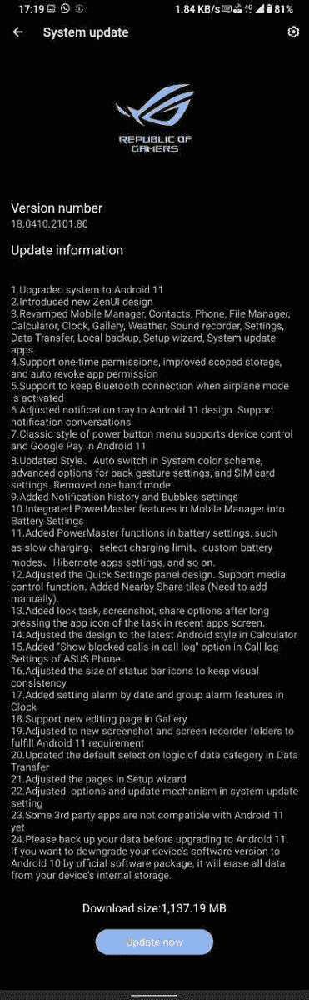

# 华硕开始向 ROG Phone 3 测试人员推出第一个 Android 11 测试版

> 原文：<https://www.xda-developers.com/asus-rog-phone-3-first-android-11-beta-update/>

谷歌早在去年九月就向全世界发布了 Android 11 的源代码[。然而，对于非像素设备，根据公司的资源、优先事项和战略决策，可能需要一些时间来获得此更新。由于原始设备制造商为他们的旧设备塑造 AOSP 代码库需要大量的工作，他们中的一些人现在才刚刚尝到 Android 11 的滋味。例如，华硕刚刚为 ROG Phone 3 发布了第一个 Android 11 测试版，允许早期用户在正式发布之前测试正在开发的软件。](https://www.xda-developers.com/android-11-source-code-aosp/)

**[华硕 ROG 手机 3 XDA 论坛](https://forum.xda-developers.com/asus-rog-phone-3)**

轴承版本号 **18.0410.2101.80** ，该更新目前对一小部分封闭测试版测试人员可用。这是一个大约 1.1GB 的下载，新版本带来了熟悉的 Android 11 功能集，包括聊天气泡，一次性权限管理，通知历史和改进的安全性。你还将获得华硕的 ZenUI/ROG UI 皮肤的最新版本，一些股票应用程序也进行了重新装修。

 <picture></picture> 

Thanks to XDA Senior Member [micky387](https://forum.xda-developers.com/m/micky387.4251307/) for the screenshot!

到目前为止，我们还没有更新的稳定版本的发布时间表的信息。然而，由于 ROG 手机 3 的 Android 11 已经进入了封闭测试阶段，不久之后华硕就会开放公共测试计划，并随后通过稳定渠道发布更新。

ROG Phone 3 于去年 7 月首次亮相，提供 6.59 英寸 AMOLED 显示屏，具有惊人的 144Hz 高刷新率，非常强大的高通骁龙 865+ SoC，高达 16GB 的 LPDDR6 RAM，高达 512GB 的 UFS 3.1 闪存，64MP 索尼 IMX686 摄像头，以及支持 30W 快速充电的 6,000mAh 电池。这款手机在 Android 10 的基础上推出了 ROG 用户界面。华硕也支持定制开发，甚至已经向 XDA 社区的一些开发者发送了多台 ROG Phone 3。