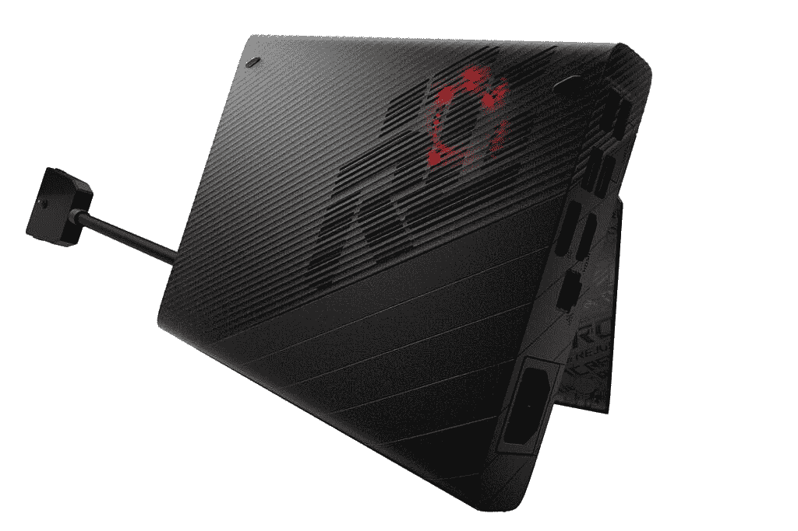

# 华硕宣布 ROG Zephyrus Duo 15 SE，ROG Strix 17，ROG Flow 13

> 原文：<https://www.xda-developers.com/asus-rog-strix-zephyrus-gaming-laptops-13-flow-x13-launch-ces-2021/>

华硕在 CES 2021 上发布了玩家国度(ROG)品牌的一系列新产品。该公司将带来三款新笔记本电脑，包括双屏 ROG Zephyrus Duo 15 SE、Strix SCAR 17 和独特的 13 英寸 ROG 流 X13 游戏笔记本电脑，配有 XG 移动外部 GPU。华硕还宣布了一些新的配件，包括 ROG 克莱莫 II 游戏键盘和 ROG Gladius III 无线游戏鼠标。最后，我们有新的 32 英寸 ROG Swift PG32UQ 4K 144 Hz 游戏显示器，带 HDMI 2.1，用于主机和 PC 游戏。

## ROG 流量 X13

去年，[华硕](https://www.asus.com/)推出了 ROG Zephyrus G14，这是一款独特的超便携游戏笔记本，采用 AMD 的锐龙 4000 移动处理器。今年，该公司将通过 ROG Flow X13 向前迈出一步，这是一款 13 英寸的超便携游戏笔记本电脑，提供 120Hz FHD 面板或由康宁大猩猩玻璃保护的高分辨率 4K 面板，并采用窄边框设计，支持触摸和手写笔输入。这两款显示器都具有 16:10 的宽高比，支持自适应同步，并且经过 Pantone 验证。这款笔记本还配有可转换设计，因此您也可以将屏幕翻转过来。

ROG 流 X13 由高达 AMD 锐龙 9 5980HS 移动处理器和 NVIDIA GeForce GTX 1650 显卡支持。虽然据说在轻度工作时可以持续 10 小时，但 100 瓦的 USB-C PD 充电器可以在 39 分钟内将笔记本电脑的电池充电到 60%。

 <picture></picture> 

ASUS ROG XG Mobile eGPU

为了提高图形能力，该机支持外部 GPU。这类似于 Razer 几年前所做的，但华硕现在展示的是一个相当紧凑的移动外部 GPU 外壳，称为 XG Mobile。它可以容纳高达 NVIDIA GeForce RTX 3080 显卡，考虑到尺寸，这听起来很疯狂。将 ROG 流 X13 与 XG Mobile 相结合，将笔记本电脑变成了一个性能怪兽，据说相当于全尺寸的游戏装备。XG Mobile 配备了一个专有的 eGPU 连接器，专门为图形提供 63Gbps 的带宽，在技术上比基于 Thunderbolt 的 eGPU 更快。XG Mobile 还具有专用的 USB 3.2 Gen 2 链路，扩展了 I/O 连接选项，并且它还具有集成的 280W 交流适配器，因此它可以同时为笔记本电脑充电。

## ROG Zephyrus Duo 15 SE

新的 Zephyrus Duo 15 SE 是去年 Zephyrus Duo 15 的升级版，具有类似的宽副屏幕，即 ROG 屏幕保护板 Plus。华硕表示，通过使用辅助显示器，游戏玩家可以获得更多可用的屏幕空间，用于游戏和生产任务。就像以前的型号一样，当笔记本电脑显示屏以舒适的视角打开时，ScreenPad Plus 会上升几度。

该笔记本电脑将配备最高 AMD 锐龙 9 5900HX 移动处理器和最高 NVIDIA GeForce RTX 3080 显卡。该显示器将提供 120 赫兹 4K 面板，100% Adobe RGB 色彩空间覆盖，或 300 赫兹 FHD 显示器，3 毫秒响应时间，100% sRGB 色彩空间覆盖。两个面板都将经过 PANTONE 验证，并采用薄边框设计和自适应同步技术。

除了使用辅助显示器浏览网页、阅读电子邮件、通过即时消息应用聊天之外，ROG 还与开发人员密切合作，并与 XSplit Gamecaster 合作，允许游戏玩家在主显示器上玩游戏时监控他们的流。对于创作者，ROG 已经与 Adobe 合作，在 ScreenPad Plus 上提供额外的内容创作工具。其他值得注意的功能包括用于清晰通信的双向人工智能噪音消除功能、杜比 Atmos 和升级的主动空气动力学系统增强版(AAS+)冷却系统。这款笔记本还采用了新的 Arc Flow 风扇，据说比上一代产品增加了 13%的气流，华硕还使用了液态金属热化合物来冷却 AMD CPU。

## ROG Strix SCAR 17

接下来是 ROG Strix SCAR 17，这是一款强大的游戏笔记本电脑，由新的 NVIDIA GeForce RTX 3080 显卡和高达 AMD 锐龙 9 5900HX 移动处理器驱动。这可以配置高达 32GB 的 DDR-3200 MHz 内存，以及新的 Arc Flow 风扇和液态金属冷却。华硕的目标是 SCAR 17 的高端电子竞技玩家。它配备了一个 17 英寸 360 赫兹 FHD 面板，提供 3 毫秒的响应时间，或一个可选的 165 赫兹 WQHD 面板，具有 DCI-P3 色域。这款笔记本还配有 90 瓦时的电池，据说一次充电可以持续 12 小时的视频播放，并支持 100 瓦的 USB Type-C 电源适配器。

对于那些关心美学的人来说，新的 SCAR 17 据说比它的前代产品更紧凑，在机箱的前边缘周围有一个更高密度的 RGB 灯条，在显示屏下面有一个额外的灯条，以及一组三个用户可更换的铰链盖。华硕还在笔记本电脑上推出了光学机械键盘，具有每键 RGB 照明、1.9 毫米的按键行程和零去抖延迟。其他功能包括四扬声器设计和杜比 Atmos 声音增强，以及双向人工智能噪音消除功能。

## ROG Swift PG32UQ

我们刚刚看到宏碁宣布了它所谓的有史以来第一款 40 英寸 4K UHD，144 赫兹，带 HDMI 2.1 的 HDR400 显示器。今天，华硕推出了 ROG Swift PG32UQ，这是世界上第一款 32 英寸 HDMI 2.1 游戏显示器。这一款还具有 144 赫兹的刷新率和 1 毫秒的动态图像响应时间(MPRT)。它配备了两个 HDMI 2.1 端口，在最新的游戏主机上支持高达 120Hz 的 4K 视觉效果，这些游戏机包括 [Xbox 系列 X|S](https://www.xda-developers.com/xbox-series-x-restocks/) 和[索尼 PlayStation 5](https://www.xda-developers.com/playstation-5-restocks/) 。

该显示器还配备了显示流压缩(DSC)技术，这是一种压缩标准，用于在单一接口上高速传输超高清视频流，而不会明显降低视觉质量。这意味着显示器通过一个 DisplayPort 1.4 接口支持 4K 144Hz。这款显示器的其他显著特性包括 G-SYNC 兼容性、DisplayHDR 600、160% sRGB 和 98% DCI-P3 色域支持，据说出厂前经过预校准，以确保 Delta E < 2 的色彩精度。

## ROG·克莱莫二世和 ROG·格拉迪斯三世无线

华硕还推出了第一款机械 RGB 游戏键盘，配有自己的 ROG RX 蓝色光学机械开关。这些开关旨在提供改善的全方位 RGB 照明，以及接近零的去抖延迟。华硕还确保了 1 亿次按键的使用寿命，键盘配有磁性腕带和可拆卸的数字小键盘。人们可以使用有线 USB-C 或 2.4GHz 无线连接的键盘。键盘上的 4000mAh 电池据说一次充电可提供长达 40 小时的使用，而 USB-C 连接支持快速充电或 USB passthrough 用于其他设备。该键盘配有无线 Aura Sync 照明，并将与 ROG RX 红色开关一起提供。

最后，ROG Gladius III 无线游戏鼠标是华硕 ROG 公司最新的外设选项，据说可以提供 19，000 dpi。它具有有线、无线 2.4GHz 射频和蓝牙三种模式。该鼠标配有一个新的按压式开关插座 II，支持传统的 3 针机械和 5 针欧姆龙光学微型开关，允许轻松交换开关。零点击延迟，鼠标采用灵活、低阻力的 ROG Paracord 电缆。

## 定价和可用性

包括 ROG Flow X13、ROG Zephyrus Duo 15 SE 和 ROG Strix SCAR 17 在内的所有三款笔记本电脑将于 2021 年第一季度上市。新的 ROG Swift PG32UQ 游戏显示器和新的外设将于 2021 年在 Q2 上市。