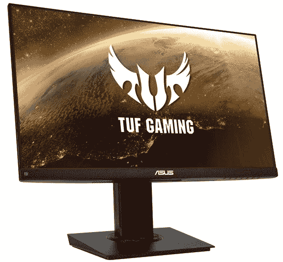

# 华硕 TUF VG249Q 144Hz 显示器现在黑色星期五仅售 170 美元

> 原文：<https://www.xda-developers.com/asus-tuf-vg249q-144hz-monitor-black-friday-sale-best-buy/>

# 华硕 TUF VG249Q 144Hz 显示器现在黑色星期五仅售 170 美元

华硕 TUF VG249Q 显示器具有 144Hz 的显示屏，1080p 的分辨率，23.8 英寸的对角线尺寸，只需 170 美元就可以成为你的了。

黑色星期五对每个人来说都是一个令人敬畏的时刻，如果你是一个游戏玩家，那就更令人惊奇了。本周有太多好的技术交易，我们绝对不能错过。作为一名游戏玩家，你可能希望用流畅的帧速率、出色的分辨率和体面的色彩再现来对待你的眼睛。那么，你从这里去哪里？支持这些功能的显示器很贵，对吧？嗯，他们不一定要这样。华硕以预算为导向的 TUF 游戏子品牌推出了 VG249Q 显示器，这款显示器现在只需 170 美元，低于通常 250 美元的价格。

 <picture></picture> 

ASUS TUF VG249Q 144Hz Monitor

##### 华硕 TUF VG249Q 144Hz 显示器

华硕 TUF VG249Q 显示器采用 1080p 显示屏，分辨率为 1920x1080，显示屏尺寸为 23.8 英寸，黑色星期五的价格相对便宜，为 170 美元。

华硕 TUF VG249Q 是一款非常体面的面板一体机。它具有 144Hz 的流畅刷新率，让您的游戏运行流畅逼真，显示器本身是 23.8 英寸的面板；远不是最大的东西，但与相同价格范围内的其他选择相比，仍然非常体面。它的分辨率为 1920x1080p，纵横比为 16:9，显示器本身支持 AMD 的 FreeSync 等功能，以提供更好的可变刷新率支持。它也有 1 毫秒的响应时间，所以延迟应该不是这个显示器的问题。

该显示器的其他特性包括 1000:1 的对比度和对不同连接的支持，如 DisplayPort、HDMI 和 DVI。如果您需要一台面向游戏的显示器，能够满足基本要求，并具备高刷新率、大尺寸和像样的分辨率，这是一笔不可错过的好交易。它不会像其他 1440p 或 [4K 显示器](https://www.xda-developers.com/dell-ultrasharp-43-inch-4k-usb-c-monitor-black-friday-sale-dell/)和高达 360Hz 刷新率的显示器一样让你大吃一惊，但它足以以全高清播放你最喜欢的所有游戏。如果你有一个适度的游戏装备，这将非常适合。