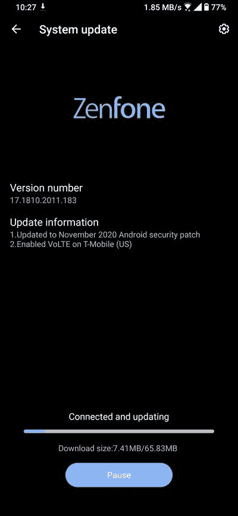

# 华硕 ZenFone 6 更新在美国的 T-Mobile 上启用 VoLTE

> 原文：<https://www.xda-developers.com/asus-zenfone-6-update-volte-t-mobile-us/>

# 华硕 ZenFone 6 更新在美国的 T-Mobile 上启用 VoLTE

华硕 ZenFone 6 的最新软件更新终于在 T-Mobile 美国网络上提供了 VoLTE 支持。继续阅读，了解更多信息！

华硕 Zenfone 6(在印度以华硕 6Z 的名称出售)是 2019 年的旗舰手机之一。它有一个 6.4 英寸的无凹槽 FHD+显示屏，一个独特的翻盖相机，高通骁龙 855 SoC，一个巨大的 5,000mAh 电池和一个耳机插孔。这款手机的最新更新应该会为美国用户带来欢呼，因为 ZenFone 6 现在可以在 T-Mobile 的网络上使用 VoLTE。这是一项重要的功能，因为越来越多的运营商[开始在其网络上采用 VoLTE](https://www.xda-developers.com/t-mobile-att-require-volte-phone-calls-shut-down-3g/) 。

**[【ASUS zenfone 6 xd a 论坛】](https://forum.xda-developers.com/c/asus-zenfone-6-2019.8903/)**

标记为软件版本 **17.1810.2011.183** ，华硕 ZenFone 6 的更新基于稳定的 Android 10 分支。增量 OTA 仅重 65MB，并带来了 2020 年 11 月的[安全补丁](https://www.xda-developers.com/november-2020-android-security-update-google-pixel-samsung-galaxy/)。虽然 VoLTE 对 T-Mobile 的支持是针对美国版手机的，但同样的版本也在其他地区推出。

 <picture></picture> 

Thanks to ZenTalk Community member [ramdanrivanto](https://zentalk.asus.com/en/profile/discussions/ramdanrivanto) for the screenshot!

回想一下，[华硕 ZenFone 5Z](https://www.xda-developers.com/asus-zenfone-5z-update-t-mobile-volte-jio-vowifi/) 、ZenFone 7、 [ROG Phone II](https://www.xda-developers.com/asus-rog-phone-ii-latest-update-90fps-pubg-mobile-volte-t-mobile-bsnl/) 和 [ROG Phone 3](https://www.xda-developers.com/rog-phone-3-latest-update-finally-enables-volte-att-t-mobile-usa/) 已经在 T-Mobile 上获得 VoLTE 支持。10 月初，ZenFone 6 的有限 Android 11 测试版最初[提供了](https://www.xda-developers.com/asus-zenfone-6-android-11-beta-t-mobile-volte/) T-Mobile VoLTE 支持。现在，华硕终于通过稳定的渠道交付了期待已久的功能，这意味着用户不再需要[摆弄调制解调器的内部诊断接口](https://www.xda-developers.com/how-to-enable-t-mobile-volte-vowifi-on-asus-smartphones-root/)并设置正确的参数，以便在 ZenFone 6 设备上启用 VoLTE 和 VoWiFi 等高级蜂窝服务。

由于这是一个分阶段的推广，更新可能需要一段时间才能覆盖全球的所有设备。如果你还没有在 ZenFone 6 上收到 OTA 通知，你可以进入设置>系统，点击“系统更新”按钮，看看是否有任何新的固件可供你的手机使用。