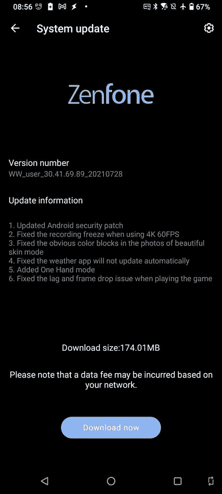
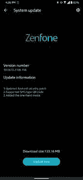

# 华硕 ZenFone 7 更新带来类似 Android 12 的单手模式

> 原文：<https://www.xda-developers.com/asus-zenfone-7-update-adds-android-12-like-one-handed-mode/>

**更新 1(****08/6/2021****@****05:30****ET):**Zen fone 6 也收到了类似 Android 12 的单手模式。文章发表于 2021 年 8 月 9 日，下面保留。

华硕正在为 ZenFone 7 和 ZenFone 7 Pro 推出新的软件更新。最新的更新带来了新的安全补丁，修复了漏洞，并添加了新的 [Android 12](https://www.xda-developers.com/android-12/) 式的单手模式。

更新版本 v30.41.69.89 已经开始向 ZenFone 7 系列推出。最新软件中最显著的变化是在 [ZenFone 8 系列](https://www.xda-developers.com/asus-zenfone-8/)上首次亮相的较新的单手模式。这个版本的单手模式看起来和行为很像我们在 Android 12 中看到的单手模式，允许你在屏幕底部附近向下滑动来下拉屏幕。

 <picture></picture> 

Screenshot courtesy: XDA Senior Member *[1st_paladin](https://forum.xda-developers.com/t/update-29-13-7-47-30-41-69-78-last.4182391/page-2#post-85425801)*

不过，单手模式对 ZenUI 或 ZenFone 7 系列来说并不新鲜。在[Android 11 更新](https://www.xda-developers.com/asus-zenfone-7-android-11-update/)之前，ZenFone 7 系列有华硕更老的单手模式实现。它通过双击 home 键或快速设置面板来触发，并在水平和垂直方向上缩小屏幕——与新的 Android 12 类似的实现相反，它只在垂直方向上缩小。

看看下面 Mishaal 的 ZenFone 8 评论中 ZenUI 8 的新单手模式演示。你可以看到它与 Android 12 的单手模式有多相似。

除了新的单手模式，ZenFone 7 的更新还解决了 4K 60fps 拍摄时的视频冻结、游戏中的延迟和丢帧以及天气应用程序不能正常同步的问题。

完整更新变更日志:

*   更新的 Android 安全补丁
*   修复了使用 4K 60FPS 时录制冻结的问题
*   修复了美肤模式照片中明显的色块
*   修正了天气应用程序不会自动更新的问题
*   增加了单手模式
*   修正了玩游戏时的延迟和丢帧问题

华硕正在以分阶段的方式推出新的软件更新，因此它可能需要一些时间才能到达您的设备。如果你不想跳过等待，你可以下载下面链接的完整 OTA zip 并在手机上手动刷新。

**[下载 WW _ 30 . 41 . 69 . 89 Zen fone 7/7 Pro 的 OTA](https://dlcdnets.asus.com/pub/ASUS/ZenFone/ZS670KS/UL-I002D-WW-30.41.69.89-user.zip)**

* * *

## 更新:ZenFone 6 紧随其后

华硕推出了 ZenFone 6 的新升级版本。除了其他方面，新的更新还包括早些时候推出到 ZenFone 7 系列的类似 Android 12 的单手模式(如上所述)。该更新包含软件版本 18.0610.2106.156，大小为 133.16MB。

 <picture></picture> 

Screenshot courtesy: XDA Senior Member [*mickey36736*](https://forum.xda-developers.com/m/mickey36736.5059016/)

新的更新已经开始推出了。如果还没收到，可以抓取下面链接的完整 OTA zip。

**[下载完整 OTA](https://dlcdnets.asus.com/pub/ASUS/ZenFone/ZS630KL/UL-ASUS_I01WD-ASUS-18.0610.2106.156-1.1.1-user.zip)**