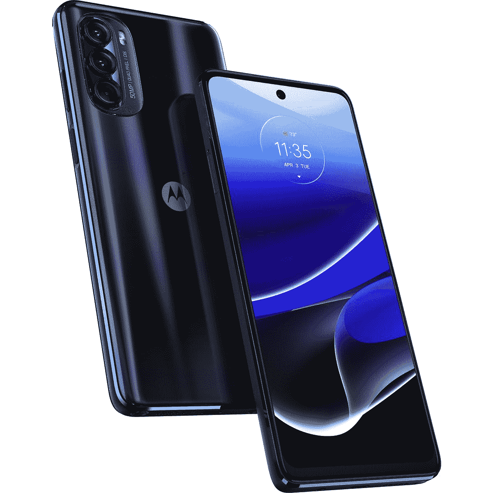

# 摩托罗拉 Moto G Stylus 5G 将于 7 月 15 日在美国电话电报公司上市

> 原文：<https://www.xda-developers.com/att-moto-g-stylus-5g-in-july/>

# 摩托罗拉 Moto G Stylus 5G 将于 7 月 15 日在美国电话电报公司上市

美国电话电报公司已经宣布了搭载摩托罗拉 Moto G Stylus 5G 的计划。这款手机将于 7 月 15 日在网上和商店发售。

几个月前的 4 月，摩托罗拉发布了 Moto G Stylus 5G。在& T 将最终使其网络可用，智能手机将于 7 月 15 日首次零售。那么，这家美国无线运营商是如何让智能手机变得诱人的呢？它的卖点很简单，每月 2 美元，不需要任何折价。激动人心吧？

Moto G Stylus 5G 拥有一个 6.8 英寸的大 FHD+显示屏，刷新率为 120Hz，由高通骁龙 695 SoC 搭配 8GB RAM 供电。此外，这款手机还有一个 50MP 摄像头，支持 5G。至于它的内部存储，你可以在基本型号上获得 256GB，并通过其 microSD 插槽进行扩展。此外，这款手机将配备 5,000mAh 的电池，当与手机的芯片组配对时，应该可以提供出色的电池寿命。也许这款手机最重要的特点是它的触控笔，这在今天的智能手机市场上并不常见。设备上的手写笔可以用来画画和做笔记，由于其 120 赫兹的显示屏，这种体验应该是非常愉快的。

## Moto G Stylus 5G 是目前为数不多的带有手写笔的 Android 设备之一。

Moto G Stylus 5G 将于 7 月 15 日开始发售。它可以在线购买，也可以在参与的零售点购买。如上所述，任何合格的无限无线计划每月只需花费 2 美元，不需要任何硬件折价。虽然美国电话电报公司没有提到这款手机的价格，但如果没有合约，它的价格应该是 499 美元。可以从 Best Buy 购买未锁定的手机。如果你不确定你正在寻找哪种智能手机，你可以随时查看我们的指南，在那里我们谈论了一些总体上最好的手机选项和一些最便宜的安卓选项。另外，一些伟大的[亚马逊 Prime Day](https://www.xda-developers.com/amazon-prime-day/) 交易即将到来，所以你会想尽快回来查看。

 <picture></picture> 

Motorola Moto G Stylus 5G

##### 摩托罗拉 Moto G 手写笔 5G

摩托罗拉 Moto G 手写笔 5G

* * *

**来源** : [AT & T](https://about.att.com/story/2022/motorola-moto-g-stylus-5g.html)