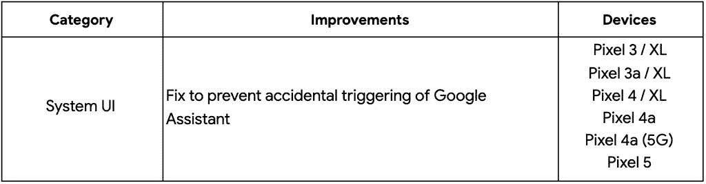

# 2021 年 8 月 Android 安全更新推广到受支持的 Pixel 手机

> 原文：<https://www.xda-developers.com/august-2021-android-security-update/>

谷歌一贯在每个月的第一个星期一发布新的 Android 安全公告，在过去几年中，他们几乎每个月都这样做。因此，毫不奇怪，今天，谷歌发布了 2021 年 8 月的 Android 安全公告，尽管公司[确实给了我们一个大惊喜](https://www.xda-developers.com/google-pixel-6-teaser/)，这与其每月的 Android 安全更新无关。

## 2021 年 8 月安全更新公告

你可以在这里查看 2021 年 8 月的 Android 安全公告[，但是和往常一样，不要期望找到每个修补漏洞的详细报道。最新的 Android 安全更新修复了许多严重程度从高到严重的漏洞，其中许多漏洞影响了高通、联发科技和其他公司的闭源供应商组件。运行修补程序级别 2021-08-01 的设备不包含这些闭源供应商组件的修复程序，但运行修补程序级别 2021-08-05 的设备包含。关于每月 Android 安全更新程序如何工作的更多信息，我们推荐阅读我们的解释者](https://source.android.com/security/bulletin/2021-08-01)[这里](https://www.xda-developers.com/how-android-security-patch-updates-work/)。

## 像素更新公告/功能更新

除了修补影响所有 Android 设备的漏洞，2021 年 8 月的 Android 安全更新还修补了几个专门影响谷歌自己的 Pixel 手机的问题。这些都记录在 2021 年 8 月的像素更新公告中，可以在这里查看。

今天的更新没有为 Pixel 手机带来 [Android 12](https://www.xda-developers.com/android-12/) 代码库，但我们可以预计下个月的更新将是大更新。今天向受支持的 Pixel 手机推出的更新将采用 2021-08-05 补丁级别，并具有以下内部版本号:

*   像素 3 (XL): RQ3A.210805.001.A1

*   像素 3a (XL): RQ3A.210805.001.A1

*   像素 4 (XL): RQ3A.210805.001.A1

*   像素 4a: RQ3A.210805.001.A1

*   像素 4a (5G): RQ3A.210805.001.A1

*   像素 5: RQ3A.210805.001.A1

除了 Pixel 更新公告中提到的安全问题，2021 年 8 月的更新还包括一个修复，以防止意外触发谷歌助手。

 <picture></picture> 

Source: [Google](https://support.google.com/pixelphone/thread/119670993/google-android-pixel-security-update-aug-2021)

2021 年 8 月的 Android 安全更新现已面向所有受支持的 Pixel 手机推出，但你可以通过侧载 OTA 文件或闪烁最新的工厂图像来跳过等待。

**[像素工厂图像](https://developers.google.com/android/images)**| |**|[像素 OTA 图像](https://developers.google.com/android/ota)**

如果你拥有另一台设备，你必须等待你的设备 OEM 或运营商推出更新。这可能需要几天或几周的时间，取决于原始设备制造商，尽管有些像三星已经开始推出更新。