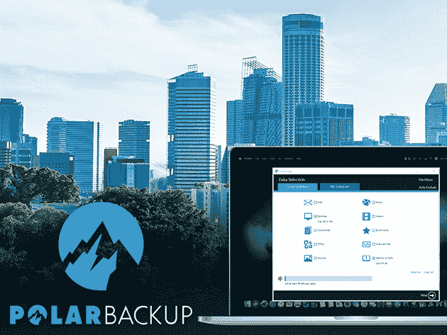

# 备份和锁定:在这些 VPN 和云存储订阅上节省 90%以上

> 原文：<https://www.xda-developers.com/back-up-and-lock-down-save-over-90-on-these-vpn-and-cloud-storage-subscriptions/>

为了真正保护您的数据安全，您需要保持良好的在线安全性，并在多个位置存储文件备份。换句话说，你需要一个可靠的 VPN 和强大的云存储。这里有一些订阅可以考虑，现在在 XDA 开发者仓库有高达 96%的折扣。

## **Degoo Premium:终生 2TB 备份计划**

[Degoo Premium](https://depot.xda-developers.com/sales/degoo-ultimate-2tb-backup-plan-lifetime-subscription?utm_source=xda-developers.com&utm_medium=referral&utm_campaign=degoo-ultimate-2tb-backup-plan-lifetime-subscription&utm_term=scsf-451175&utm_content=a0x1P000004YmUHQA0&scsonar=1)的存储空间比 Dropbox、OneDrive 和 Google Drive 的总和还要多，非常适合创建备份。该平台还具有 256 位 AES 加密和自动文件更改检测功能。

花费 59.99 美元获得 [终身 2TB 备份计划](https://depot.xda-developers.com/sales/degoo-ultimate-2tb-backup-plan-lifetime-subscription?utm_source=xda-developers.com&utm_medium=referral&utm_campaign=degoo-ultimate-2tb-backup-plan-lifetime-subscription&utm_term=scsf-451175&utm_content=a0x1P000004YmUHQA0&scsonar=1)(reg1200 美元)，节省了 95%。

## **SurfShark VPN: 2 年订阅**

****

[SurfShark VPN](https://depot.xda-developers.com/sales/surfshark-vpn-2-year-subscription?utm_source=xda-developers.com&utm_medium=referral&utm_campaign=surfshark-vpn-2-year-subscription&utm_term=scsf-451176&utm_content=a0x1P000004YmUHQA0&scsonar=1)提供无限流量和 61 个国家的 1，200 台服务器可供选择，非常有利于冲浪安全。VPN 实验室评定为 8/10，该提供商阻止跟踪，使用 IPv6 泄漏保护，并保持严格的无日志记录策略。

今天只需 56.99 美元即可获得一份 [SurfShark VPN 两年期套餐](https://depot.xda-developers.com/sales/surfshark-vpn-2-year-subscription?utm_source=xda-developers.com&utm_medium=referral&utm_campaign=surfshark-vpn-2-year-subscription&utm_term=scsf-451176&utm_content=a0x1P000004YmUHQA0&scsonar=1)(reg。290 美元)，节省了 80%。

## **极地云备份:终身订阅(5TB)**

想要备份多台机器和多个驱动器？ [极地](https://depot.xda-developers.com/sales/polar-backup-lifetime-subscription-5tb?utm_source=xda-developers.com&utm_medium=referral&utm_campaign=polar-backup-lifetime-subscription-5tb&utm_term=scsf-451178&utm_content=a0x1P000004YmUHQA0&scsonar=1) 让云存储真正实惠，包含文件版本控制和 AES 256 加密。它适用于 Windows 和 Mac，以及外部和网络驱动器。

以 79.99 美元的价格获得一份 [极地云备份终身 5TB 订阅](https://depot.xda-developers.com/sales/polar-backup-lifetime-subscription-5tb?utm_source=xda-developers.com&utm_medium=referral&utm_campaign=polar-backup-lifetime-subscription-5tb&utm_term=scsf-451178&utm_content=a0x1P000004YmUHQA0&scsonar=1)(reg。990 美元)，节省了 91%。

## **KeepSolid SmartDNS:终身订阅**

如果你想在保护隐私的情况下播放高清电影和电视，[KeepSolid smart DNS](https://depot.xda-developers.com/sales/keepsolid-smartdns-lifetime-subscription?utm_source=xda-developers.com&utm_medium=referral&utm_campaign=keepsolid-smartdns-lifetime-subscription&utm_term=scsf-451177&utm_content=a0x1P000004YmUHQA0&scsonar=1)是一个很好的选择。这项服务让你绕过地理限制，无限的流量和快速连接。

以 39.99 美元的价格获得 [KeepSolid SmartDNS 终身订阅](https://depot.xda-developers.com/sales/keepsolid-smartdns-lifetime-subscription?utm_source=xda-developers.com&utm_medium=referral&utm_campaign=keepsolid-smartdns-lifetime-subscription&utm_term=scsf-451177&utm_content=a0x1P000004YmUHQA0&scsonar=1) (注册 239 美元)，节省了 83%。

## **KeepSolid VPN Unlimited:终身订阅**

****

说到强大的功能和可靠的连接， [VPN 无限](https://depot.xda-developers.com/sales/vpn-unlimited-lifetime-subscription?utm_source=xda-developers.com&utm_medium=referral&utm_campaign=vpn-unlimited-lifetime-subscription&utm_term=scsf-451172&utm_content=a0x1P000004YmUHQA0&scsonar=1) 难以匹敌。被称为 PC Mag 的顶级 VPN，这种 torrent 友好的服务在大多数平台上提供军事级加密，没有日志记录。

花 39.99 美元获得一个 [VPN 无限终身套餐](https://depot.xda-developers.com/sales/vpn-unlimited-lifetime-subscription?utm_source=xda-developers.com&utm_medium=referral&utm_campaign=vpn-unlimited-lifetime-subscription&utm_term=scsf-451172&utm_content=a0x1P000004YmUHQA0&scsonar=1)(reg。199 美元)，节省了 80%。

## **ThunderDrive 云存储:终身订阅**

****

得益于先进的数据中心，[ThunderDrive](https://depot.xda-developers.com/sales/thunderdrive-cloud-storage-lifetime-subscription?utm_source=xda-developers.com&utm_medium=referral&utm_campaign=thunderdrive-cloud-storage-lifetime-subscription&utm_term=scsf-451174&utm_content=a0x1P000004YmUHQA0&scsonar=1)运行速度比亚马逊云存储快 6 倍。它可以在任何移动或桌面浏览器中工作，在无限的设备上使用 256 位 AES 加密。

花 59 美元获得一份 [迅雷终身订阅](https://depot.xda-developers.com/sales/thunderdrive-cloud-storage-lifetime-subscription?utm_source=xda-developers.com&utm_medium=referral&utm_campaign=thunderdrive-cloud-storage-lifetime-subscription&utm_term=scsf-451174&utm_content=a0x1P000004YmUHQA0&scsonar=1)(reg。1200 美元)，节省了 95%。

## **Degoo Premium Mega 备份计划:终身订阅**

[Degoo](https://depot.xda-developers.com/sales/degoo-premium-mega-backup-lifetime-subscription-15tb?utm_source=xda-developers.com&utm_medium=referral&utm_campaign=degoo-premium-mega-backup-lifetime-subscription-15tb&utm_term=scsf-451171&utm_content=a0x1P000004YmUHQA0&scsonar=1) 还提供了一个巨大的 15TB 计划，让你在一个帐户上保存几十年的数据，并与朋友安全地共享文件。TechRadar 称之为“以照片为重点的快速、简单的备份”

以 149.99 美元的价格获得[Degoo Premium Mega Backup 计划](https://depot.xda-developers.com/sales/degoo-premium-mega-backup-lifetime-subscription-15tb?utm_source=xda-developers.com&utm_medium=referral&utm_campaign=degoo-premium-mega-backup-lifetime-subscription-15tb&utm_term=scsf-451171&utm_content=a0x1P000004YmUHQA0&scsonar=1) (注册 4320 美元)，节省了 96%。

## **基本 NordVPN &密码管理器 2 年期套餐**

[这个捆绑](https://depot.xda-developers.com/sales/the-essential-nord-2-year-subscription-bundle?utm_source=xda-developers.com&utm_medium=referral&utm_campaign=the-essential-nord-2-year-subscription-bundle&utm_term=scsf-451173&utm_content=a0x1P000004YmUHQA0&scsonar=1) 结合了两大 app。NordVPN 因其防弹 2048 位加密和由 5508 台高速服务器组成的网络获得了 PC Mag 罕见的“杰出”评级。您还可以获得广受好评的密码管理器 NordPass。

花费 99.99 美元获得 [Essential NordVPN &密码管理器套装](https://depot.xda-developers.com/sales/the-essential-nord-2-year-subscription-bundle?utm_source=xda-developers.com&utm_medium=referral&utm_campaign=the-essential-nord-2-year-subscription-bundle&utm_term=scsf-451173&utm_content=a0x1P000004YmUHQA0&scsonar=1)(reg。406 美元)，节省了 75%。

*价格随时变化*