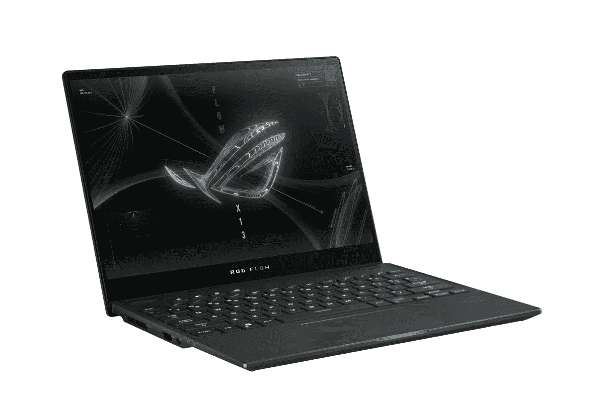
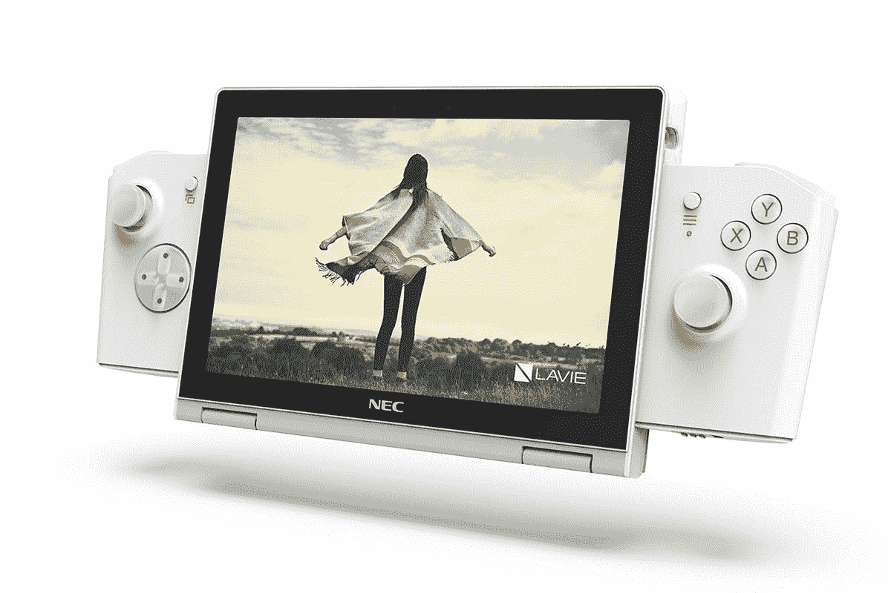
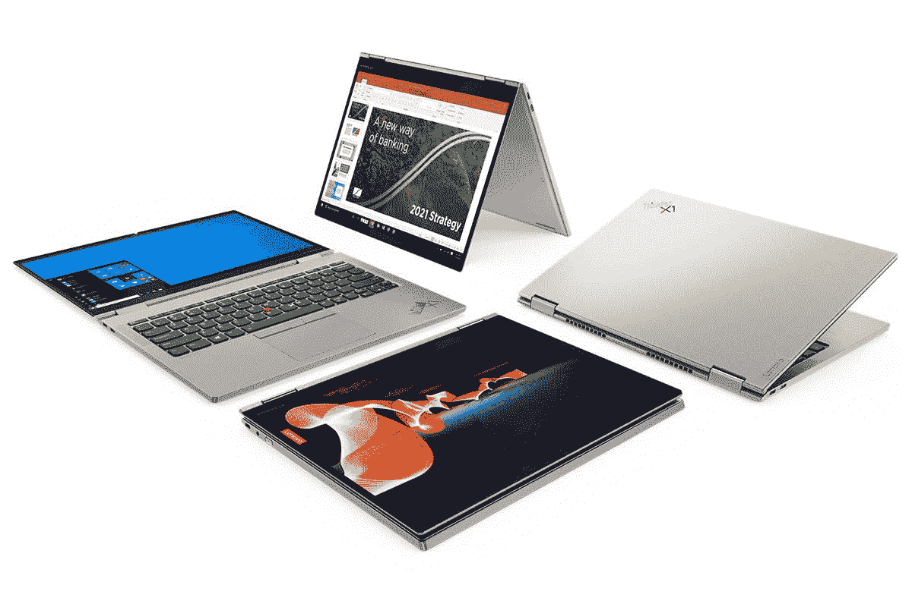

# CES 2021 最佳产品:手机、平板电脑、概念、笔记本电脑、家庭及更多！

> 原文：<https://www.xda-developers.com/best-of-ces-2021/>

拉斯维加斯的另一个展览已经尘埃落定，只是今年的消费电子展实际上是由于正在进行的新冠肺炎疫情而举行的。有许多公告，都与展会直接相关，或者——在三星与[合作的情况下，Galaxy S21 系列公告](https://www.xda-developers.com/samsung-galaxy-s21/)——都是在 CES 举行的几天内发布的。我们的团队花了很多时间浏览 CES 上的公告，虽然你可以在这里看到我们所有的 CES 报道[，但我们想强调几款因多种原因而脱颖而出的产品！](https://www.xda-developers.com/tag/ces-2021/)

从笔记本电脑、手机和硬件到软件、组件和家用物品，以下是我们为 CES 2021 挑选的最佳产品。

我们挑选了在 CES 2021 之前或期间发布的产品。由于这些产品尚未上市，我们的决定是基于出版时的任何可用信息。

## 2021 年消费电子展最佳作品——我们的最佳选择

以下是我们在 2021 年消费电子展上的精选作品:

1.  [ROG 之流 13](#rogflow13)
2.  [TCL NXTPAPER](#tclnxtpaper)
3.  [联想 LAVIE MINI](#laviemini)
4.  [LG & TCL 可滚动显示屏](#rollable)
5.  [TCL 6 系列 8K 电视](#tcl8k)
6.  [索尼 Bravia Core](#braviacore)
7.  [三星 JetBot 90 AI+机器人真空](#jetbot)
8.  [LG 超精细有机发光二极管 Pro](#ultrafine)
9.  [联想 ThinkPad X1 钛金瑜伽 5G](#thinkpadx1)
10.  [华硕无风扇 Chromebox](#fanless)
11.  [Razer 项目 Hazel](#hazel)

以下是我们选择每种产品的原因:

## ROG 流 13

 <picture></picture> 

ASUS ROG Flow X13

[华硕 ROG Flow X13](https://www.xda-developers.com/asus-rog-strix-zephyrus-gaming-laptops-13-flow-x13-launch-ces-2021/) 是一款 13.3 英寸的超便携游戏笔记本电脑，配有 120Hz FHD 面板或由康宁大猩猩玻璃保护的高分辨率 4K 显示屏。两种显示器选项都提供 16:10 的宽高比，支持自适应同步，并且经过 Pantone 验证。它由 AMD 锐龙 9 5980HS 移动处理器和 NVIDIA GeForce GTX 1650 显卡提供支持。

与 ROG 流 X13 一起发布的突出产品是 XG Mobile，这是一款相对紧凑的移动外部 GPU 外壳，可容纳高达 GeForce RTX 3080 显卡。考虑到卡的大小和外壳的大小，这对于任何需要移动图形的人来说都是一个福音。

## TCL NXTPAPER(土耳其文)

新的 TCL NXTPAPER 是一款创新产品，在平板电脑市场上并不常见有意义的创新。本质上是一个电子墨水平板电脑，但实际上没有使用电子墨水显示屏，TCL NXTPAPER 的对比度比大多数电子墨水平板电脑高 25%，比标准 LCD 屏幕的能效高 65%。

为什么这很重要？最重要的是，没有有害的蓝光，它没有使用背光显示屏，而是使用高反射 IPS 屏幕来重复利用自然光。TCL 显然希望最终结果是你不会爱不释手。

## 联想 LAVIE MINI

 <picture></picture> 

NEC LAVIE MINI with gaming controller

从字面上理解，LAVIE MINI 是一种迷你可转换概念电脑，可以很容易地成为小型电脑或大型便携式游戏机。它配备了 8 英寸 WUXGA (1920 x 1200)触摸屏显示器，最高可配第 11 代酷睿 i7 移动处理器和英特尔 Iris Xe 显卡，256GB 存储空间和 16GB lpddr 4 内存。

LAVIE MINI 重 579 克，绝对便携，还配有背光键盘。还有一个用于 Windows Hello 的红外摄像头、26 瓦时电池和 Wi-Fi 6。有趣的是可选的游戏控制器，它可以将迷你笔记本电脑变成任天堂 Switch 风格的便携式游戏机。联想表示，它可以处理高质量的 PC 游戏，就像 Switch 一样，你可以使用可选的 HDMI Dock 在更大的显示器上玩游戏。

## LG & TCL 可滚动显示屏

移动领域最大的创新肯定会出现在下一代体验中，包括可折叠设备、可滚动设备，以及一些我们很久以来见过的最奇怪的概念。

LG 在 CES 2021 上发布的可卷曲手机在从智能手机到平板电脑的过渡中令人难以置信地光滑。LG 是首批涉足可卷曲显示屏电视的公司之一，该公司首次涉足可卷曲手机将于今年晚些时候在 T2 作为真正的产品亮相。我们等不及了！

去年是折叠、滚动和其他转换设备开始获得动力的一年。今年，许多这些概念应该会成为现实，TCL 应该会在今年将几个下一代概念推向市场。

这些产品中的一种可能是基于 TCL 概念的具有可滚动显示器的滚动电话。这款概念手机在 CES 2021 上展出，它使用内部电机，只需按一下按钮，即可将 6.75 英寸的 AMOLED 显示屏扩展到 7.8 英寸的显示屏。据说这款手机只有 9 毫米厚——大约与 Galaxy S21 Ultra 的厚度相同——这意味着它仍然足够薄，可以在日常生活中使用。

我们很高兴看到这两个概念在今年晚些时候上市！

## TCL 6 系列 8K 电视

你知道什么也令人兴奋吗？TCL 的电视系列，特别是 6 系列。6 系列通常以低于 1000 美元的价格出售，是 TCL 产品线中负担得起的高端产品，比高端 8 系列更主流。TCL 被广泛认为生产的是你能买到的价格在 1000 美元以下的最实惠的电视，它的实惠电视推动它成为美国第二大电视制造商。

去年，TCL 将 mini-LED 技术应用于 600 美元以下的电视，成为该价位第一家使用该技术的电视。今年，TCL[将 8K 引入范围](https://www.xda-developers.com/2021-tcl-tvs-google-tv-8k/)，这可能会使 8K 版本稍微贵一点，但会导致内容公司为 8K 内容建立更大的基础。

## 索尼 Bravia Core

流媒体平台可能看起来不像是令人兴奋的消息，但索尼新的 Bravia Core 平台可能会被证明是任何拥有索尼电视、对电影院般的观看体验感兴趣的人的福音。这项服务将使用索尼的“纯流”技术，允许最新索尼 Bravia XR 电视的用户以高达 80Mbps 的速度传输，索尼表示，这将提供近乎无损的质量，堪比观看 4K 的蓝光电影。

索尼表示，这项服务预装在所有新的 Bravia XR 4K 和 8K 型号上，包括主系列 Z9K 8K LED 和 X90J 等 4K 型号，可以让你随时随地播放索尼电影公司的精选电影。他们还声称将会有“最大的 IMAX 增强电影收藏”,有重制的 IMAX 图片和 DTS 声音。这项服务上有多少个标题还有待观察，但这项服务肯定可以帮助你充分利用你的新电视。

## 三星 JetBot 90 AI+机器人真空

三星 JetBot 90 AI+机器人吸尘器的名字可能有点拗口，但它采用了一些令人印象深刻的技术，旨在处理您所有的日常清洁需求。它使用传感器和人工智能增强的物体识别在你的家中四处移动，同时避免通常可能出现的无数障碍。激光雷达传感器检测到物体的距离并跟踪位置，从而精确清理每个斑点。

**你可能会喜欢:**这些是在 CES 2021 上推出的[最佳耳塞](https://www.xda-developers.com/best-true-wireless-earbuds-ces-2021/)

有一个 3D 传感器，可以检测地板上的小物体，如充电器或咀嚼玩具，并避免易碎的物品，这样它就不会意外地嚼碎你昂贵的音响系统的电线，同时它还会在完成清洁后清空自己的袋子。像大多数机器人吸尘器一样，它也可以为你的家绘制最有效的清洁路线，并可以使用移动应用程序远程控制。当你不在家时，前面的摄像头也可以用作远程摄像头来监视你的家，使它可以兼作巡回家庭安全机器。

## LG 超精细有机发光二极管 Pro

LG 制造了一些市场上最受欢迎的显示器，特别是对 Mac 用户来说，该公司在 CES 2021 上的最新发布承诺也是粉丝的最爱。该公司的 Ultra Fine 系列获得了一款真正的专业显示器，这也是 LG 首次在显示器上使用有机发光二极管技术。

该显示器尺寸为 31.5 英寸，支持 3840x2160 像素(4K 分辨率)、一个 USB-C 端口、三个 USB-A 端口、两个 DisplayPorts 和一个 HDMI 端口。还有有机发光二极管像素调光 HDR 和 1，000，000:1 的对比度。没有关于价格的消息，所以它可能会很贵，但它很可能是今年推出的最好的显示器之一。

## 联想 ThinkPad X1 钛金瑜伽 5G

 <picture></picture> 

Lenovo ThinkPad X1 Titanium Yoga

另一个绝对拗口的产品名称是 ThinkPad X1 Titanium Yoga 5G，这是一款[超薄的新型英特尔笔记本电脑](https://www.xda-developers.com/lenovo-thinkpad-2021-range-ces-2021/)，由钛、镁和碳制成。它的重量仅为 2.5 磅，超轻，但配备了第 11 代酷睿 i7 处理器、16GB 内存和高达 1TB 的存储空间。厚度仅为 11.5 毫米，是市场上最薄的敞篷车之一，但可以处理你在 2021 年用 Windows 电脑可以做的一切。

13.5 英寸显示屏的长宽比为 3:2，分辨率为 2256 x 1504，杜比视觉峰值亮度为 450 尼特。它配备了触摸支持和随附的联想精密笔、红外摄像头、指纹读取器、两个 Thunderbolt 4 端口和 44.5 瓦时电池。由于可选的[高通骁龙 X55 5G 调制解调器](https://www.xda-developers.com/qualcomm-snapdragon-x55-5g-modem-2019-android-smartphones/)，它还支持 Wi-Fi 6 和 5G，这使它成为市场上越来越多的 5G 笔记本电脑之一。如果你想要功能强大又便于携带的东西，这绝对符合要求，尽管它将在今年晚些时候上市，起价为 1899 美元。

## 华硕无风扇 Chromebox

谁说创新只能为消费者服务？华硕在 CES 2021 上发布的新无风扇 Chromebox 证明了商业技术也可以很有趣，尽管该公司的 Chromebooks 抢走了所有的注意力。作为 Chrome OS 台式机的更新，无风扇 Chromebox 是一款便携式无风扇微型计算机，外形坚固，旨在支持商业和工业应用。它配备了第 10 代英特尔处理器和更新的连接选项，使用被动冷却来承受来自其组件的热量，而没有嘈杂的风扇。

小巧的尺寸(尺寸为 1.3 x 8.1 x 5.8 英寸)和可锁定的 VESA 支架使这款设备成为隐藏在显示器后面或桌子下面的完美设备。它配备了三种 CPU 选择-酷睿 i3、i7 或赛扬 5205-并支持高达 8GB 的内存和高达 128GB 的存储。由于它运行的是 Chrome 操作系统，因此支持谷歌 Play 商店和安卓应用。它有一系列连接选项，包括 Wi-Fi 6、USB 3.2 Gen 1 Type-C 端口、一对 HDMI 端口和一个 microSD 卡插槽。

## Razer 项目 Hazel

在我们都经历了一年之后，有人注定要制造它:N95 口罩，它以一种很酷的方式利用了技术。Razer 在这里绝对有正确的想法[与 Project Hazel](https://www.xda-developers.com/razer-mask-project-hazel-rgb-lighting/) :一个概念面具，旨在提供保护，同时仍然允许你展示你的一些个性。它有一个光滑的外壳，由防水和防刮擦的再生塑料制成。我总是面带微笑，很明显，戴上面具后，这种非语言交流会消失多少；黑兹尔项目的透明外壳旨在允许读唇，在与人交谈时看到面部暗示，大概因此面部配件和化妆是可见的。

目前还没有 Hazel 项目上市的确切日期，也没有最终产品的确切日期，但 Razer 表示，它正在与医学专家密切合作，以确保它符合 Razer 的目标标准。就像一个旧的防毒面具一样，嘴巴两侧的两个圆形区域使用盘式通风设备来过滤吸入的空气和呼出的二氧化碳。Razer 预计这种口罩将被认证能过滤 95%的颗粒物，包括在对抗新冠肺炎病毒中的有效性。

当然，它是 Razer，我们希望该公司也将更多的传统技术带到前沿。嵌入在通风器中的麦克风和放大器将有助于投射你的声音，该公司正在与 THX 合作，以找到音量方面的正确平衡。在传统的 Razer 时尚中，两个环中还内置了色度 RGB LEDs，在晚上，一系列 led 会自动照亮你的嘴，这样人们仍然可以看到你的嘴。

* * *

这就是我们 CES 2021 的最佳选择！你可以在我们的 [CES 2021 档案中看到我们所有更详细的报道！](http://xda-developers.com/tag/ces-2021)你对我们挑选的 2021 年消费电子展最佳作品有什么看法:你还有什么要补充的吗？如果有，是什么，为什么？请在下面的评论中告诉我们，明年再见！