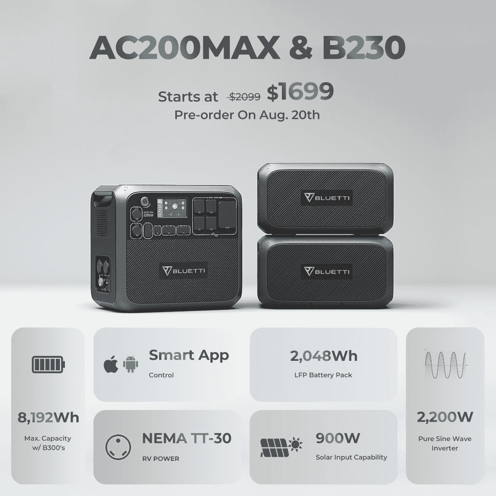
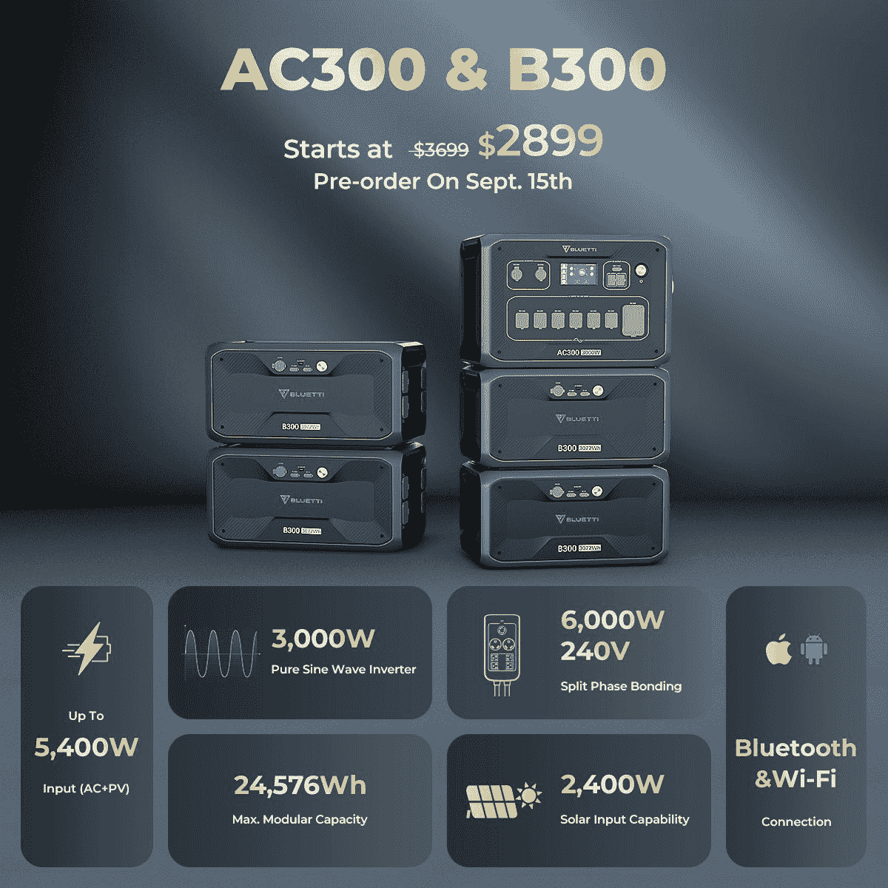
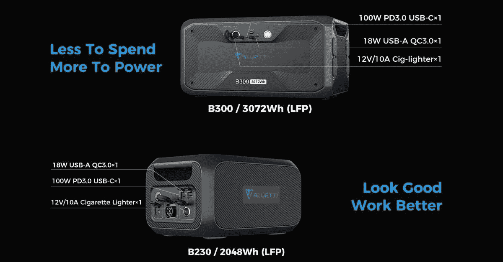

# Bluetti 发布带热插拔模块的新电站

> 原文：<https://www.xda-developers.com/bluetti-new-power-station/>

随着技术的进步和停电越来越频繁，便携式电站越来越受欢迎。当你投资一个发电站时，模块化是你应该考虑的事情之一。您可以从小规模开始，如果您决定以后需要更强大的功能，可以进行扩展。Bluetti 的最新产品旨在以经济实惠的价格加入完整的解决方案电源备份计划。

* * *

在 AC200P 取得成功之后，Buetti 仔细听取了专门用户的意见，了解他们下一步应该包括什么。AC200 MAX 是该发电站的升级版，包括一些奇妙的新功能。对于决定购买 AC200 MAX 的用户，他们将能够包括多达两个 B230 或 B300 物质模块。这允许你根据需要扩展你的发电站，而不必购买一个全新的单元。你可以有总共 8192Wh 和 900 瓦的太阳能输入充电。

对于正在寻找一个发电站的人来说，AC200 MAX 有一个特别设计的内置 30A NEMA TT-30 插座。发电站上的一切都可以通过蓝牙连接的配套应用程序进行远程控制。

 <picture></picture> 

Bluetti AC200 MAX and B230

**Bluetti AC200 MAX** 和 **B230** 现已在 Bluetti power week 上市，起价**500 美元。** [点击此处](https://www.bluettipower.com/pages/ac300debutsale)了解更多

* * *

对于寻求更大功率的人来说，AC300 是一个巨大的 3000w 纯正弦波逆变器。该装置采用模块化设计，能够支持大量电力。将 AC300 与至少一块 B300 电池配对，以获得 3072 瓦时的功率。您可以连接多达四个这样的电池，以获得 12，228 瓦时的总容量。

Bluetti 了解模块化在所有发电站中的重要性，甚至通过使用 Fusion Box Pro 让您走得更远。该装置允许您将两个 AC300s 配对在一起，将整个系统提升至 240V、6000W。此时，您可以使用八个 B300 电池模块，总容量为 24，576 瓦时。这足够为你家里的所有东西供电长达一周。

对于充电选项，AC300 能够支持 2400W 太阳能输入，而完全堆叠版本允许 10，400W。这是任何可能持续几天以上的长期停电的理想选择。

 <picture></picture> 

Bluetti AC300 and B300

Bluetti 将于 9 月 15 日发布 3000 瓦的 AC300。您可以[进入此处](https://www.bluettipower.com/pages/ac300debutsale)通过订阅获得 800 美元的早鸟折扣。

* * *

这两个新的电池模块可以作为独立的电源模块进行充电和放电。这两种型号都具有各种 DC 插座，包括 100W USB-C，12V/10A 汽车输出和一些 USB-A 端口。

您可以预期两个电池模块都能够通过交流到 DC 适配器吸收 500W 的交流电源。B300 有自己的 200 瓦(MPPT 就绪)太阳能插座，当你的电力存储快用完时，下次你和你的朋友外出露营时可以使用。

 <picture></picture> 

Bluetti B230 and B300 Battery Modules

* * *

利用 Bluetti 的 Power Week 销售活动，获得这些新产品的巨大折扣。除了这些新发布的产品，您还可以找到以下产品的折扣:

*   AC200P 现在售价 1599 美元(优惠 400 美元)
*   EB240 售价 1399 美元(优惠 500 美元)
*   EB55 仅售 449 美元(优惠 100 美元)

**欲了解更多信息，请访问 [Bluetti 动力周活动页面](https://www.bluettipower.com/pages/powerweek)。**

###### 我们感谢 Bluetti 赞助了这篇文章。我们的赞助商帮助我们支付与运行 XDA 相关的许多费用，包括服务器成本、全职开发人员、新闻撰稿人等等。虽然您可能会在门户内容旁边看到赞助内容(这些内容将始终被标记为赞助内容),但门户团队对这些帖子不承担任何责任。赞助内容、广告和 XDA 仓库完全由一个独立的团队管理。XDA 绝不会通过接受金钱来赞扬一家公司，或以任何方式改变我们的观点或看法，从而损害其新闻诚信。我们的意见不能被收买。