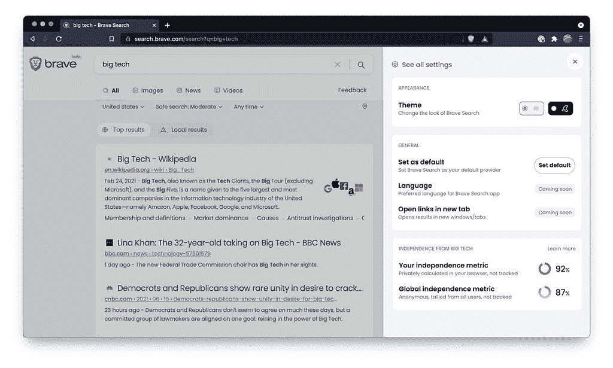

# Brave 以专注于隐私的搜索引擎挑战谷歌

> 原文：<https://www.xda-developers.com/brave-search-engine-privacy/>

如果你需要另一个搜索引擎来选择，Brave，同名浏览器背后的公司，已经推出了一个表面上专注于隐私的搜索引擎。Brave Search 的推出是在 Brave 宣布它打算使用 Tailcat 开发的技术与 Google 竞争之后，tail cat 是该公司最近收购的一个搜索引擎。

该公司在一篇博客文章中表示:“无论他们已经是勇敢的浏览器用户，希望通过勇敢浏览器中的一体化集成勇敢搜索来扩大他们的在线隐私保护，还是其他浏览器的用户正在寻找最佳隐私保护搜索引擎，他们都可以使用新发布的勇敢搜索测试版，该测试版将用户放在第一位，并完全控制他们的在线体验。”。“勇敢搜索建立在完全独立的索引之上，不会跟踪用户、他们的搜索或他们的点击。”

该公司表示，已有超过 10 万人注册了勇敢搜索的测试版，勇敢浏览器最近的活跃用户超过了 3200 万。该公司还表示，其搜索引擎坚持以下原则，并表示这使其有别于竞争对手:

1.  隐私:不跟踪或分析用户。
2.  用户至上:用户至上，而不是广告和数据行业。
3.  独立性:Brave 有自己的搜索索引，可以在不依赖其他提供商的情况下私下回答常见问题。
4.  选择:很快，无广告付费搜索和广告支持搜索的选项。
5.  透明度:没有秘密的方法或算法来偏向结果，不久，[社区策划的开放排名模型](https://brave.com/wp-content/uploads/2021/03/goggles.pdf)来确保多样性，防止算法偏见和彻底的审查。
6.  无缝:从个性化到用户键入时的即时结果，在不损害隐私的情况下，浏览器和搜索之间的最佳集成。
7.  开放性:Brave Search 将很快为其他搜索引擎提供支持。

“Brave Search 是业内最隐私的搜索引擎，也是唯一的独立搜索引擎，为用户提供了他们在大型技术替代品中寻求的控制和信心，”Brave 首席执行官兼联合创始人布伦丹·艾希说。“与跟踪和描述用户的旧搜索引擎以及主要是旧引擎的外壳并且没有自己的索引的新搜索引擎不同，Brave Search 提供了一种新的方式来通过社区支持的索引获得相关结果，同时保证隐私。勇敢的搜索填补了当今市场的一个明显空白，因为数百万人对监控经济失去了信任，并积极寻求控制自己数据的解决方案。”

 <picture></picture> 

Brave Search offers an "independence metric" which shows how close the results are to "complete independence" from "big tech."

该公司表示，它正在使用自己的索引，包括来自社区的匿名贡献，以完善和改进其搜索结果，并避免从必应或谷歌租赁其结果。该公司承认，目前，某些查询和图像结果对普通用户来说不够相关，他们在这些情况下使用其他服务的 API 来返回搜索结果。他们将这项服务作为谷歌和 DuckDuckGo 的替代品，提供他们所说的其他竞争对手无法提供的东西。

在测试阶段的早期，Brave Search 不会显示广告，但以后会提供无广告付费搜索和有广告支持的免费搜索选项。它还将探索把与 BAT 收入分成的私人广告引入搜索，这就是勇敢用户广告目前的工作方式。通过将任何网络浏览器指向 search.brave.com 的，可以在线访问该搜索引擎，也可以从面向 PC、Android 和 iOS 的 Brave browser 应用程序中访问该搜索引擎。