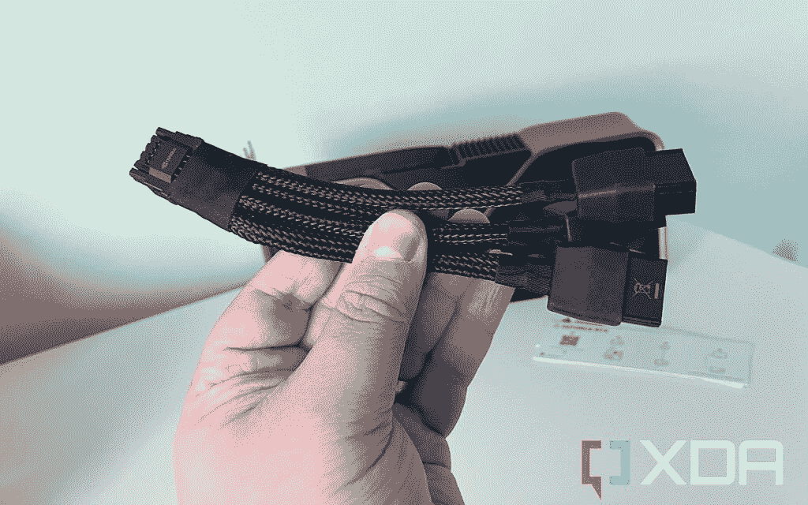

# Cablemod 已经来为大家修复 RTX 4090 电源连接器

> 原文：<https://www.xda-developers.com/cablemod-comes-to-the-rescue-with-just-what-every-rtx-4090-owner-will-want/>

# Cablemod 带来了每个 RTX 4090 车主都想要的东西

如果你有或者正在得到一个 RTX 4090，那么你肯定会想要一个 Cablemod 适配器来帮助你给 girthy 显卡供电。

英伟达 RTX 4090 的[尺寸已经被做了很多，但问题的一部分是包括的电源连接器。我们大多数人都需要使用内置适配器来打开电脑，这就产生了一系列问题。电源制造商已经开始着手此事，但是 Cablemod 已经准备好了。该公司新宣布的直角 12VHPWR 电缆正是医生所订购的。](https://www.xda-developers.com/how-big-invidia-rtx-4090/)

> 我们已经创造了完美的配件，以帮助您的新 beastly GPU 漂亮地适合你的情况。这款薄型适配器可插入显卡的 16 针 12VHPWR 端口，使电源线能够以 90 度角插入。这款适配器采用多 PCB 设计和光滑的外形，有助于增加 GPU 和侧面板之间的间隙，非常适合当今的超宽 GPU。

 <picture></picture> 

The RTX 4090 12VHPWR to 8-pin adapter cable

长度只是 RTX 4090 尺寸问题的一部分。它也非常宽，使其适合中塔成为一个问题。我们的创始人版评论样本就是一个很好的例子。安装到我的实际游戏 PC 的 12VHPWR 到四个 8 针适配器电缆意味着我不能得到玻璃侧面板。即使使用专用的 12VHPWR 电缆，这也是一种紧密配合。

这就是 Cablemod 的适配器对每个拥有 RTX 4090 的人来说完全有意义的地方。它的多 PCB 设计意味着没有电线弯曲，没有危险的连接，也没有热量问题。所有重要的东西，可以预期处理高达 600 瓦。这种设计使它成为一个完美的 90 度角，电缆直接钩入底部。它将提供两种配置来匹配您的特定显卡，预计将于 10 月底上市。

**来源:** [Cablemod](https://store.cablemod.com/cablemod-12vhpwr-right-angle-adapter/)