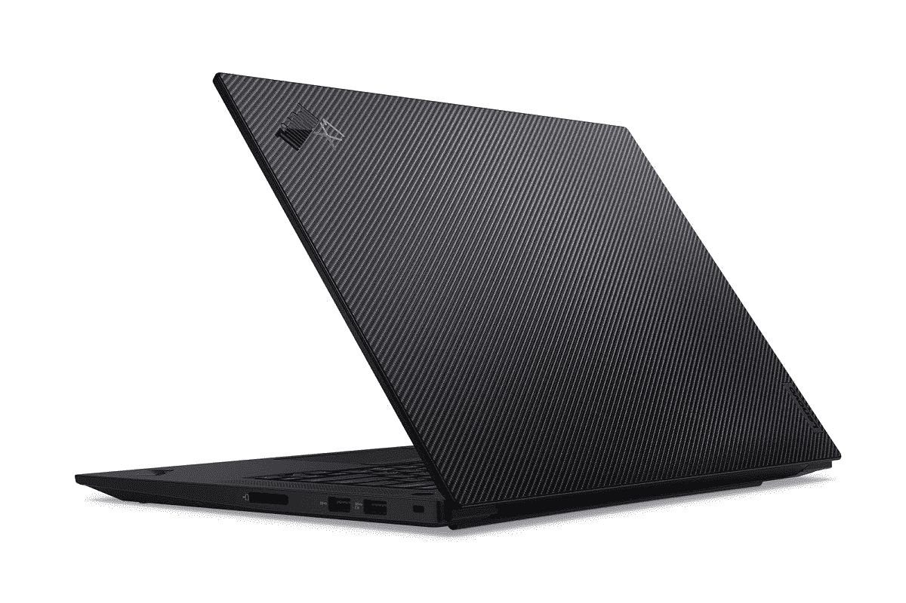

# 我可以在联想 ThinkPad X1 Extreme Gen 5 上运行 Ubuntu Linux 吗？

> 原文：<https://www.xda-developers.com/can-i-run-ubuntu-linux-lenovo-thinkpad-x1-extreme-gen-5/>

联想 ThinkPads 是市场上[最好的商务笔记本电脑](https://www.xda-developers.com/best-business-laptops/)，它们都迎合不同类型的用户。其中， [ThinkPad X1 Extreme Gen 5](https://www.xda-developers.com/lenovo-thinkpad-x1-extreme-gen-5/) 是你能得到的最强大的产品之一，有 Nvidia GeForce RTX 3080 Ti 显卡和强大的英特尔 CPU 选项。当然，虽然大多数消费者更喜欢使用 Windows 11(或 10)，但并非所有人都是如此。那么如果你想在联想 ThinkPad X1 Extreme Gen 5 上运行 Ubuntu Linux 呢？

谢天谢地，你可以做到，而且有几种方法可以做到。如果你想两全其美，你可以直接在 Windows 中运行 Linux 应用程序，或者你可以真正的双引导或虚拟机。最终，如果你想完全避开 Windows，你应该也能买到开箱即用的联想 ThinkPad X1 Extreme Gen 5。

## 用于 Linux 的 Windows 子系统

在你的笔记本电脑上运行 Linux 最简单的方法——无论是 ThinkPad X1 Extreme 还是其他什么——就是使用 Linux 的 Windows 子系统。这是一个自 Windows 10 以来就存在的功能，但它在过去几年中一直在不断改进。本质上，这是一种高级形式的虚拟化，它允许您在 Windows 中运行 Linux 系统，同时提供比虚拟化通常提供的更紧密的集成。Linux 应用程序可以和 Windows 应用程序一起运行，并出现在任务栏上，所以你不必在两个完全不同的环境之间切换。

自从它首次亮相以来，Linux 的 Windows 子系统发生了一些重大变化，所以现在它可以使用你的 GPU，甚至支持 GUI Linux 应用程序，所以如果你不想，你不会局限于基于终端的应用程序。这确实是一个非常有效的解决方案。最近，微软甚至增加了对系统的支持，这可以大大改善 Ubuntu 的体验，包括对 snap package manager 的支持。

你可以在控制面板或 Windows 11 中启用 Windows 子系统 for Linux，或者从微软商店下载软件包[，这样可以更频繁地获得更新。一旦你这样做了(在重启之后)，你就可以从微软商店安装你喜欢的 Linux 发行版，比如 Ubuntu，并开始在 Windows 终端中使用它。](https://apps.microsoft.com/store/detail/windows-subsystem-for-linux-preview/9P9TQF7MRM4R)

## 在联想 ThinkPad X1 Extreme 上安装 Ubuntu Linux

如果 Linux 的 Windows 子系统对你来说听起来不太理想，而你想要完整的 Ubuntu 体验，你可以用几种方法把它安装到你的 PC 上。如果您希望降低风险，我们建议您使用虚拟机。这让你可以创建一个包含的环境，在这个环境中你可以安装 Ubuntu 并把它作为一个独立的系统来运行。它仍然可以在 Windows 的虚拟化中运行，但是这是最安全的方式，尤其是如果你只是想尝试一下 Linux 的话。首先，你需要虚拟化软件，如微软的 Hyper-V 或 [VMware Workstation Player](https://www.vmware.com/products/workstation-player.html) ，以及一个 Ubuntu ISO 文件[，你可以在这里下载](https://ubuntu.com/download/desktop)。

另一方面，如果你想在 ThinkPad X1 Extreme 上获得 Ubuntu Linux 的原生性能，你可以尝试双重启动 Ubuntu 和 Windows。这意味着，无论何时你打开电脑，你都可以在 Ubuntu 和 Windows 之间进行选择，你将获得两者的全部原生性能。这确实让设置和切换两个操作系统变得有点麻烦，但是如果你使用一个操作系统用于工作，一个用于娱乐，这可能是个好主意。如果你想这样做，你可以看看我们关于如何在同一台电脑上双启动 Windows 11 和 Linux 的指南。

## 购买采用 Ubuntu Linux 的联想 ThinkPad X1 Extreme Gen 5

如果你不想做上述任何事情，而宁愿完全避开 Windows，你可以购买开箱安装 Ubuntu Linux 的联想 ThinkPad X1 Extreme Gen 5。或者至少，你*应该*能够。虽然联想的官方规格表上提到了这个选项，但你现在实际上不能为 ThinkPad X1 Extreme Gen 5 配置 Ubuntu。尽管如此，该选项应该在未来几周或几个月的某个时候出现，所以继续查看是值得的。

* * *

无论你想用 Ubuntu Linux 还是 Windows 11 获得它，你都可以使用下面的链接购买联想 ThinkPad X1 Extreme Gen 5。联想的配置器提供了大量的选项，不仅仅是软件，还有笔记本电脑的硬件，还有一些预设的配置你可以直接购买，这些配置通常比定制配置快一点。如果你想要别的东西，有许多其他的[神奇的联想笔记本电脑](https://www.xda-developers.com/best-lenovo-laptops/)在那里，你可以看看。或者，如果你不喜欢联想，看看[最好的笔记本电脑](https://www.xda-developers.com/best-laptops/)。

 <picture></picture> 

Lenovo ThinkPad X1 Extreme Gen 5

##### 联想 ThinkPad X1 Extreme Gen 5

联想 ThinkPad X1 Extreme Gen 5 是一款功能强大的商用笔记本电脑，采用英特尔 H 系列处理器和英伟达 RTX 显卡，可以处理要求最苛刻的工作负载。