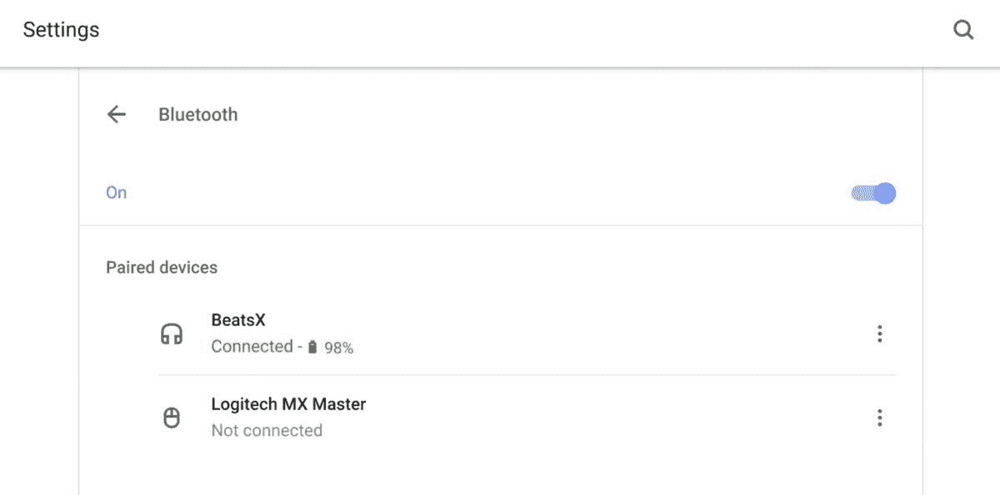

# Chrome OS 87 增加了标签搜索、蓝牙电池电量等功能

> 原文：<https://www.xda-developers.com/chrome-os-87-tab-search-bluetooth-battery-levels/>

# Chrome OS 87 增加了标签搜索、蓝牙电池电量等功能

在将 Chrome 87 引入桌面后，谷歌发布了 Chrome OS 87，其中包括标签搜索和其他新功能。

几周前，谷歌[发布了 Chrome 87](https://www.xda-developers.com/google-chrome-87-performance-improvements-tab-search/) ，其中包括性能改进和其他新功能。该公司现在正在向 Chrome OS 推出一些相同的功能。

Chrome OS 87 的更新有三个主要组成部分:标签搜索、设置和快速设置中的蓝牙电池电量以及新的壁纸选项。

使用选项卡搜索，用户可以在打开的浏览器窗口中快速搜索他们打开的选项卡。如果你经常一次打开几十个标签，找到你要找的东西就容易多了。只需点击浏览器右上角的下拉菜单按钮，开始搜索。

 <picture></picture> 

Bluetooth battery levels in Chrome OS settings. Source: [Chrome Enterprise release notes](https://support.google.com/chrome/a/answer/7679408?hl=en)

设置和快速设置中的蓝牙电池电量是不言自明的。将蓝牙耳机连接到 Chromebook 后，您可以通过打开快速设置或设置菜单来查看剩余的电池电量。Chrome OS 87 还会在连接耳机时，在屏幕的右下角显示耳机的电池电量。

最后，谷歌表示在 Chrome OS 87 中增加了 36 种新壁纸。谷歌最近[强调了 Chromebooks 的设计能力](https://www.xda-developers.com/chromebooks-new-perks-features-design-photo-editing/)，委托艺术家使用 Chrome OS 创建新的壁纸。如果你最终使用 Chromebook 进行内容创作，谷歌表示，它将提供额外津贴，包括免费访问高级应用程序。

Chrome OS 87 还[包括](https://9to5google.com/2020/12/04/chrome-os-87/)其他新功能:

*   保存到 Google Drive 已经更新，可以重命名文件并选择存储在哪个文件夹中
*   Chrome OS 设备现在支持开关辅助设备
*   Google 已经更新了语言设置，以便多语言用户更容易浏览
*   Alt+Tab 窗口切换器现在支持鼠标、触摸屏和手写笔输入
*   87 版本在重命名虚拟桌面和启动器文件夹时做了视觉上的改进

谷歌表示，系统将在未来几天内接收更新，所以保持警惕。