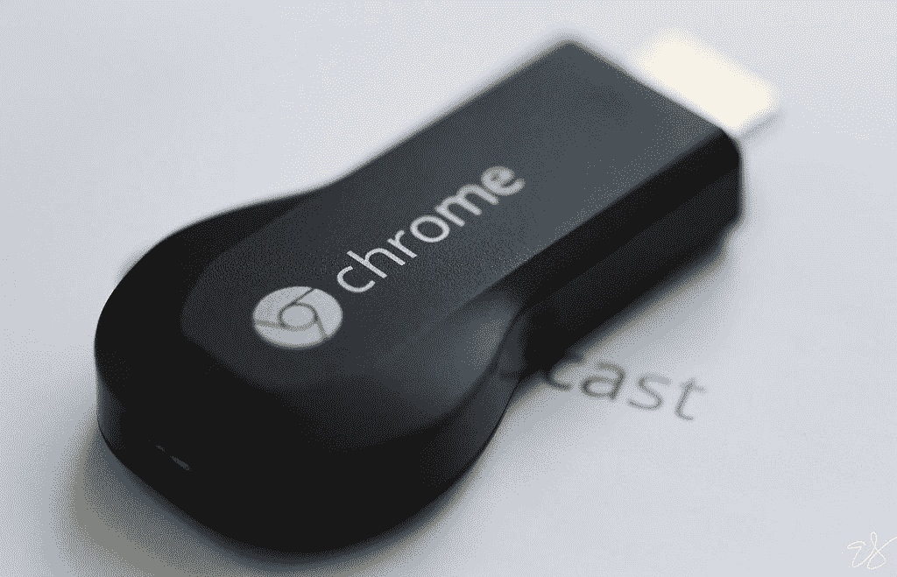

# 什么是 Chromecast:解释谷歌的无线流媒体技术

> 原文：<https://www.xda-developers.com/chromecast/>

如果你在过去几年中考虑过购买一个加密狗，以便在非智能高清电视上实现无线流媒体，那么你很有可能会遇到 Chromecast。它本质上是谷歌的一系列设备，允许你将媒体无线传输到你的电视或 AV 接收器。但是 Chromecast 的底层技术不仅仅局限于谷歌加密狗。事实上，你可以在[电视机](https://www.xda-developers.com/best-tv/)、扬声器和 AV 接收器中找到它。它能做的远不止是在线流媒体内容。

## 什么是 Chromecast？

除了作为谷歌流媒体加密狗的绰号，Chromecast 还用于指代谷歌使用谷歌 cast 协议的专有技术。因此，虽然 Chromecast 是面向用户的品牌，但它是谷歌 cast 协议，在引擎盖下做一切。

该协议允许用户在兼容的接收设备(如电视)上启动和控制移动设备或 Chrome 上的媒体内容播放。它还可以用来镜像电视上的 Chrome 标签、电脑或 Android 设备屏幕。此外，您可以使用 Chrome 或 AllCast 或 Plex 等应用程序中的 cast 功能将本地保存的媒体文件传输到电视上。

谷歌 Cast 协议于 2013 年随着第一台 Chromecast 设备推出。谷歌随后推出了 Google Cast SDK，允许开发者将 Google Cast 集成到他们的应用和网站中。

自从在最初的 Chromecast 中首次亮相以来，Google Cast 已经集成到数百台设备中。虽然最初是为了播放视频和图像，但谷歌在 2015 年增加了音频支持。

## 两种铸造类型

Chromecast 技术支持两种类型的内容播送。在第一种类型中，您可以使用内置 Google Cast 支持的移动应用程序或网络应用程序来选择您想要在接收设备(如电视)上播放的内容。然后，使用 cast 按钮在接收设备上启动回放。一旦您触发了播放，您的接收器设备就会收到播放特定内容的指令，方法是直接从应用程序的服务器或您设备的本地存储中获取该内容(如果您正在传输本地文件)。然后，这些内容将在接收端的本地版本 Chrome 中传输。这使得发送方设备可以自由地做其他事情。但你仍然可以从智能手机或 Chrome 上控制播放和音量。

第二种类型包括从你的电脑上铸造一个 Chrome 标签，或者使用 Google Home 应用镜像你的 Android 设备屏幕。在第二种方法中，演员或屏幕镜像的质量取决于发送方设备的处理能力，因为所有处理都在该设备上进行。

## 谷歌的 Chromecast 设备

 <picture></picture> 

First-gen Chromecast

2013 年的 Chromecast 是第一款采用谷歌 cast 协议的硬件。它基本上是一个插入电视 HDMI 端口的加密狗。谷歌随后推出了第二代机型，采用了新的设计和 Chromecast 音频加密狗，旨在让哑扬声器变得智能。后来出现了 Chromecast Ultra、第三代 Chromecast 和带有谷歌电视 4K 功能的 Chromecast。最后，谷歌更新了 Chromecast，推出了带有谷歌电视高清版本的 Chromecast，售价 29.99 美元，首次在 Chromecast 中支持 T2 AV1。

然而现在，只有 Chromecast 和谷歌电视 4K 版以及高清版幸存下来。谷歌已经停止了其他 Chromecast 型号。此外，虽然第三代 Chromecast 只能用于播放其他设备的内容，但带有谷歌电视的 Chromecast 是一种[流媒体设备，具有完整版本的安卓电视操作系统](https://www.xda-developers.com/best-android-tv-box/)和谷歌电视用户界面。因此，它不一定需要 Chromecast 功能来播放内容，因为它有自己的应用程序，但如果你需要的话，它会包含该功能。

## 来自第三方制造商的“Chromecast 内置”设备

虽然 Chromecast 技术最初是在谷歌的一个小加密狗中推出的，但后来它已经应用于几十家电视、音频和 AV 接收器制造商的数百种设备。您可以通过 Chromecast 内置标签来识别采用 Chromecast 技术的设备。每一个包含该技术的设备都带有标签。

具体来说，你主要会发现谷歌 Cast 在安卓电视和谷歌电视驱动的设备上的兼容性。但 Vizio 也在其 SmartCast 操作系统电视上加入了 Chromecast 支持。

## 如何用 Chromecast 铸造内容

如果你想将智能手机中的内容投射到电视或扬声器上，请在应用程序中寻找投射图标——一个角落有三个同心环的矩形图标。图标可能会出现在应用程序的主页或播放屏幕上。

当你点击图标时，应用程序会列出你周围所有的谷歌 Cast 兼容设备。确保您的手机和接收器设备在同一个 Wi-Fi 网络上，除非您使用的是启用了访客模式的 Chromecast。

选择要在其上播放内容的设备，播放将在接收设备上开始。您可以从内容应用程序或使用 Google Home 应用程序控制播放。

如果你想从电脑上播放内容，你需要 Chrome 浏览器。首先，打开您想要发布内容的网站。而且，如果网站启用了 Google Cast，您将会看到 Cast 图标。否则，你将不得不使用三点菜单中的 Chrome tab casting 来从电视上获取内容。

你也可以使用 Chrome 来转换保存在你的电脑或电脑屏幕上的本地文件。这些选项可以在演员菜单中找到。

* * *

尽管随着智能电视和智能扬声器的迅速普及，Chromecast 已经不像过去那样重要了。但这仍然是将内容从智能手机或电脑传输到兼容设备的最简单方式之一。

你还在使用 Chromecast 功能吗？请在评论区告诉我们。我们在 [Miracast](https://www.xda-developers.com/miracast/) 和 [AirPlay](https://www.xda-developers.com/airplay/) 也有类似的解说。