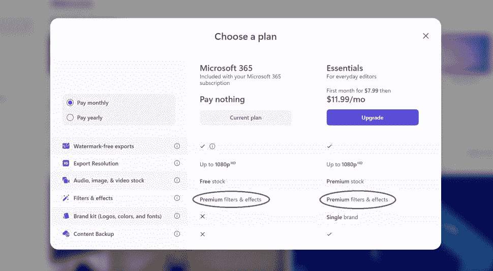

# Clipchamp 现在允许微软 365 用户访问高级过滤器

> 原文：<https://www.xda-developers.com/clichamp-free-filters-microsoft-365/>

微软开始让它的 Clipchamp 视频编辑器更接近微软 365 套件的其他产品。该公司最近开始向微软 365 订阅用户提供优质滤镜和效果的访问权限，因此您无需为 Essentials 计划支付额外费用即可访问它们。这一变化首先被 Windows Central 的丹尼尔·鲁比诺发现，是使 Clipchamp 成为微软 365 真正一部分的第一个重要步骤。

自微软首次收购 Clipchamp 以来的一年中，视频编辑器已经发生了一些重大变化，使其明显更有价值。在收购之前，免费的 Clipchamp 计划只提供 480p 的视频输出，总共有四个价格等级，高达每月 39 美元。然而，事情很快开始发生变化，1080p 视频出口被添加到每一层，最近，一个更简单的定价方案只有一个免费计划和一个付费(基本)计划。

每月 11.99 美元，你现在可以访问所有的库存图像、音频和视频，以及用于文件和项目的云存储。Essentials 计划还允许您创建 brank 套件，以便您可以更轻松地在视频中统一品牌。高级滤镜和特效也是套餐的一部分，但现在，如果你订阅了微软 365，这种特殊的额外待遇是免费赠送的。如果您登录的帐户附带了订阅，您可以在定价方案中看到这一变化。

 <picture></picture> 

Image credit: Future

在 Clipchamp 的库中，总共有八种滤镜和效果被标记为高级。此外，Clipchamp 中有一些高级音效，你也可以通过订阅微软 365 来获得。

随着微软试图让 Clipchamp 更接近其产品和服务家族，在不久的将来，我们不会惊讶地看到微软 365 订户可以获得更多的功能。现在，如果你好奇，你可以阅读我们关于如何使用 clipcamp 的指南，如果你想开始编辑你自己的视频。

* * *

**来源****:**[Windows Central](https://www.windowscentral.com/software-apps/microsoft-gives-microsoft-365-users-premium-filters-for-clipchamp-video-editor)