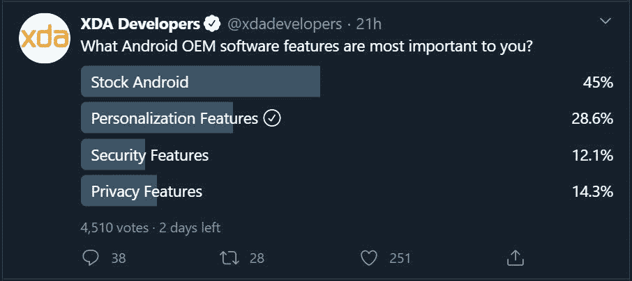

# OPPO 的 ColorOS 11 如何推安卓定制潮流

> 原文：<https://www.xda-developers.com/coloros11-customization/>

OPPO 在 2020 年有很强的 Android 设备选择，有了它们，OPPO 一直对软件有很大的关注。Android 11 是谷歌移动操作系统的最新大版本。为了充分利用 Android 11，OPPO 发布了 ColorOS 11，作为 ColorOS 迄今为止最重要的更新之一。9 月 14 日，ColorOS 11 活动作为虚拟发布会举行。这次活动让我们看到了许多 OPPO 设备将会具备的所有新功能。有许多不同类型的特性更新，但最有趣的方面是新的定制特性。

当我听到 Android 上的 OEM 定制时，我想到的是臃肿的主题引擎，它们拖慢了我的手机，却没有提供任何其他东西。这似乎是 ColorOS 11 想要避免的。他们的目标不是拥有一个主题化的界面，而是一个更加传统的 Android 外观，同时实现有效的个性化功能。

* * *

## OEM Android 软件的趋势

我在@ xdadevelopers twitter 帐户上进行了一次民意调查，询问我们的用户他们看重 OEM 软件的什么。今年操作系统软件的一些最大趋势是安全性、隐私性和定制化。所有这些功能都很重要，但 XDA 用户最终更看重个性化。

 <picture></picture> 

XDA Twitter Poll

然而，你可能会注意到最受欢迎的功能是一个普通的 Android 体验。因此，一个理想的解决方案是制作一个更接近 Android 的操作系统，同时具有一些个性化功能，使其成为你自己的。那么这是怎么做到的呢？我将分享一些在 OPPO Find X2 Pro 上运行的 ColorOS 11 的例子。

这款手机的主屏幕对你来说会非常熟悉，因为它与你在普通 Android 设备上看到的非常相似。谷歌的材料设计规则贯穿于整个软件。从一部普通的谷歌手机开始，一切都按照你期望的方式运行。这里没有臃肿的元素。过渡是简单的，图标是股票，设置菜单有传统的布局，通知阴影没有陷入与 OEM 功能。

所有这些功能都可以根据您的喜好进行定制。你可以调整图标，生成自己的壁纸，制作铃声，等等。没有必要下载图标包或沉重的主题来实现这种外观。现在，您可以使用自适应个性化功能来实现这一点。一些最好的新定制功能包括:

*   始终展示
*   主屏幕图标样式
*   指纹图标动画
*   强调色
*   字体和显示大小
*   通知抽屉图标形状
*   边缘照明
*   黑暗模式
*   壁纸创作

现在，用户可以在享受一些伟大的定制功能的同时，拥有自己的 Android 体验。这似乎是最好的前进方式，因为原始设备制造商正试图在他们的下一次操作系统更新中实现更多用户希望看到的东西。

* * *

## Android 个性化的未来

在 XDA，一直有一个围绕着 Android 主题和定制 rom 的大型社区。然而，这总是需要一定水平的技术知识，而普通消费者是无法达到这一水平的。以这种方式定制你的手机也需要很多努力。这就是为什么我们看到用户越来越重视个性化功能的趋势，正如上面的民意调查所示。

许多手机制造商正朝着这些功能的方向前进。以正确的方式实现它们是关键，以避免变得混乱，而不是一个特性。

**在这里阅读我们的文章，了解 ColorOS 11 的所有新特性:**

[ColorOS 11 回顾–OPPO 在 Android 11 上增加了许多定制功能](https://www.xda-developers.com/coloros-11-android-11-oppo-review/)

###### 我们感谢 OPPO 赞助这篇文章。我们的赞助商帮助我们支付与运行 XDA 相关的许多费用，包括服务器成本、全职开发人员、新闻撰稿人等等。虽然您可能会在门户内容旁边看到赞助内容(这些内容将始终被标记为赞助内容),但门户团队对这些帖子不承担任何责任。赞助内容、广告和 XDA 仓库完全由一个独立的团队管理。XDA 绝不会通过接受金钱来赞扬一家公司，或以任何方式改变我们的观点或看法，从而损害其新闻诚信。我们的意见不能被收买。