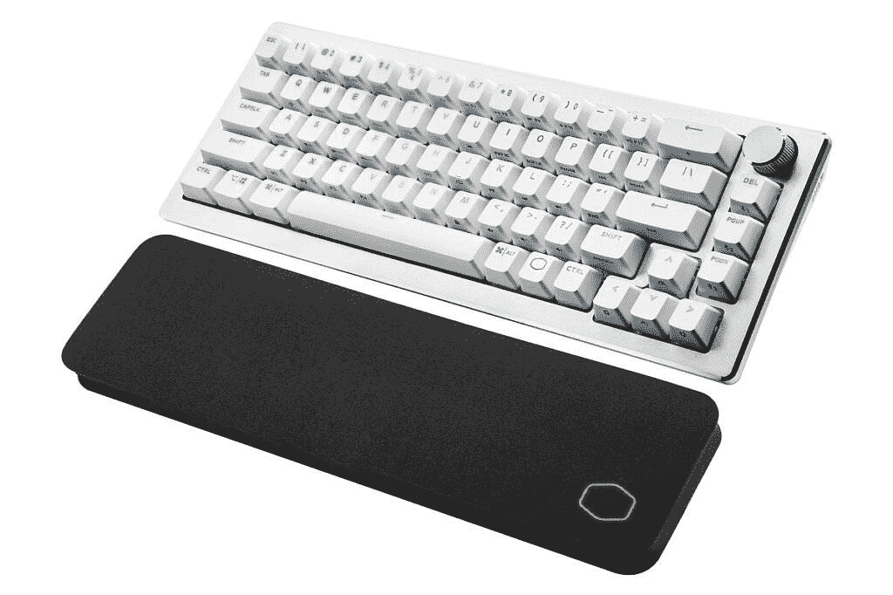

# 酷派大师在夏季峰会上推出新案例及更多内容

> 原文：<https://www.xda-developers.com/cooler-master-cases-and-more/>

说到 PC 组件和[外设](https://www.xda-developers.com/cooler-master-nachocustomz-mm720-limited-edition-mice/)，酷派大师是一个知名品牌。该公司本周将举办 Cooler Master Summer Summit 2021 活动，并展示了大量新产品。其中包括新外壳和外壳配件、散热解决方案、电源、外围设备、游戏显示器等。这是公司公布的所有信息。

## 表壳和配件

对于那些有兴趣建立自己的电脑，酷硕士有几个新的案件和配件在夏季峰会。首先，它推出了新的 MAX 系列系统。这些案例旨在通过提供简化的建筑体验来节省用户的时间，第一个是 NR200P MAX。

这是一个小型机箱(约 18.3 升)，包括 850 瓦 PSU、280 毫米散热器、双 140 毫米风扇和开箱即用的液体 CPU 冷却解决方案。您最多可以再添加两个风扇，有一个 3.5 英寸硬盘插槽，两个 2.5 英寸固态硬盘插槽，以及一个可用于任何尺寸的组合插槽。

Cooler Master 还推出了常规 NR200P 表壳的新颜色，包括火烈鸟粉色、茄紫色、日落橙色和加勒比海蓝色。不过，这些只是个案，没有包括太多其他内容。

Cooler Master 还宣布将从 HAF500 开始，重新推出 HAF 系列产品。这种情况下，前面有两个巨大的 200 毫米风扇，后面有一个较小的 120 毫米风扇，内部 120 毫米风扇以可调角度安装在 GPU 旁边。前后风扇也都有 RGB 照明。该公司表示，它还在开发一款 HAF 旗舰产品，但具体细节不得而知。

Cooler Master 在 Summer Summit 上推出了另外两款机箱，MasterBox 500 和 MasterBox TD300 Mesh。第一个有一个更干净的设计，前面有 RGB 照明的“电路向量”设计，下面还有一个 RGB 风扇。MasterBox TD300 Mesh 在前面使用了一个 3D 外观的网格，后面安装了两个 120 毫米的风扇。当然，你总是可以用更多的粉丝来定制它们。

除此之外，Cooler Master 还将其 PCIe 竖管电缆升级至 PCIe Gen 4。这些电缆提供更快的数据传输，它们有 200 毫米和 300 毫米两种长度。Cooler Master 的垂直 GPU 支架现在也配有 PCIe Gen 4 竖板电缆。

## 冷却器主电源

Cooler Master 还在夏季峰会上推出了一系列新的电源，从 XG Platinum 系列开始。这些 PSU 具有 80 Plus 白金效率、模块化布线、135 毫米风扇和智能热控制模式，可提高性能和延长使用寿命。Cooler Master 表示，它还使用了 100%日本电容器来提高效率和减少纹波噪声。您还可以使用 XG Plus Platinum 系列 PSU 更进一步，它添加了一个用于性能监控和 ARGB 照明效果的显示器。这些 PSU 的功率介于 650 瓦和 850 瓦之间。

如果你需要更多的功率，Cooler Master 还推出了 M1600 和 M2000 白金，分别提供 1600W 和 2000W 的功率。这些是针对专业项目的，但它们保持 80 多白金的效率。

## 冷却器主散热解决方案

如果你想让你的电脑保持凉爽，Cooler Master 也展示了一些新的解决方案。对于 CPU 空气冷却器，有新的超 H6 和超 H6DT。这些是具有 RGB 照明的空气冷却器，后者具有双塔散热器。Cooler Master 还展示了其新的 Mobius 风扇，该风扇具有互连的风扇叶片，设计更加坚固，旋转更加流畅。

对于液体冷却，有新的 MasterLiquid PL240 和 PL360 Flux。这些液体冷却器具有不同尺寸的散热器，分别带有两个或三个 120 毫米的风扇。该公司还拥有新的 ARGB 管套，可以插入您的主板，将 RGB 添加到水冷回路中。

## 冷却器主外设

说到外设，Cooler Master 发布了 MM730 和 MM731 游戏鼠标。前者是最高 16，000 DPI 的有线鼠标，而后者提供最高 19，000 DPI 的有线、2.4GHz 无线和蓝牙 5，1 连接选项。两者都具有可定制的 RGB 和按钮重新映射，以及更快响应时间的光学开关。

至于键盘，有新的 CK721 机械游戏键盘，带有 TTC 机械开关。它有一个 65%的小布局，有线或无线连接，以及一个可定制的转盘，可用于不同类型的控制。对于全尺寸键盘，CK351 和 CK352 都是全键盘，具有 RGB 照明，但仅使用有线连接。CK351 使用 LK 光学开关，而 CK352 使用机械开关。

 <picture></picture> 

Cooler Master CK721 in White

对于 streamers，有新的 StreamEnjin，这是一个直播流混合器，使用户可以更容易地设置多个场景进行流媒体播放，StreamEnjin 有多个端口来连接所有需要的外围设备，简单的按钮控制，它可以同时向两个直播目的地进行流媒体播放，它有一个专有的 iPad 应用程序，使设置更容易。

最后，酷派大师还宣布了新的游戏显示器，GM27-CFX，GM27-FQS 和 GM32-FQ。前者是全高清面板，刷新率高达 240Hz，而其他则具有四倍高清分辨率和 165Hz 刷新率。它们都具有自适应同步功能，但只有 GM27-FQS 和 GM32-FQ 具有 AMD FreeSync 高级支持。

## 椅子和桌子

Cooler Master 还推出了一系列新的椅子和桌子，其中最令人印象深刻的是 Orb X。这款一体化游戏椅几乎具备沉浸式游戏体验所需的一切功能。这是一个半封闭的椅子，支持多达三个 27 英寸的显示器或一个 34 英寸的显示器。它包括一个 2.1 环绕声系统，一个用于存储游戏桌面的托盘，以及多个用于插入所有外围设备的 USB 端口。它甚至可以使用键盘托盘为你的手机无线充电。该托盘还使用编织顶部来增加鼠标的准确性。

腰部支撑和头枕可调节，您可以将椅子倾斜多个角度，以更加舒适。整把椅子的边缘都采用了可定制的 RGB 颜色，营造出更加身临其境的氛围。

如果你想要一些不那么花哨的东西，有新的 Motion 1 椅子，它具有 3D 雕刻泡沫，高度调节和倾斜，以及可调节的腰部支撑和头枕。在与 D-Box 的合作中，它还拥有触觉电机，可以根据电影或游戏中的动作向用户提供反馈。这将于 2022 年初上市。

还有新的混合 1 椅子，对游戏玩家和创作者都有意义。它提供高达 180 度的倾斜和可调的腰部和头枕支撑，并将在第四季度上市。新的 Caliber Cooling 系列旨在让用户保持凉爽，并将于 9 月 1 日上市，而 Caliber R1S 系列提供了更多独特的设计和透气材料。那些[现在可以买到](https://www.coolermaster.com/catalog/setup/chairs/caliber-r1s-camo/)。