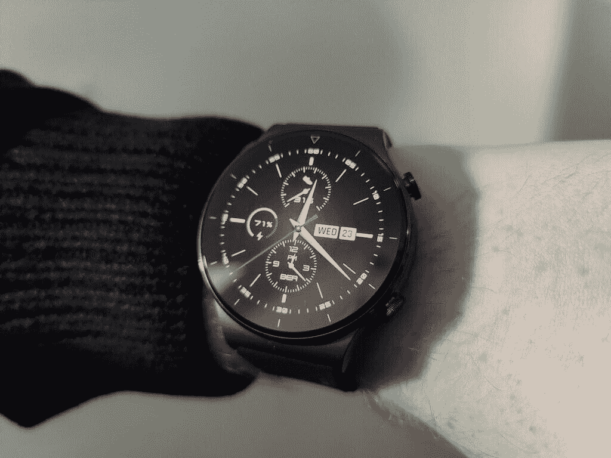

# 打造自己的华为手表脸，赢取一台华为 P40 Pro！

> 原文：<https://www.xda-developers.com/create-your-own-huawei-watch-face-and-win-a-huawei-p40-pro/>

对于世界各地的智能手表用户来说，最近推出的华为手表 GT2 Pro 是一个激动人心的时刻。这款新智能手表非常注重个性化和设计。来自世界各地的有创造力的人正在将他们的技能付诸实践，制作出其他人也能欣赏的表盘。这些创作者包括 Medialink Creative，他设计了 Le Petit Prince 腕表表盘(见上图)。

随着华为社区不断上传新设计，手表表面的选择不断增加。您也可以参与其中，提交自己的新表盘设计。通过提交您自己的设计，您将获得华为 P40 Pro 赠品。

华为主题已经启动了 **Empower 设计师激励计划**，鼓励来自欧洲的人们上传他们的主题并观看人脸。加入 Empower Designer 激励计划，上传您自己的作品！

**点击获取更多信息[。](https://huaweimobileservices.com/empower-designer-incentive-programme/)**

 <picture></picture> 

Huawei Watch GT2 Pro

##### 华为手表 GT2 Pro

它提供了一系列令人印象深刻的功能，包括由蓝宝石玻璃制成的 1.39 英寸 AMOLED 显示屏，长达两周的电池寿命，100 多种不同的健身模式，无线充电，全天候心脏监测，睡眠监测和氧饱和度检测器，4GB 的板载存储，接听或拒绝电话的能力，防水等等。

展示定制手表外观的最佳方式之一是使用华为手表 GT 2 Pro。这款高级智能手表配有 LiteOS，这是目前最好的健身操作系统之一。将手表与华为健康 app 配对，可以帮助你设置理想的健身追踪环境。你可以找到适合喜爱雪上运动、高尔夫、徒步旅行、跑步以及你能想到的任何其他主要运动的人的特色。有 100 多种健身模式可供您用来追踪自己的进度。手表会根据你的动作自动知道什么时候开始追踪。这意味着你将花更少的时间来建立一个锻炼，更多的时间做你喜欢的事情。

 <picture></picture> 

Huawei Watch GT 2 Pro

华为 Watch GT 2 Pro 的好处并不止于健身。天气预警一目了然。您还可以通过血氧饱和度检测和心脏监测来监测您的健康状况。健康的一个重要方面是良好的睡眠。配合华为 TruSleep 2.0 使用科学睡眠监测。这些功能只是触及了华为 Watch GT 2 Pro 许多功能的表面。

###### 我们感谢华为赞助这篇文章。我们的赞助商帮助我们支付与运行 XDA 相关的许多费用，包括服务器成本、全职开发人员、新闻撰稿人等等。虽然您可能会在门户内容旁边看到赞助内容(这些内容将始终被标记为赞助内容),但门户团队对这些帖子不承担任何责任。赞助内容、广告和 XDA 仓库完全由一个独立的团队管理。XDA 绝不会通过接受金钱来赞扬一家公司，或以任何方式改变我们的观点或看法，从而损害其新闻诚信。我们的意见不能被收买。