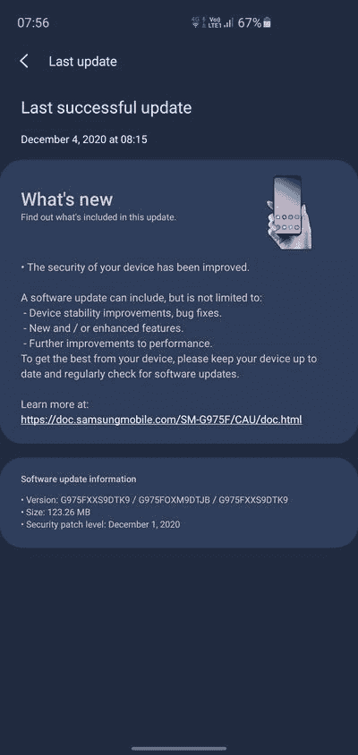

# 三星将于 2020 年 12 月推出 Galaxy Note 20 和 Galaxy S10 的安全更新

> 原文：<https://www.xda-developers.com/december-2020-security-update-samsung-galaxy-note-20-s10/>

在过去的几个月里，三星在为其设备发布安全更新方面做得非常出色。继上个月通过测试版渠道推出 2020 年 12 月的 [Android 安全补丁后，该公司又为](https://www.xda-developers.com/samsung-galaxy-s20-one-ui-3-0-beta-december-2020-security-patch/) [Galaxy S20 FE、](https://www.xda-developers.com/samsung-galaxy-s20-fe-s9-december-2020-security-patch-update/)[Galaxy S9](https://www.xda-developers.com/samsung-galaxy-z-fold-2-note-10-xcover-pro-receive-updates-december-2020-security-patches/)、Galaxy Z Fold 2、Galaxy Note 10、Galaxy XCover Pro 和 [Galaxy S20](https://www.xda-developers.com/samsung-galaxy-s20-stable-one-ui-3-android-11/) 系列提供了 2020 年 12 月的补丁。现在，韩国 OEM 已经开始推出 Galaxy Note 20 和 Galaxy S10 系列的更新。

## Galaxy Note 20

基于 Exynos 990 的 Note 20 5G(型号 **SM-N981B** )和 Note 20 Ultra 5G(型号 **SM-N986B** )的 2020 年 12 月安全更新和固件版本**n 98 xbxx S1 AK 1**现已在几个欧洲国家推出。有趣的是，Ultra variant 的版本号为 **N986BXXS1ATK4** 的稍新版本[在“SEB”地区](https://forum.xda-developers.com/t/atk4-official-stock-fw-update-odin-thread-03-dec-20-galaxy-note20-ultra-sm-n986b.4143909/post-84037271)可用，这是三星在波罗的海国家的代码。

从版本号来看，除了 Android 安全补丁级别(SPL)的明显提升，新版本没有任何显著的新功能。预计该公司将在未来几周内发布 Exynos 4G 和骁龙 Galaxy Note 20 变种的同等更新。

**[Galaxy Note 20 XDA 论坛](https://forum.xda-developers.com/c/samsung-galaxy-note-20.11095/) || [Galaxy Note 20 超 XDA 论坛](https://forum.xda-developers.com/c/samsung-galaxy-note-20-ultra.11203/)**

## 银河 S10

Galaxy S10 的全球版本现在正在一系列地区接收 2020 年 12 月的安全补丁更新。这个新版本被标记为 G97xFXXS9DTK9 ，大小约为 123MB。就像 Galaxy Note 20 系列的案例一样，是典型的安全维护发布。

 <picture></picture> 

Thanks to XDA Member [Vazovski2007](https://forum.xda-developers.com/m/vazovski2007.11288205/) for the screenshot!

**XDA 论坛:[银河 S10e](https://forum.xda-developers.com/c/samsung-galaxy-s10e.8763/) || [银河 S10](https://forum.xda-developers.com/c/samsung-galaxy-s10.8507/) || [银河 S10 加](https://forum.xda-developers.com/c/samsung-galaxy-s10.8693/)**

三星尚未在其网站上发布 2020 年 12 月安全公告[的细节。更新正在分批推出，但你可以跳过队列，使用](https://security.samsungmobile.com/securityUpdate.smsb) [Frija](https://forum.xda-developers.com/t/tool-frija-samsung-firmware-downloader-checker.3910594/) 或 [Samloader](https://www.xda-developers.com/samloader-download-updates-samsung-galaxy/) 直接从三星更新服务器下载新的固件包。