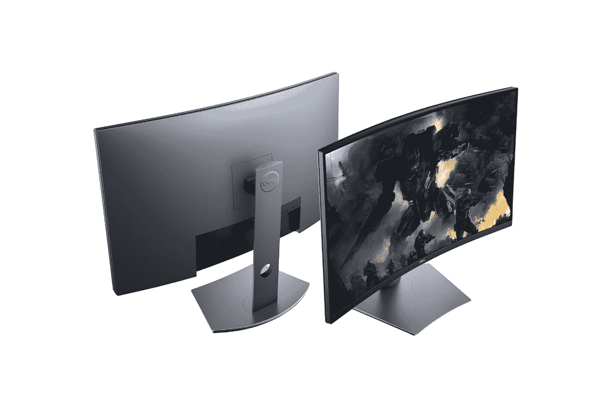

# 在百思买购买戴尔 32 英寸曲面 QHD 游戏显示器，仅需 330 美元

> 原文：<https://www.xda-developers.com/dell-32-inch-curved-qhd-freesync-monitor-black-friday-sale-best-buy/>

曲面显示器可以让您的游戏体验更加身临其境，因为与普通平板显示器相比，它们可以为您提供更广阔的视野。如果你有一个高分辨率，高刷新率面板的曲面显示器，你可以期待有一个奇妙的游戏体验。所以，如果你还在游戏设置上纠结于 1080p 平板显示器，现在是时候让事情更上一层楼了。戴尔的 32 英寸曲面 QHD [FreeSync](https://www.xda-developers.com/tag/freesync/) 游戏显示器目前在这个黑色星期五的百思买上以 330 美元的价格出售，它提供了一切可以帮助您提升设置的东西。戴尔 S3220DGF 通常在百思买和戴尔网站上的零售价为 450 美元，这意味着你可以在这个黑色星期五节省 120 美元，可以在即将到来的 Steam 销售中使用。

 <picture></picture> 

Dell 32-inch curved QHD FreeSync Monitor

##### 戴尔 34 英寸 WQHD 曲面显示器

Dell S3320DGF 是一款出色的曲面游戏显示器，提供 2K 面板，峰值刷新率为 165Hz。售价仅为 330 美元，是目前市场上最好的 1440p 显示器之一。

Dell S3220DGF 曲面游戏显示器采用 32 英寸曲面 VA 面板，分辨率为 2560 x 1440 像素。它提供 165 赫兹的刷新率，AMD FreeSync 和 [HDR 支持](https://www.xda-developers.com/tag/hdr/)，16:9 的宽高比，400 尼特的峰值亮度，以及 4 毫秒的灰阶响应时间。该显示器配有各种端口，包括 2 个 HDMI 2.0 端口、1 个 DisplayPort 1.4 端口、4 个 USB 3.0 Type-A 端口、1 个 3.5 毫米耳机插孔和 1 个音频线路输出插孔。

戴尔 32 英寸游戏显示器配有高度可调的支架，内置电缆管理功能。除了高度调节，支架还提供倾斜和旋转调节，因此您可以根据自己的需要精确定位显示器。如果您不想使用附带的支架，Dell S3220DGF 配有标准的 100 毫米 x 100mm 毫米 VESA 支架。您可以用它将新显示器连接到现有的支架上，或者安装在墙上，腾出一些桌面空间。

为了帮助您在显示器送货上门后立即开始使用，戴尔还在包装盒中提供了一根 HDMI 2.0 电缆、一根 DisplayPort 1.2 电缆和一根 USB 3.0 上行电缆。请注意，如果你想以 165Hz 的频率玩游戏，你必须使用 DisplayPort 电缆，因为 HDMI 端口在 1440p 分辨率下的最高频率为 144Hz。