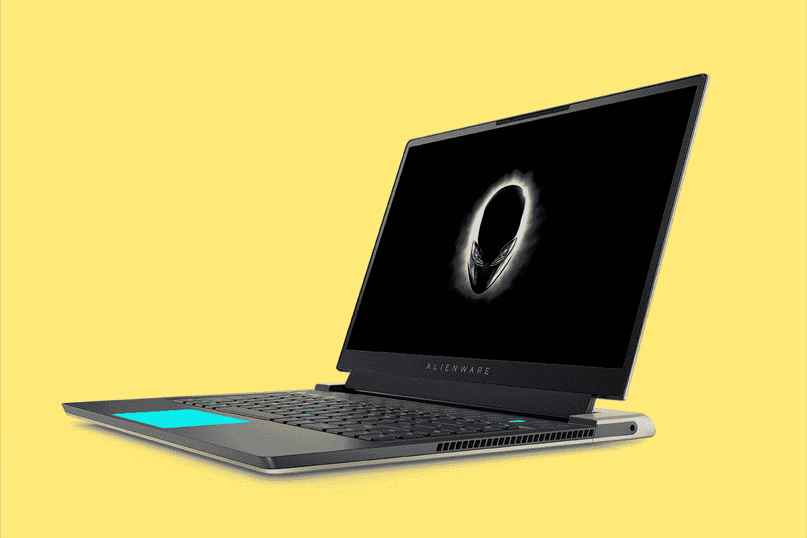
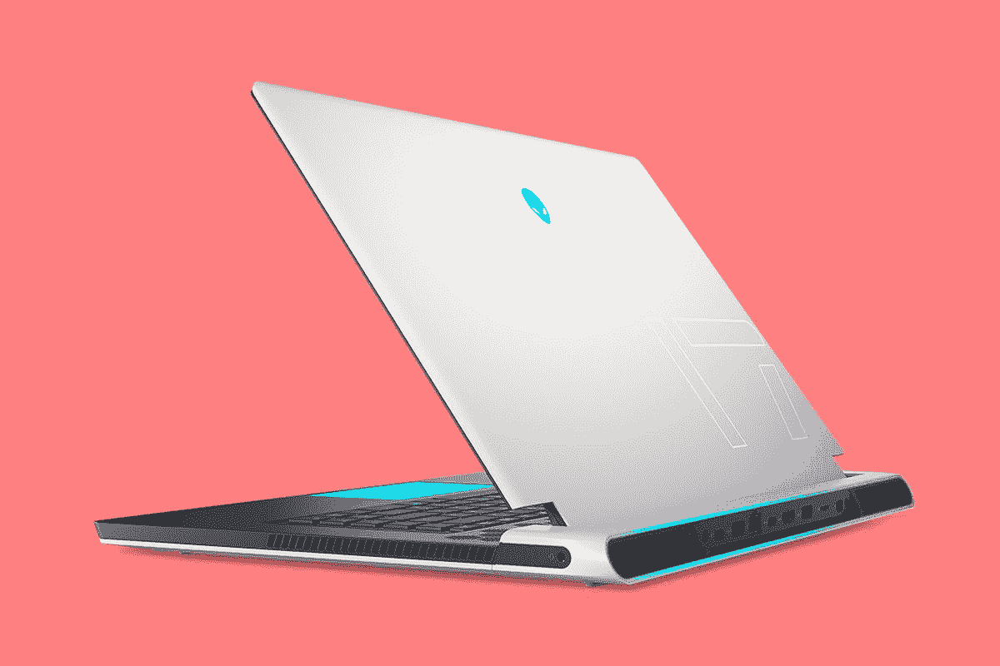
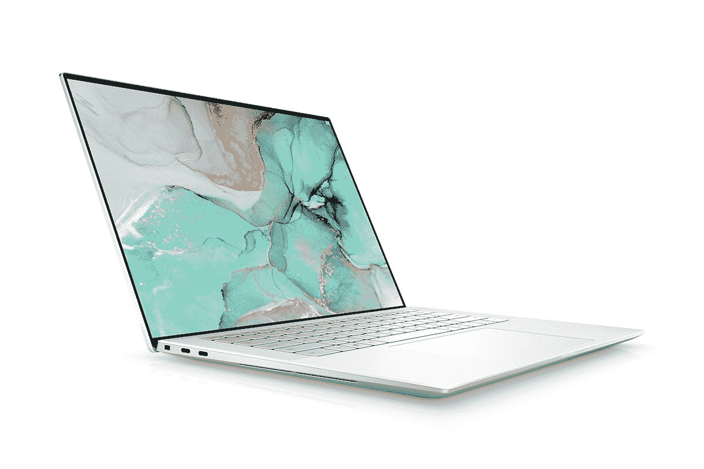
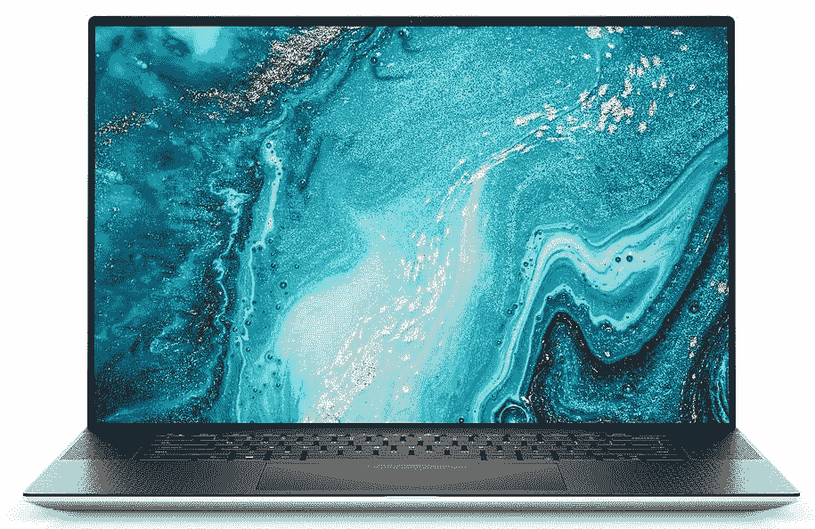
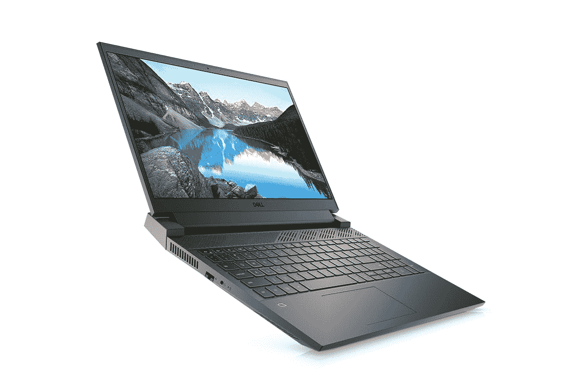

# 戴尔在印度推出最新的外星人 X 系列、XPS 和 G 系列笔记本电脑

> 原文：<https://www.xda-developers.com/dell-alienware-xps-g-series-laptops-india-2021/>

今年 4 月，戴尔在美国推出了最新版本的戴尔 G15 和戴尔 G15 锐龙版。此后不久，该公司在该地区推出了新的外星人 X 系列游戏笔记本电脑，随后是最新的 XPS 15 和 XPS 17 型号。虽然这些笔记本电脑已经在美国销售了一段时间，但它们现在终于进入了印度市场。

## 外星人 X 系列

戴尔的新外星人 X 系列包括两种型号——外星人 x15 和外星人 x17。高端游戏笔记本电脑采用了外星人的标志性设计语言、相对纤薄的机箱和强大的内部功能。这两款笔记本电脑都配备了英特尔最新的第 11 代酷睿 H 系列 CPU 和 NVIDIA GeForce 30 系列显卡、高刷新率显示器和新的 Cryo-Tech 冷却解决方案。外星人 X 系列还提供可选的 Cherry MX 机械键盘，采用 3.5 毫米超薄设计。更多信息，关于最新的外星人 X 系列游戏笔记本电脑，查看[这篇文章](https://www.xda-developers.com/alienware-unveils-x-series/)。

外星人 X 系列将于 9 月 3 日开始通过戴尔网站在印度销售。Alienware x15 的起价为₹2,40,990，而 Alienware x17 的起价为₹2,90,990.

 <picture></picture> 

Alienware x15

##### Dell Alienware x15

外星人 x15 采用 15.6 英寸高刷新率显示屏、英特尔第 11 代酷睿 H 系列处理器和英伟达 RTX 30 系列显卡，采用全新纤薄机箱。

 <picture></picture> 

Alienware x17

##### Dell Alienware x17

外星人 x17 采用 17 英寸高刷新率显示屏、英特尔第 11 代酷睿 H 系列处理器和英伟达 RTX 30 系列显卡，采用全新纤薄机箱。

## Dell XPS 15 & 17

更新的戴尔 XPS 15 和 XPS 17 型号还采用了英特尔第 11 代处理器和英伟达 RTX 30 系列显卡。但是，与外星人 X 系列不同，新的 XPS 系列面向专业人士。因此，它采用了优质的轻量级设计、色彩精确的 16:10 无限边缘显示屏和体面的连接选项。您可以通过点击[此链接](https://www.xda-developers.com/dell-xps-15-xps-17-come-with-11th-gen-processors-rtx-30-graphics/)了解有关最新戴尔 XPS 笔记本电脑的更多信息。

新的戴尔 XPS 笔记本电脑也将于 9 月 3 日开始通过戴尔网站销售。XPS 15 的起价为₹2,23,990，而 XPS 17 的起价为₹2,64,490.

 <picture></picture> 

Dell XPS 15

##### Dell XPS 15

戴尔 XPS 15 是一款面向专业人士的功能强大而轻薄的机器，采用色彩精确的显示屏、英特尔最新的处理器和 NVIDIA RTX 30 系列显卡。

 <picture></picture> 

Dell XPS 17 9710 (2021)

##### Dell XPS 17

戴尔 XPS 17 是一款面向专业人士的功能强大而轻薄的机器，采用色彩精确的显示屏、英特尔最新的处理器和 NVIDIA RTX 30 系列显卡。

## Dell G15 & G15 AMD

最新的 Dell G15 系列笔记本电脑采用了最新的设计、高刷新率显示屏、最高可配第 10 代英特尔酷睿 i7 或 AMD 锐龙 7 5800H 处理器，以及英伟达 RTX 30 系列显卡。这两款笔记本电脑都配备了高达 32GB 的 DDR4 内存、合适的端口选择和最新的无线连接选项。新的戴尔 G15 系列将于 9 月 23 日开始在印度销售。

戴尔 G15 AMD 将在戴尔网站上出售，起价为₹82,990，而英特尔版本的起价为₹94,990.，稍微贵一点有关新戴尔 G15 系列的更多详细信息，请查看[这篇文章](https://www.xda-developers.com/dell-alienware-g-series-gaming-laptops-amd-ryzen/)。

 <picture></picture> 

Dell G15

##### 戴尔 G15

Dell G15 采用了最新的设计、英特尔第 10 代处理器，以及高达 NVIDIA RTX 30 系列显卡，而且价格合理。

 <picture></picture> 

Dell G15

##### 戴尔 G15

Dell G15 AMD 采用了最新的设计，AMD 的锐龙 7 系列处理器，以及高达 NVIDIA RTX 30 系列显卡，价格实惠。