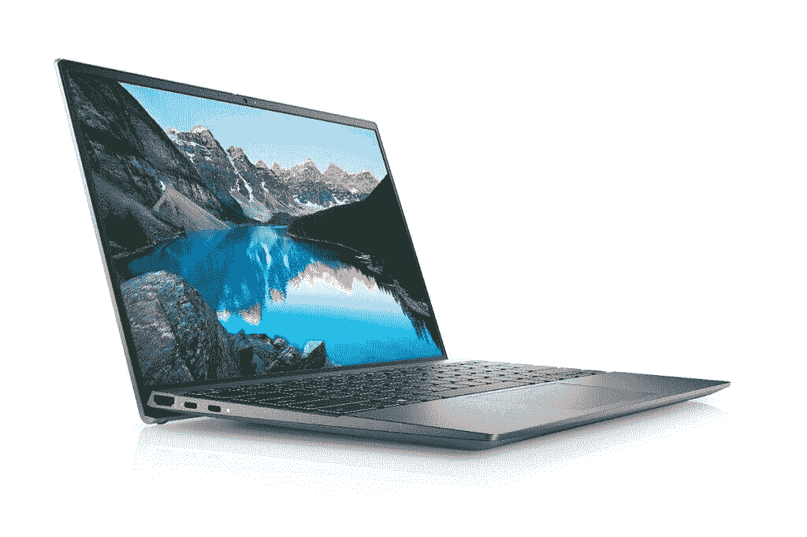

# 戴尔的新 Inspiron 系列配备了英特尔的第 11 代 Tiger Lake-H CPU

> 原文：<https://www.xda-developers.com/dell-inspiron-series-update-intel-11th-gen-tiger-lake-h/>

戴尔正在更新其主流 Inspiron 笔记本电脑系列，为内容创作者推出了新的 13 英寸、14 英寸、15 英寸和 16 英寸机型。所有新的笔记本电脑都配备了最新的第 11 代英特尔 Tiger Lake-H 处理器，这意味着与常规的 Tiger Lake CPUs 相比，您可以获得更好的性能。该公司将带来其[新的 Inspiron 系列](https://www.notebookcheck.net/Dell-refreshes-the-Inspiron-13-14-15-models-with-Tiger-Lake-H-CPUs-and-Nvidia-MX450-dGPUs.531052.0.html)，带有新的酷睿 i5-11300H 和酷睿 i7-11370H，尽管配备酷睿 i3-1115G4 和 i3-1125G4 的基本型号基于 Tiger Lake-U 设计，这意味着轻薄的笔记本电脑。

从 13 英寸 Dell Inspiron 5310 开始，您将获得 16:10 的宽高比显示器，并可选择全高清(1920 x 1080 像素)或四高清+ (2560 x 1600 像素)分辨率，两种面板的峰值亮度均为 300 尼特。它将可配置高达第 11 代英特尔酷睿 i7-11370H CPU、NVIDIA GeForce MX450 GPU、16GB lpddr 4x RAM 和高达 2TB 的 M.2 PCIe NVMe 固态硬盘。内存是焊接在主板上的，用户无法升级。与大多数最新的笔记本电脑一样，这款笔记本电脑也支持 Wi-Fi 6 和蓝牙 5.1，而 I/O 连接选项包括一个 HDMI 端口、一个 USB Type-A 3.2 Gen 1 端口、两个 Thunderbolt 4 端口和一个 3.5 毫米耳机插孔。

 <picture></picture> 

Dell Inspiron 13 5310

除屏幕外，Dell Inspiron 14 (5410)和 Inspiron 15 (5510)的规格相似。Inspiron 灵越 14 配备 14 英寸全高清(1920 x 1，080 像素)分辨率显示屏，而 Inspiron 灵越 15 配备 15.6 英寸全高清(1920 x 1080 像素)分辨率显示屏，面板峰值亮度分别为 250 尼特和 300 尼特。它们将配备高达第 11 代英特尔酷睿 i7-11370H CPU、NVIDIA GeForce MX450 GPU、32GB DDR 4 RAM 和高达 1TB 的 M.2 PCIe NVMe 固态硬盘用于存储。连接选项包括一个 HDMI 端口、一个 Thunderbolt 4 端口、一个 USB Type-C 3.2 Gen2 端口、两个 USB Type-A 3.2 Gen1 端口、一个 SD 读卡器、一个 3.5 毫米耳机/麦克风组合插孔、Wi-Fi 6 和蓝牙 5.0。

戴尔还[推出了](https://www.notebookcheck.net/Dell-introduces-Inspiron-16-Plus-content-creator-laptop-with-16-10-3K-display-Tiger-Lake-H-CPUs-and-up-to-an-Nvidia-RTX-3060-GPU.531055.0.html)一款名为 Inspiron 16 Plus (7610)的 16 英寸新机型。这款手机配备了 16 英寸 3K (3072 x 1920 像素)分辨率的显示屏，峰值亮度为 300 尼特。戴尔没有指定型号，但我们假设它将配备最高第 11 代英特尔酷睿 i7 处理器，图形选项高达 NVIDIA GeForce RTX 3060。它将提供高达 32GB 的 DDR4 内存和 2TB 的 M.2 PCIe NVMe 固态硬盘。笔记本电脑上的连接选项包括一个 HDMI 端口、一个 Thunderbolt 4 端口、两个 USB 3.2 Gen 1 Type-A 端口、一个 SD 读卡器和一个 3.5 毫米耳机/麦克风组合插孔。在无线连接方面，这款机型还支持 Wi-Fi 6 和蓝牙 5.0。其他功能包括高达 86 瓦时的电池，由 Waves MaxxAudio Pro 调谐的立体声扬声器，以及可选的指纹识别器。

谈到价格和可用性，新的戴尔 Inspiron 灵越 13 起价为 599 美元，将于 4 月 12 日上市，而 Inspiron 灵越 14 和 Inspiron 灵越 15 将于 5 月 4 日上市，价格为 549 美元。更大的戴尔 Inspiron 灵越 16 Plus 起价 949 美元，将于 6 月 3 日开始销售。