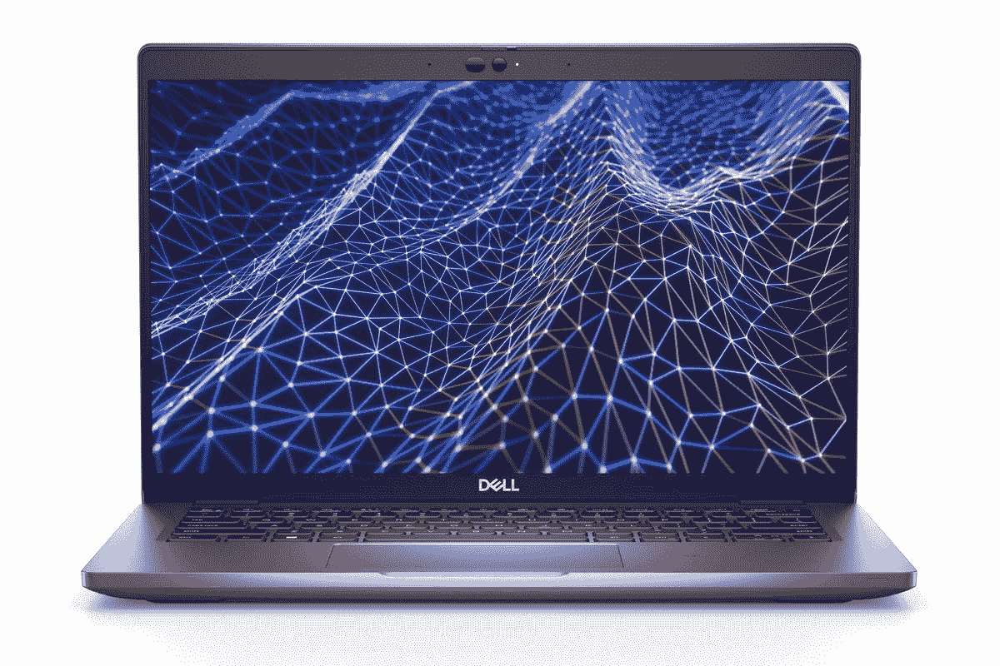

# 戴尔 Latitude 5430 有好的保修期吗？

> 原文：<https://www.xda-developers.com/dell-latitude-5430-warranty/>

在商业环境中，为您的设备提供良好的保修服务是至关重要的，这样才能确保在出现任何问题的情况下，您能够保持运营顺利进行。此外，笔记本电脑等设备可能非常昂贵，因此保修服务可以帮助保护这种投资。戴尔最近推出了 [Latitude 5430](https://www.xda-developers.com/dell-latitude-5430/) ，这是一款主流的，但有点贵的[商务笔记本电脑](https://www.xda-developers.com/best-business-laptops/)，所以你可能想知道它是否有一个好的保修，以防发生意外。好消息是，如果你愿意花钱的话，它确实有用。

戴尔提供四种不同等级的保修服务，价格和条件各不相同。这些服务包括基本保修、戴尔专业技术支持和专业技术支持增强版。让我们仔细看看这些选项意味着什么。

## Dell Latitude 5430 的保修选项

默认情况下，Dell Latitude 5430 配置有一年的基本现场支持。这意味着，如果有任何问题，戴尔将前往您的位置修复您的计算机，并且还包括正常工作时间内的在线和电话技术支持。不过，真正的基本配置是邮寄服务，即您将笔记本电脑送到戴尔进行维修。这个自然便宜，但是没那么方便。无论您选择哪个选项，您都可以将保修期延长至五年，这样您可以享受更长时间的保修。

除了这些基本服务，还有戴尔专业技术支持。如果您升级到专业技术支持层，除了现场服务之外，您还可以获得 24x7 技术支持、直接联系您所在地区的戴尔工程师、指挥中心监控和危机管理，以及利用 Dell SupportAssist 技术自动检测问题(包括通知和案例创建)。

如果您想要更多的服务，您还可以选择戴尔专业技术支持 Plus。除了上述所有内容，ProSupport Plus 还包括更换笔记本电脑时的硬盘保留，包括泼溅和跌落等意外损坏，还包括预测问题检测以防止停机，以及由 Dell SupportAssist 支持的病毒/恶意软件删除。下面是每一层涵盖的内容的分类:

当然，你的保修服务覆盖的范围越广，价格就越贵。所有这些层级都可以延长到五年，这也增加了成本。由于戴尔不断在其网站上进行销售，保修的价格可能会有很大差异，此外还取决于您选择的硬件配置。如果您的配置已经达到极限，那么您可能会在 5 年期专业技术支持+保修服务上花费超过 1，000 美元，但这已经是最高限额了。

* * *

这就是关于 Dell Latitude 5430 保修选项的全部信息，该选项也适用于戴尔生产的大多数商用笔记本电脑。如果这减轻了你对未来几年能否使用笔记本电脑的担忧，你可以使用下面的链接购买。否则，如果你想看看其他选择，你也可以看看今天能买到的[最好的笔记本电脑](https://www.xda-developers.com/best-laptops/)——尽管不是所有的笔记本电脑都提供同样的保修服务。

 <picture></picture> 

Dell Latitude 5430

##### Dell Latitude 5430

Dell Latitude 5430 是一款高度可配置的商用笔记本电脑，采用第 12 代英特尔处理器和高端设计。您可以通过长达五年的保修服务和特优支持来保护它。