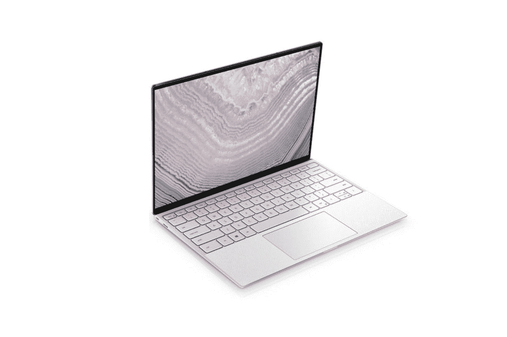

# 购买 Dell XPS 13 笔记本电脑可节省 400 多美元，包括 XDA 最佳笔记本电脑！

> 原文：<https://www.xda-developers.com/dell-xps-13-deal/>

几天前，我们谈论了一次关于 [Galaxy Chromebook](https://www.xda-developers.com/galaxy-chromebook-samsung-store-deal/) 的销售，这是我们最喜欢的学生用 Chromebook 之一。但是如果，比方说...你就是不喜欢 Chromebooks？这是可以理解的，因为使用 Chrome OS 的怪癖有时会很烦人，根据你对应用程序的需求，你可能会完全需要 Windows OS。别担心，我们不会把你排除在外的！现在，戴尔 XPS 13 是我们认为的附近[最好的笔记本电脑！](https://www.xda-developers.com/best-laptops/)

嗯，不仅仅是 [Dell XPS 13 9310](https://www.anrdoezrs.net/links/100122946/type/dlg/sid/UUxdaUeUpU31425/https://www.dell.com/en-us/shop/cty/pdp/spd/xps-13-9310-laptop/xn9310cto235h) 在售，这是 XDA 整体最佳笔记本电脑选择，而是所有 XPS 13 系列，因此您可以选择最符合您需求的笔记本电脑。目前，在戴尔，他们为所有 XPS 13 笔记本电脑提供 209 美元的即时折扣。这本身就是一笔不错的交易，但是那些有鹰眼的人可能会注意到，209 美元的折扣加起来不超过 400 美元！要获得全额折扣，你需要使用 **SAVE12** 优惠券代码，它可以在售价的基础上再打 12%的折扣。

对于 XPS 13 9310 触控笔记本电脑，优惠券代码将 1959 美元的价格降低了 419 美元，使新的总价格仅为 1540 美元。凭借第 11 代英特尔处理器、13.4 英寸 UHD+显示屏、16GB 内存和 512GB 固态硬盘，它确实是最佳的高端选择之一。

 <picture></picture> 

Dell XPS 13 (9310)

##### Dell XPS 13 9310

以 1，540 美元的价格获得 XDA 评选的最佳笔记本电脑！在结账时使用代码 **SAVE12** 获得全额折扣。

不过，那还是很贵。如果您的笔记本电脑不需要如此强大的规格，您可以选择普通的戴尔 XPS 13。它仍然是强大的第十代英特尔处理器，UHD 显示屏，8GB 内存和 256 固态硬盘，这仍然是一个非常称职的笔记本电脑！使用 **SAVE12** 后，这款 XPS 13 型号为 792 美元。

 <picture></picture> 

Dell XPS 13 (9310)

##### Dell XPS 13

如果 9310 仍然太贵，不要担心-你可以以 792 美元的价格购买基本型号 XPS 13！在结账时使用代码 **SAVE12** 获得全额折扣。

目前还不清楚 209 美元的统一折扣会持续多久，但 **SAVE12** 代码只会在明天结束前有效。还有融资选择，千万不要错过！