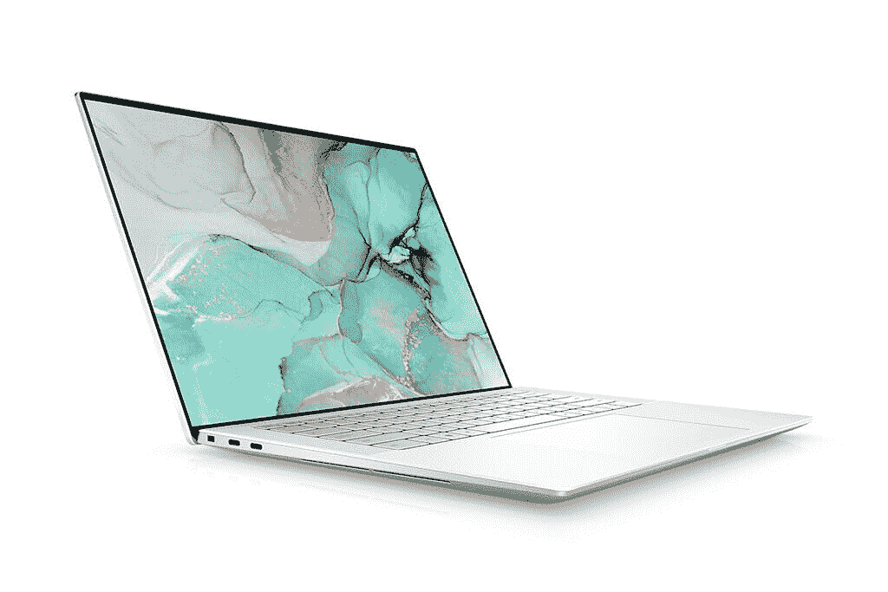
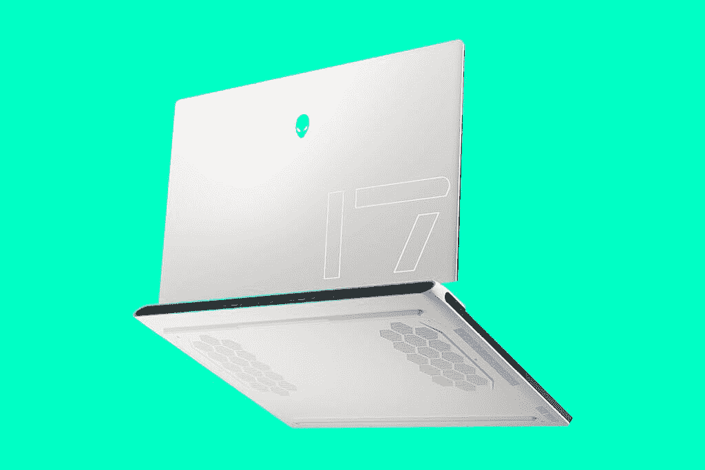
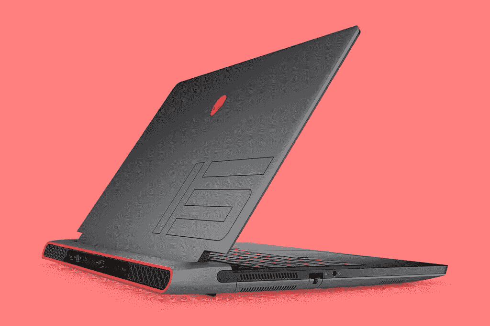
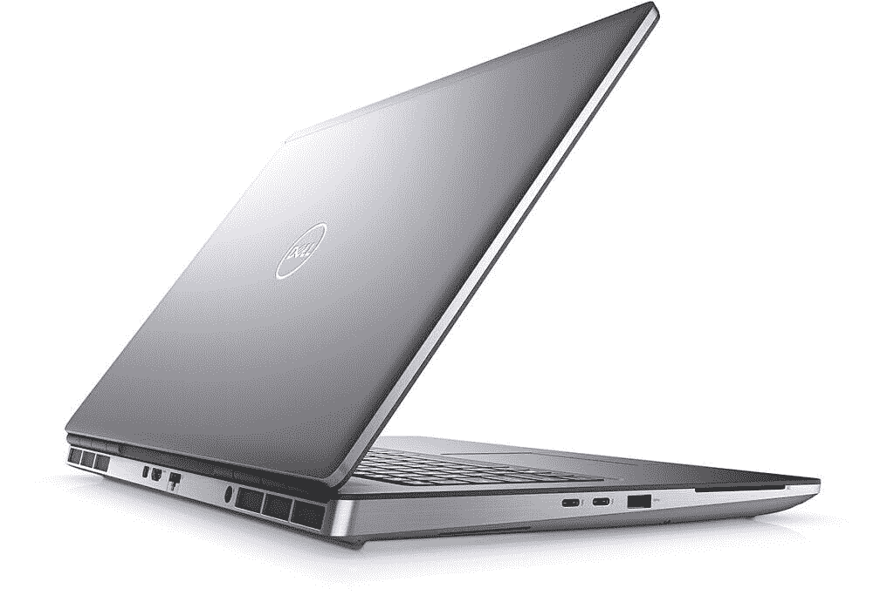
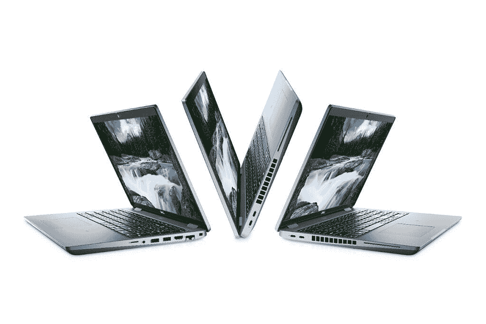

# 戴尔 XPS 15 和 XPS 17 采用第 11 代 CPU 和 RTX 30 显卡

> 原文：<https://www.xda-developers.com/dell-xps-15-xps-17-come-with-11th-gen-processors-rtx-30-graphics/>

今天是新的英特尔处理器日，该公司[推出了用于游戏笔记本电脑、创作型笔记本电脑和移动工作站的 Tiger Lake-H 处理器](https://www.xda-developers.com/intel-announces-11th-gen-processors-gaming-laptops/)。这意味着一大堆原始设备制造商也在排队宣布他们的产品。这包括戴尔，虽然它有很多东西可以炫耀，但阵容中的佼佼者是新的 XPS 15 和 XPS 17，这两款是去年的[最佳笔记本电脑](https://www.xda-developers.com/best-laptops/)。

首先，它们都配备了英特尔新的第 11 代处理器。戴尔 XPS 15 9510 配备了高达 i9-11900H 的酷睿，而更强大的 XPS 17 9710 配备了未锁定的酷睿 i9-11980HK。在显卡方面，XPS 15 配备了 NVIDIA 新发布的 GeForce RTX 3050 或 3050 Ti，这是 XPS 15 首次配备 RTX 显卡。戴尔 XPS 17 将从 RTX 2060 升级到更新的 RTX 3060。

 <picture></picture> 

Dell XPS 15 9510

这些是关键的变化。XPS 15 上还有一个新的显示选项，即有机发光二极管。您可能还记得，当 XPS 15 9500 问世时，这是该产品五年来的首次重新设计。显示器的纵横比从 16:9 变为 16:10，因此有机发光二极管选项被移除。现在，它以 3，456x2，160 的分辨率回归。如果你仍然喜欢非有机发光二极管，那 3，840x2，400 面板仍然可用。对于 XPS 17，仍然没有有机发光二极管选项，因为根本没有供应商生产 17 英寸有机发光二极管面板。

另一个重要的变化是雷电 4。虽然如果 OEM 使用所有四个通道，雷电 3 在技术上可以做 Thunderbolt 4 所做的一切，但戴尔没有。戴尔在其高端 XPS PCs 上使用了雷电 3 的最低规格，因此这是一次重大升级。XPS 15 有两个 Thunderbolt 4 端口，而 XPS 17 有四个。

戴尔 XPS 15 和 XPS 17 的起价分别为 1249.99 美元和 1449.99 美元。

**更新:**戴尔更新了新款 XPS 笔记本电脑的定价。这个故事的早期版本是 XPS 15 起价 1199.99 美元，XPS 17 起价 1399.99 美元。

 <picture></picture> 

Alienware X17

下一个是外星人。戴尔从该系列中推出了一个新的 X 系列，从外星人 X17 开始。它配备了第 11 代处理器和 RTX 30 系列显卡，还承诺采用由镓硅制成的 Element 31 热接口材料。这是为了降低热阻，戴尔称这是同类产品中的第一款。它还有一个新的四风扇设计，这显然是为了改善热量。

X 系列只是一个预告片，所以没有发布日期。

 <picture></picture> 

Alienware m15 R6

至于准备发货的产品，有新的外星人 m15 和戴尔 G5，后者是我们认为最便宜的游戏笔记本电脑之一。这里没有任何设计上的改变。它们配备了第 11 代 CPU 和 NVIDIA GeForce RTX 30 系列显卡。它们的起价分别为 949.99 美元和 1，299.99 美元。

 <picture></picture> 

Dell Precision 7760

接下来是戴尔的 Precision 移动工作站。即将推出新的 Precision 3561、Precision 5560、Precision 5760、Precision 7560 和 Precision 7760。是的，是时候刷新所有的东西了。产品编号的第一个数字是层级，所以 7000 系列是最好的。第二个数字是屏幕尺寸，因此 7560 是 15 英寸的笔记本电脑，而 7760 是 17 英寸的笔记本电脑。

在 Precision 7760 和 Precision 7560 产品系列中，戴尔的目标是更薄的边框、更小的占地面积和更轻的设计。然而，这些仍然是非常强大的机器，用来完成最复杂的任务。Precision 7760 最高可配备酷睿 i9-11980HK 或至强 W-11955M，具体取决于您的工作负载。对于图形，它配备了高达 16GB GDDR6 内存的英伟达 RTX A5000。

戴尔表示，随着发布日期的临近，它将提供新移动工作站产品组合的定价。

 <picture></picture> 

Dell Latitude 5521

最后，还有一些新的 Latitude 笔记本电脑，特别是 Latitude 5421 和 Latitude 5521。这是同样的交易，升级到第 11 代处理器。不过，戴尔没有为他们提供任何定价或供货信息。