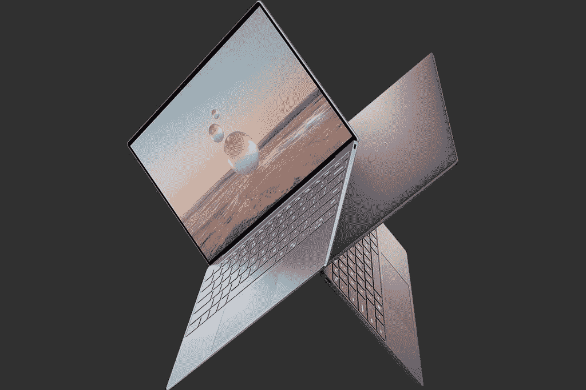
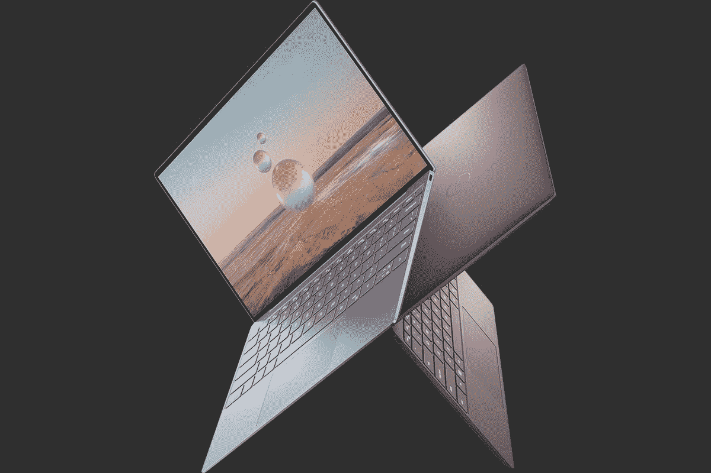
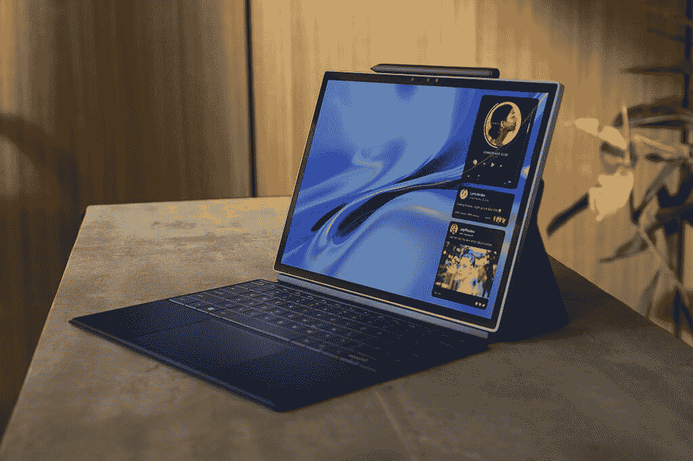

# 戴尔的新款 XPS 13 和 XPS 13 二合一设备都经过了全新设计

> 原文：<https://www.xda-developers.com/dells-new-xps-13-xps-13-2-in-1-totally-redesigned/>

今天，戴尔推出了全新的 XPS 13 和 XPS 13 二合一设备。你可能还记得今年早些时候，该公司推出了[戴尔 XPS 13 Plus](https://www.xda-developers.com/dell-xps-13-plus/) ，这是一款现代化的笔记本电脑。但如果你认为这是公司重新设计的终结，那你就错了。有了全新的 Dell XPS 13 和 XPS 13 二合一设备，一切都变了。

## 史上最薄最轻的 Dell XPS 13

事实上，戴尔最近重新设计了 XPS 13。当它将网络摄像头移到屏幕上方，给它 16:10 的宽高比，并缩小下巴尺寸时。此后，XPS 15 和 XPS 17 采用了相同的设计，但尽管明显不同，它仍然保持了经典的 XPS 外观。这是全新的东西。

 <picture></picture> 

Dell XPS 13

正如你从图片中看到的，不再有黑色碳纤维掌托和银色外观。仍然由数控加工铝制成，有两种颜色:天空和棕色。与新的戴尔 XPS 13 Plus 不同，按键仍然是孤岛式的，它仍然有传统的触摸板。此外，它没有获得 Plus 型号获得的 P 系列处理器；相反，它使用英特尔的 9W U 系列处理器，由于戴尔的冷却解决方案，该处理器的功率提高到 12W，并且仍然承诺比上一代的 15W U 系列处理器更强大。

它的厚度为 13.9 毫米，重量为 2.55 磅，是迄今为止最薄、最轻的戴尔 XPS 13。事实上，该公司提到了其技术逐渐淡出背景的使命，从其 InfinityEdge 显示屏开始，一直到该产品有多薄、轻、易于携带。为了缩小到这个尺寸，戴尔将主板制作得比 2021 型号小 1.8 倍。

 <picture></picture> 

Dell XPS 13

至于其他规格，它配备了 13.4 英寸 FHD+或 UHD+显示屏，最高 32GB LPSSR5-5200 内存，最高 1TB 固态硬盘。不幸的是，网络摄像头仍然是 720p，尽管 XPS 13 仍然符合英特尔的 Evo 规格，这要归功于英特尔的积分系统，它弥补了 FHD 网络摄像头在其他领域的不足。

它还配备了 51 瓦时的电池，戴尔称其电池续航时间可达 12 小时。

戴尔 XPS 13 从今天开始发售，起价 999 美元，戴尔 XPS 13 开发者版(包括 Ubuntu 20.04)起价 949 美元。

 <picture></picture> 

Dell XPS 13 9315

##### Dell XPS 13 9315

全新的戴尔 XPS 13 进行了彻底的重新设计，有天空色和棕色可选。它也是有史以来最薄最轻的 XPS 笔记本电脑。

## 戴尔 XPS 13 2 合 1 现在是一款平板电脑

Dell XPS 13 二合一设备过去是一款配备 360 度转轴的平板电脑，现在是一款平板电脑，类似于 Surface Pro。然而，与多年前 Surface Pro 的克隆版 Windows 平板电脑不同，戴尔的 XPS 13 二合一设备具有更独特的设计。

 <picture></picture> 

Dell XPS 13 2-in-1

除了全新的设计，XPS 系列还有许多第一次。事实上，这是第一台配备 1080p 网络摄像头的戴尔 XPS PC，这在家庭办公和视频通话的时代是一件大事。这是我们在采用第 12 代处理器的英特尔 Evo 电脑中普遍看到的情况，这始终是一个受欢迎的变化。背面还有一个面向世界的 4K 相机。

另一件事是，它是第一款包含蜂窝连接的戴尔 XPS，特别是 5G。这意味着无论你走到哪里，你都可以无缝连接到互联网。事实上，当你谈论技术退居幕后时，不必关心如何连接到互联网是一个很好的方式。

 <picture></picture> 

Dell XPS 13 2-in-1

这款手机的 13 英寸显示屏为 3:2，分辨率为 2，880x1，920，配有 LPDDR4x 内存和 9W 第 12 代处理器。起始重量为 1.6 磅，起始厚度为 7.4 毫米。5G 型号厚半毫米，重 0.2 磅。

Dell XPS 13 二合一设备将于今年夏天上市，定价将于稍后公布。只有 Wi-Fi 的型号与 XPS 13 有相同的天空颜色，5G 型号有石板色。