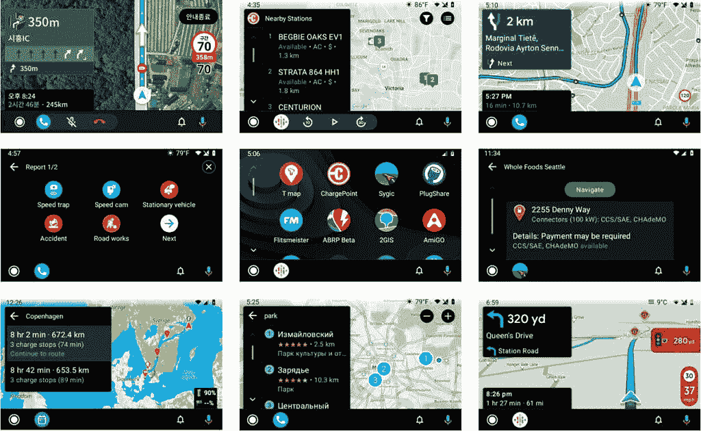

# 开发者现在可以向 Google Play 发布用于充电、导航和停车的 Android 汽车应用

> 原文：<https://www.xda-developers.com/developers-publish-android-auto-charging-navigation-parking-apps-google-play/>

去年 8 月，谷歌[宣布](https://www.xda-developers.com/google-expands-android-automotive-os-android-auto-support-car-manufacturers-developers/)已经开始与开发者合作，将一系列第三方导航、停车和电动汽车充电应用程序引入 Android Auto。声明发布几个月后，谷歌[发布了测试版的 Android for Cars 应用程序库](https://www.xda-developers.com/google-releases-android-for-cars-app-library-developers-create-apps-android-auto/)，允许第三方应用程序开发者在 Android Auto 平台上设计、开发和测试他们的应用程序。去年年底，该公司开始允许开发者发布使用这个库构建的应用，Sygic 是[第一个利用这一点的人。](https://www.xda-developers.com/sygic-available-android-auto-alternative-google-maps-waze/)

今年早些时候，谷歌宣布它正致力于将 Android for Cars 应用程序库迁移到 Android Jetpack。该公司还开始允许开发者在开放的测试轨道上发布使用该库构建的应用程序。上个月初，图书馆[在 Jetpack](https://www.xda-developers.com/google-jetpack-android-auto-wear-os-tiles-screen-extension/) 上可用，该公司现在终于允许开发者在 Google Play 上发布他们的导航、停车和充电应用。

 <picture></picture> 

Third-party apps running on the Jetpack library (clockwise from upper left): T map, Chargepoint, Sygic, Plugshare, AmiGO, 2GIS, A Better Route Planner, and Flitsmeister (Image: Google)

在最近一篇关于此事的博客文章中，谷歌的 Eric Bahna 写道，*“今天，我们很兴奋地宣布，你可以发布你的 Android 自动导航、停车和充电应用了！我们一直在努力稳定库、Android Auto 和发布流程，以达到这一里程碑。发布到生产使司机能够在他们的汽车屏幕上使用您的 Android Auto 应用程序，而无需注册测试程序。”*

要在 Google Play 上发布您的 Android Auto 应用程序，您需要:

目前，开发者只能在 Google Play 上发布导航、停车和充电应用。但我们预计谷歌在不久的将来会扩展到更多类别。一旦发生，我们会让你知道。