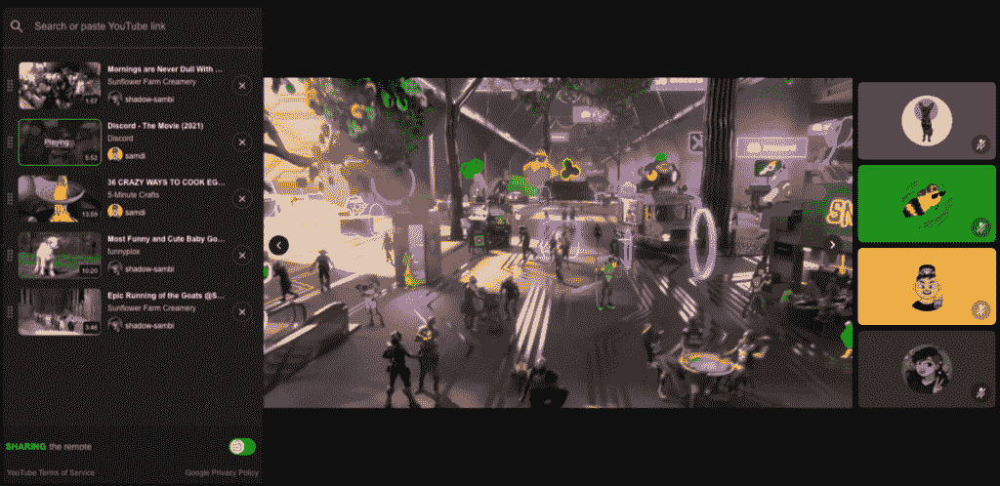
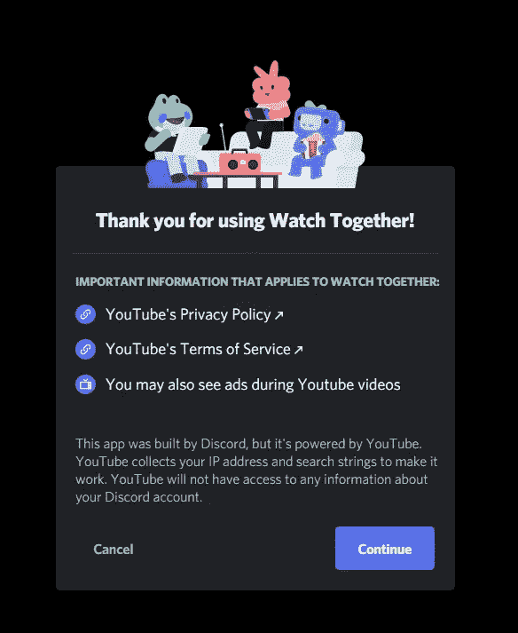

# Discord 正在推出原生的 YouTube“一起看”整合

> 原文：<https://www.xda-developers.com/discord-adding-youtube-watch-together/>

# Discord 正在推出原生的 YouTube“一起看”整合

Discord 正在添加一个新的观看功能，将 YouTube 集成到聊天客户端，但你可能会在观看视频时看到一些广告。

几周前，YouTube [关闭了](https://gizmodo.com/youtube-forces-popular-discord-music-bot-to-shut-down-1847664573) [Discord](https://www.xda-developers.com/tag/discordapp/) 平台上的两个流行音乐机器人。这些机器人允许数百万用户在消息和社交平台上听 YouTube 上的音乐。Discord 正准备推出一个新的“一起观看”功能，以帮助减轻这些停工的痛苦。

正如 [*The Verge*](https://www.theverge.com/2021/9/22/22687492/discord-youtube-integration-watch-together-feature-beta) 所发现的，Discord 已经开始首先向朋友和家人的服务器部署“一起观看”功能，其他类型的服务器将紧随其后。它让用户能够开始观看会话，类似于其现有的屏幕共享功能的工作方式。YouTube 视频链接可以添加到播放列表中，媒体控件可以在会话中与其他人共享。

 <picture></picture> 

The new "Watch Together" feature in action. Credit: The Verge

类似的功能早在 10 个月前就已经开发出来了。该公司[在 Reddit](https://www.reddit.com/r/discordapp/comments/jtnso2/social_party_games_on_discord/) 上分享的一个功能是直接在 Discord 应用程序中玩共享社交游戏。由于最近音乐机器人的关闭，新的一起观看功能显然被转移到了高优先级，以给用户提供一种一起听音乐的新方式。然而，用户会被警告，他们可能会在 YouTube 视频中看到广告。

 <picture></picture> 

Ads warning for Watch Together. Image Credit: The Verge

Discord 计划很快在较小的服务器上推出该功能，所有用户和服务器将在 10 月底看到该功能。