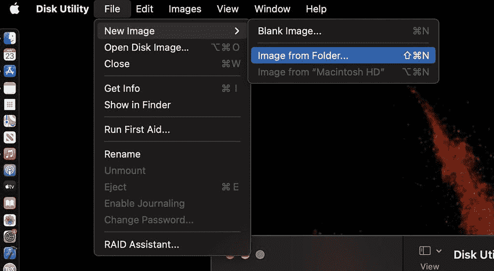

# Mac 上的磁盘工具是什么，它可以执行哪些功能？

> 原文：<https://www.xda-developers.com/disk-utility-mac/>

苹果的 macOS 由于其直观的界面和相对易用性而非常受欢迎。此外，苹果设计了吸引人的硬件，不断将他们的一些选项列入我们的最佳笔记本电脑名单。虽然您的 Mac 可能大部分时间都运行良好，但偶尔需要对潜在问题进行故障诊断。当您需要诊断/修复硬盘驱动器的问题时，Mac 上的“磁盘工具”是完成这项工作的应用程序。您也可以使用此应用程序来创建磁盘映像。

“磁盘工具”是第三方 macOS 应用程序，位于“实用工具”文件夹中。“磁盘工具”应用程序最常见的用途是检查磁盘或宗卷上的错误。此工具也有助于修复您的磁盘问题，如果它检测到任何问题。除了这个简单的用例之外，许多用户从未探索过磁盘工具。正如我们将看到的，Mac 上的磁盘工具提供了许多其他强大的工具。

## 使用“磁盘工具”检查并修复磁盘和宗卷上的错误

使用“磁盘工具”可以轻松检查磁盘和宗卷中的错误。如果你正在经历多个应用程序崩溃、文件损坏或突然重启，那么这是一个很好的探索选项。

要检查和修复磁盘，您需要依次在存储设备上的每个卷和容器上运行急救，然后在存储设备本身上运行急救。在对每个宗卷和磁盘本身运行急救后，您会收到一份发现任何错误的报告。通常，发现的任何问题都会自动修复。如果您收到一条错误消息，系统会提供重新格式化磁盘或更换硬盘(如果无法修复)的说明。

## 使用“磁盘工具”格式化和管理物理储存设备上的宗卷

在深入了解“磁盘工具”的这种流行用法之前，理解磁盘和宗卷之间的区别很重要。这些词经常出现在“磁盘工具”菜单中。术语“磁盘”指的是物理硬盘驱动器本身。卷只是磁盘的格式化部分。因为卷是磁盘的子集，所以如果您擦除磁盘，其中包含的所有卷也会被删除。另一方面，您可以抹掉特定的宗卷，而不抹掉整个磁盘。

为了区分抹掉卷和抹掉磁盘，我们经常说我们正在格式化磁盘。这个概念很重要。这是因为“磁盘工具”提供了抹掉宗卷的选项和格式化特定磁盘的能力。如果您对擦除卷感兴趣，您可以选择基本和安全选项。格式化整个磁盘比抹掉宗卷需要更长的时间，但是“磁盘工具”中也提供了此选项。请注意，如果您想要格式化您的启动磁盘，那么您必须引导到 macOS 恢复模式，并从菜单中选取“磁盘工具”。

## 使用“磁盘工具”创建磁盘映像来加密文件夹

磁盘映像是一个文件，您可以使用它将文件从一台电脑移到另一台电脑，或者备份和归档您的工作。“磁盘工具”允许您创建新的磁盘映像，甚至使用映像来加密 Mac 上的文件夹。

## 

从文件夹创建新的磁盘映像已经是“磁盘工具”中的一个菜单选项，非常容易使用。值得记住的是，大文件夹可能需要相当长的时间来加密。加密文件夹后，很容易将它们移动到外部存储设备以释放硬盘上的空间。

## 将多个硬盘组合成一个 RAID 磁盘阵列，充当单个磁盘

“磁盘工具”的最后一个常用用法更高级一些。在 RAID 磁盘阵列中使用多个硬盘可以提高数据储存系统的性能、可靠性和储存容量。许多高级用户更喜欢维护 RAID 磁盘阵列，以提高视频编辑等多媒体应用程序的性能。与[功能强大的 15 英寸笔记本电脑](https://www.xda-developers.com/best-15-inch-laptops)配合使用时，实施 RAID 阵列可以提高创作者的工作效率和写入速度。在 OS X El Capitan 删除 RAID 阵列之后，创建和管理 RAID 阵列的功能最近又回到了 macOS。

在“磁盘工具”中，您可以找到创建和管理四种流行 RAID 版本的选项:

*   RAID 0(条带化)
*   RAID 1(镜像)
*   RAID 10(条带化驱动器的镜像集)
*   JBOD(只是一堆磁盘)

这些配置各有利弊，但默认情况下，每种配置都在 Disk Utility 中进行无缝管理。请记住，如果您尝试 RAID 配置，最重要的第一步是备份您的所有数据！如果你的 Mac 需要一个好的外部存储选项，请查看我们的[最佳 Mac 配件列表](https://pocketnow.com/best-mac-accessories)。

* * *

“磁盘工具”是最有用的本机 macOS 应用程序之一，用于对硬盘驱动器的问题进行故障诊断。此外，您还可以从应用程序中执行一些重要的备份和加密任务。如果您是高级用户，您可能会发现 RAID 创建和管理工具对您的工作流程很有用。在 Mac 的整个生命周期中，您不需要过于频繁地修复问题。然而，知道“磁盘工具”会有所帮助应该会让您放心。