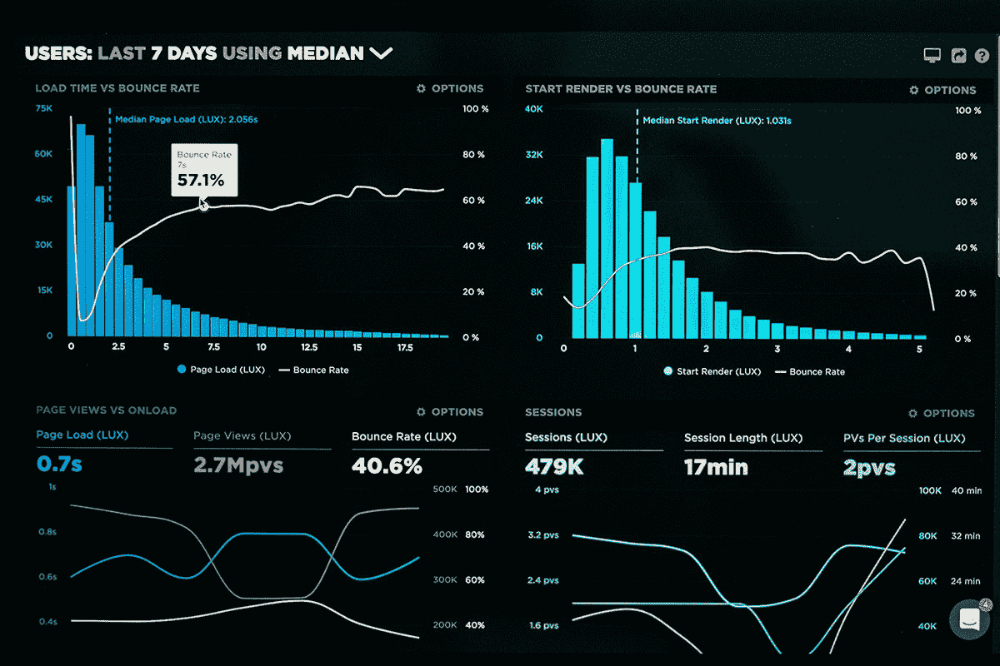

# 深入研究数据，这些 Microsoft Excel 课程的折扣超过 90%

> 原文：<https://www.xda-developers.com/dive-into-data-with-over-90-off-these-microsoft-excel-courses/>

从金融到营销，数据在许多不同的行业中都扮演着举足轻重的角色。为了引起招聘人员的注意，展示你能处理这些数字是很重要的。这里有七个关于顶级 Microsoft Excel 培训的交易——现在在 XDA Developers Depot 有超过 90%的全价折扣。

## **终极微软 Excel 认证培训包**

****

要获得全面的 Excel 教育，只需看看这份包含六门课程的套餐。通过 33 个小时的内容，你从完全的初学者到认证专家。内容包括公式和函数、数据可视化、数据分析、宏、VBA 等等。

花费 33.99 美元获得 [终极微软 Excel 认证培训套装](https://depot.xda-developers.com/sales/the-ultimate-excel-bundle?utm_source=xda-developers.com&utm_medium=referral&utm_campaign=the-ultimate-excel-bundle&utm_term=scsf-490327&utm_content=a0x1P000004f4VRQAY&scsonar=1) (注册 945 美元)，节省了 96%。

## **专业微软 Excel 认证培训包**

****

了解基础知识并想让自己的技能更上一层楼？这个套装提供了八门专注于专业 Excel 技巧的课程。在 45 小时的教程中，您将了解到 Power Query、Power Pivot、DAX、模型、宏等等。内容来自 Chris Dutton，微软 Excel 认证专家，畅销书在线导师。

花费 39 美元获得 [专业微软 Excel 认证培训套装](https://depot.xda-developers.com/sales/the-a-to-z-microsoft-excel-certification-training-bundle?utm_source=xda-developers.com&utm_medium=referral&utm_campaign=the-a-to-z-microsoft-excel-certification-training-bundle&utm_term=scsf-490326&utm_content=a0x1P000004f4VRQAY&scsonar=1) (注册 1600 美元)，节省了 97%。

## **高级微软 Excel 软件包。艾伦·贾维斯&克里斯·达顿**

****

这款套餐包含 10 道菜，名副其实。这些课程将带您了解三个不同级别的 Excel 技能，总共超过 43 个小时的培训。你的导师包括克里斯·达顿和艾伦·贾维斯，他在 Udemy 上帮助了 80，000 多名学生。

以 39.99 美元的价格获得 [微软 Excel 高级套装](https://depot.xda-developers.com/sales/the-2020-ultimate-microsoft-excel-certification-training-bundle?utm_source=xda-developers.com&utm_medium=referral&utm_campaign=the-2020-ultimate-microsoft-excel-certification-training-bundle&utm_term=scsf-490329&utm_content=a0x1P000004f4VRQAY&scsonar=1)(reg。1732 美元)，节省了 97%。

## 高级 2021 Microsoft Excel 和数据认证捆绑包

这个庞大的学习库汇集了 24 门全长课程，帮助您掌握使用 Microsoft Excel 和 Power BI 进行数据分析。你还会得到关于 VBA、金融 Python、SAS 编程、Google Sheets、Tableau 分析等等的培训。培训来自专家导师，比如顶级的 Excel Maven。

以 69.99 美元(注册价 2，376 美元)的价格获得[Premium 2021 Microsoft Excel&数据认证包](https://depot.xda-developers.com/sales/the-microsoft-and-data-power-super-certification-bundle?utm_source=xda-developers.com&utm_medium=referral&utm_campaign=the-microsoft-and-data-power-super-certification-bundle&utm_term=scsf-490328&utm_content=a0x1P000004f4VRQAY&scsonar=1)，节省 97%。

## **一体化 Microsoft Excel 认证培训包**

如果您计划使用 Excel 进行商业智能和财务预测，这个软件包可以帮助您建立完美的技能组合。它包括 10 门课程，侧重于 Excel 的实际应用，如股票数据科学和人力资源管理。你总共可以得到超过 50 小时的内容。

花费 33.99 美元获得 [微软 Excel 认证培训套装](https://depot.xda-developers.com/sales/the-all-in-one-microsoft-excel-certification-training-bundle?utm_source=xda-developers.com&utm_medium=referral&utm_campaign=the-all-in-one-microsoft-excel-certification-training-bundle&utm_term=scsf-490317&utm_content=a0x1P000004f4VRQAY&scsonar=1) (注册号 2000 美元)，节省了 98%。

## **Excel 大学:会计自动化&金融**

当你不得不每天运行相同的计算时，知道如何自动化这些任务可以节省大量的时间。Excel 大学的这个包向您展示了如何通过屡获殊荣的讲师和注册会计师 Jeff Lenning 的 22 小时培训。

获得 [Excel 大学:会计自动化&金融捆绑](https://depot.xda-developers.com/sales/excel-university-excel-automation-skills-for-accounting-and-finance-course-bundle?utm_source=xda-developers.com&utm_medium=referral&utm_campaign=excel-university-excel-automation-skills-for-accounting-and-finance-course-bundle&utm_term=scsf-490324&utm_content=a0x1P000004f4VRQAY&scsonar=1) 售价 29.99 美元(reg。636 美元)，节省了 95%。

## **用微软 Excel 2019 动手机器学习【电子书】**

自动化的下一步是机器学习。来自 Packt Publishing 的这本 254 页的电子书向您展示了如何在 Excel 工作流程中利用智能模型。该指南评级为 4.3 星，涵盖功能、插件、云服务等内容。

花费 9.99 美元获得 [用微软 Excel 2019](https://depot.xda-developers.com/sales/hands-on-machine-learning-with-microsoft-excel-2019?utm_source=xda-developers.com&utm_medium=referral&utm_campaign=hands-on-machine-learning-with-microsoft-excel-2019&utm_term=scsf-490325&utm_content=a0x1P000004f4VRQAY&scsonar=1) 【电子书】(reg。31 美元)，节省了 68%。

*价格随时变化*