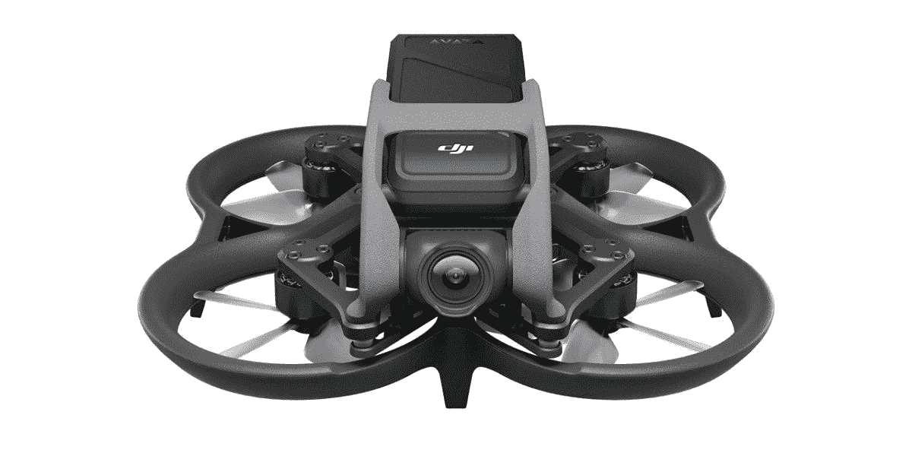

# DJI 推出其最新的 FPV 无人机 Avata

> 原文：<https://www.xda-developers.com/dji-avata-makes-its-official-debut/>

经过几个月的泄露和谣言，DJI 终于发布了它的 Avata 无人机。凭借这款新型无人机，DJI 继续扩大其产品组合。然而，Avata 没有进入该公司通常的[无人机类别](https://www.xda-developers.com/dji-officially-announces-its-sub-249-gram-mini-3-pro/)，而是扩展了其 FPV 产品线，提供了一种对初学者更友好的产品。除了无人机，DJI 还首次推出了一种新的耳机，护目镜 2。

Avata 看起来与 DJI 以前的参赛作品不同，主要是因为无人机内置的螺旋桨防护装置。这使得无人机可以接触到物体，但仍停留在空中。这意味着更少的时间在地面上，更多的时间飞行和娱乐。此外，如果你碰巧坠毁了，无人机有一种叫做海龟模式的东西，这种模式允许无人机在背部着陆时自行校正。Avata 还有一个紧急制动按钮，可以在飞行途中停止无人机，防止潜在的事故。

虽然 DJI Avata 可以使用传统的控制器进行控制，但它也可以接受来自 DJI 运动控制器的输入。虽然它是在 2021 年发布的，但控制器相当有趣，让飞行员能够使用手势导航无人机。只需将控制器向前倾斜，无人机就会向前飞；向右或向左倾斜手腕，让无人机转弯。真的就这么简单。

至于相机，Avata 封装了一个 1/1.7 英寸的 CMOS 传感器，光圈为 f/2.8。它提供了一个广阔的视野，可以达到 155 度，支持每秒 60 帧的 4K 记录。该无人机还将通过 DJI 的 RockSteady 2.0 和 HorizonSteady 功能保持画面流畅。那些有兴趣用他们的无人机镜头创造一个更专业的外观的人会欣赏 DJI 的 D-Cinelike 视频色彩配置文件。

如前所述，除了新的无人机，该公司还宣布了一套新的护目镜，DJI 护目镜 2。护目镜 2 重量轻，体积小，采用 1080p 微有机发光二极管显示器，提供最佳的视觉体验。如果一套新的护目镜不是你想要的，Avata 还为 DJI 的 FPV 护目镜 V2 提供支持。这款无人机现已上市，起价 629 美元，组合售价高达 1388 美元。

 <picture></picture> 

DJI Avata

##### 蒂杰神通

DJI 的 Avata 无人机非常适合初学者和专业人士

* * *

**来源** : [DJI](https://www.dji.com/avata)