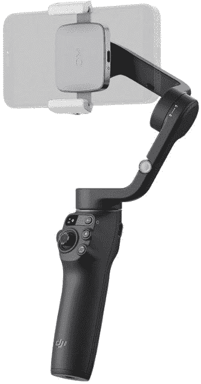

# DJI 的 Osmo Mobile 6 可折叠万向节在紧凑的尺寸中提供了大功能

> 原文：<https://www.xda-developers.com/dji-osmo-mobile-6-smartphone-gimbal/>

DJI 最近一直很忙，最近宣布了新的 [FPV 无人机](https://www.xda-developers.com/dji-avata-makes-its-official-debut/)和[动作摄像机](https://www.xda-developers.com/dji-announces-osmo-action-3/)。今天，该公司宣布了其最新的移动万向节，Osmo Mobile 6。它提供了一个紧凑和可折叠的设计，快速释放磁性手机夹，和 3 轴稳定，让您可以在您支持的智能手机上捕捉最平滑的剪辑。Osmo Mobile 6 现在可以从 DJI 直接购买，也可以从百思买预购，价格为 159.99 美元。预计发布日期定在 9 月 29 日。

Osmo Mobile 6 是 DJI 所有努力的顶点，在紧凑的机身中提供强大的稳定性。该设备还提供了一个快速释放的磁性手机夹，便于连接智能手机。这种夹子甚至可以夹住保护套中的大型手机。万向架甚至可以扩展，变成自拍杆，让你有机会从更高的地方拍摄视频。如果你有一部 iPhone，你可以让万向节自动进入相机模式，这样你就不会错过任何一个镜头。DJI 还增加了一个新的侧轮，允许用户控制缩放和聚焦，以获得更精致的电影外观。此外，像 ActiveTrack 5.0 这样的附加功能将使专注于您的主题变得更加容易。

在过去的十年里，智能手机相机不断发展，提供了更好的弱光摄影，更好的稳定性等等。尽管制造商尽了最大努力，但当谈到稳定时，内置相机只能做这么多。这就是为什么有一个万向节有时会很方便，特别是如果你在移动中拍摄视频。一般来说，万向节需要很多额外的空间，但多年来，DJI 已经推出了更紧凑、更易于使用的万向节。Osmo Mobile 6 的重量略高于 300 克，尺寸为 189 毫米×84.5 毫米×44 毫米。该万向支架一次充电可提供长达 6 小时 24 分钟的使用时间，并可以使用 USB-C 充电。不幸的是，目前 DJI 没有智能手机兼容性列表，但你应该在购买前先检查一下，以确保它与你的智能手机兼容。

 <picture></picture> 

DJI Osmo Mobile 6

##### DJI 奥斯莫移动 6

来自 DJI 的最新智能手机万向节，采用可折叠设计和磁性夹紧系统。

* * *

**来源** : [DJI](https://www.dji.com/newsroom/news/dji-osmo-mobile-6-pushes-smartphone-photography-further)