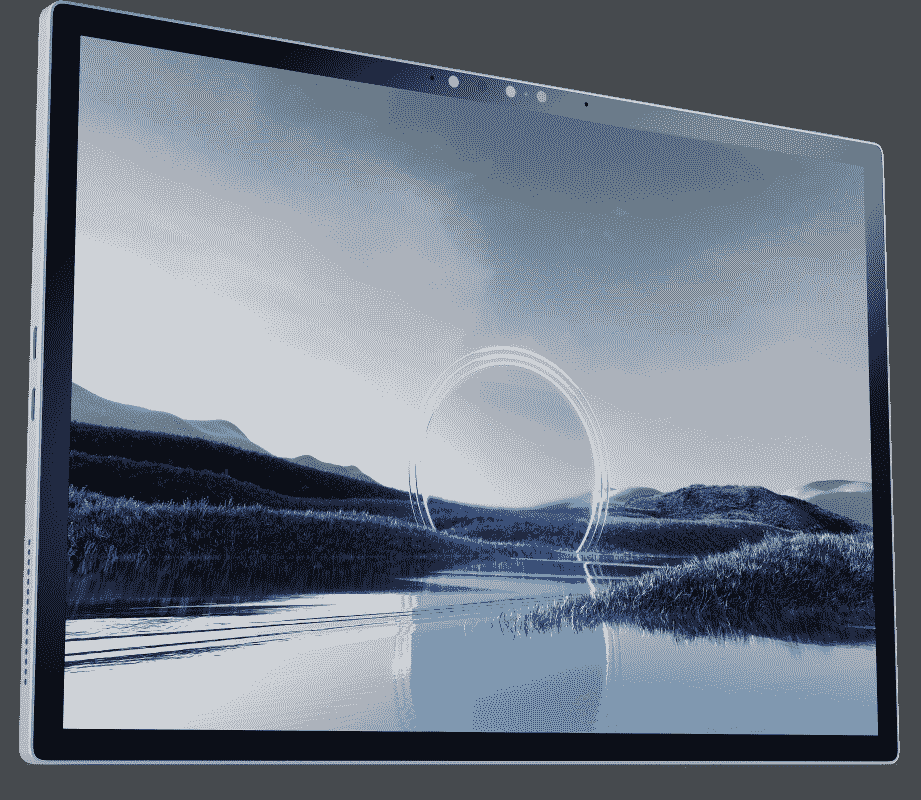
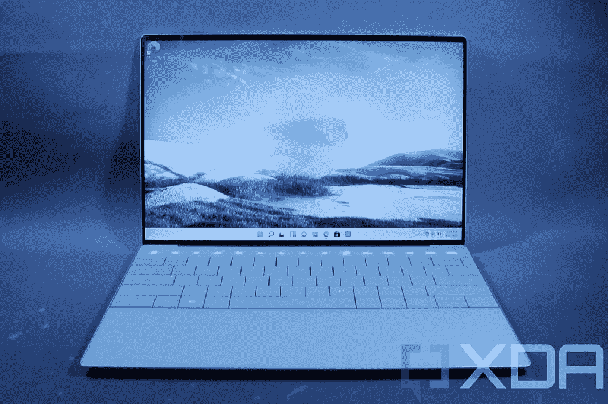

# Dell XPS 13 2 合 1 (2022)有有机发光二极管显示屏吗？

> 原文：<https://www.xda-developers.com/does-dell-xps-13-2-in-1-2022-oled/>

戴尔最近推出了新的 [XPS 13 二合一](https://www.xda-developers.com/dell-xps-13-2-in-1-2022/)，它与以前的型号有很大的不同。它不再是敞篷车，而是一台带可拆卸键盘的平板电脑。新的设计也带来了规格方面的变化，包括显示屏。如果您想知道 Dell XPS 13 2 合 1 显示器是否有有机发光二极管配置，它没有。

事实上，2022 年的 Dell XPS 13 二合一设备根本没有任何显示配置。这款新机型配备了 13 英寸的 IPS 面板，长宽比为 3:2，分辨率为 2880 x 1920。这是你唯一的选择，但公平地说，这已经是一个很好的展示了。

 <picture></picture> 

Dell XPS 13 2-in-1 (2022)

首先，对于这个尺寸来说，这是一个非常清晰的分辨率，与微软的 Surface Pro 系列相当。最重要的是，这款显示器支持 DisplayHDR 400 和杜比视觉，加上它的亮度高达 500 尼特，所以它仍然会给你带来出色的视觉体验。戴尔通常在其 XPS 设备中使用非常好的 IPS 显示器，以至于你甚至不会太想念有机发光二极管。

## 有戴尔 XPS 13 有 OLED 面板吗？

如果您热衷于购买一台有机发光二极管笔记本电脑，您可以随时在戴尔 XPS 13 系列的其他产品中寻找，但选择比通常更有限。除了 2 合 1 机型之外，戴尔还从常规 XPS 13 中删除了 OLED 面板选项，因此如果您真的想要一台，您唯一的选择是未来的戴尔 XPS 13 Plus。这是该家族中唯一一位保留了前几年所有显示器选项的成员，包括超清晰 3.5K (3456 x 2160)有机发光二极管显示器。然而，这一次会让你的钱包付出更多的代价。

 <picture></picture> 

Dell XPS 13 Plus

如果你真的想要一台敞篷车，或者只是一台不同类型的笔记本电脑，那么你可能想看看我们现在列出的[最佳有机发光二极管笔记本电脑](https://www.xda-developers.com/best-oled-laptops/)。有许多不同种类的设备，包括敞篷车、游戏笔记本电脑等等。

* * *

话虽如此，如果您仍想购买戴尔 XPS 13 二合一设备，我们也不会责怪您。它通常是戴尔最好的笔记本电脑之一，这款新机型也将成为最好的 Windows 平板电脑之一。考虑到一开始就没有大量的高端 Windows 平板电脑，有这个新选项是很好的。然而，你现在还不能购买它，尽管它预计将于本月晚些时候推出。一旦你能购买它，我们将肯定在下面有一个链接。