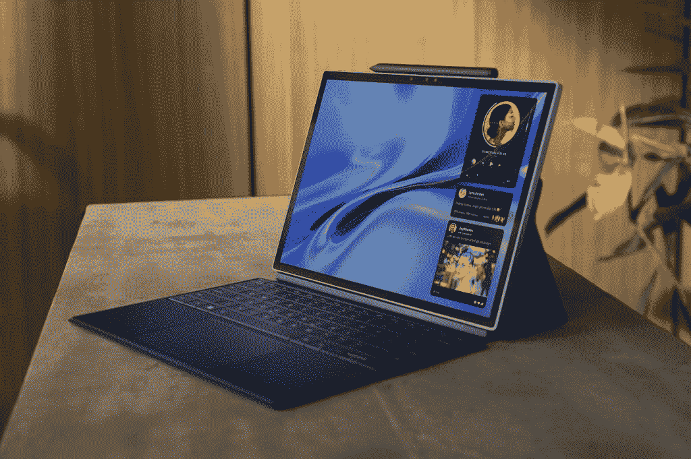

# 戴尔 XPS 13 (2022)有 5G 吗？你需要它吗？

> 原文：<https://www.xda-developers.com/does-dell-xps-13-2022-5g/>

戴尔最近推出了[戴尔 XPS 13 2022](https://www.xda-developers.com/dell-xps-13-2022/) 型号，除了内部升级之外，它还进行了一些重大的设计更改。XPS 笔记本电脑传统上缺少的一项功能是蜂窝连接，这是意料之中的，因为大多数面向消费者的笔记本电脑都不具备这一功能。如果你希望最新款是个例外，它不是。2022 年的戴尔 XPS 13 不支持蜂窝网络，无论是 5G 还是 LTE。

嗯，至少翻盖式没有。今年，戴尔还彻底改变了 [XPS 13 二合一](https://www.xda-developers.com/dell-xps-13-2-in-1-2022/)，现在它是一款带有可拆卸键盘的平板电脑。如果你想要一款支持 5G 的高端设备，也许你可以看看那款，或者看看我们今天列出的你可以买到的[最好的 5G 笔记本电脑](https://www.xda-developers.com/best-5g-laptops/)。但是你应该关心 5G 支持吗？

## 什么是 5G？为什么您希望在 Dell XPS 13 上使用 5G？

5G 是最新一代的蜂窝网络，主要针对手机。这就是蜂窝网络的本意，但是随着这些网络变得更加强大，使用它们浏览互联网成为可能，一些笔记本电脑也开始支持它们。笔记本电脑支持蜂窝网络有两个主要好处:移动性和安全性。

机动性是最明显的一个。通常，笔记本电脑使用 Wi-Fi(或有线连接)连接到互联网，但这意味着你被限制在一个非常特定的位置。Wi-Fi 网络的覆盖范围非常小，即使你在两个有 Wi-Fi 的地方之间移动，这些连接也可能是不同的，所以你必须重新设置它们。蜂窝网络几乎可以在任何地方工作，因此您可以在火车上、汽车后座或任何其他地方继续使用互联网。如果你需要经常在线工作，这非常有用。

另一方面，安全性可能不是对每个人都显而易见的，但它是一件大事，尤其是对商业用户而言。当你去当地的星巴克并使用那里的 Wi-Fi 时，你正在与多个其他人共享该网络，恶意攻击者可能会拦截你通过网络发送的数据，从而暴露潜在的敏感或私人信息。这就是为什么 VPN 现在如此受欢迎，但有了蜂窝网络，你几乎不需要担心这个。这种额外的安全层是蜂窝支持在商用笔记本电脑中更常见的原因。

 <picture></picture> 

Dell XPS 13 2-in-1

但戴尔 XPS 13 不是商务笔记本电脑，因此，缺乏对 5G 的支持不应令人惊讶。Dell XPS 13 2 合 1 确实具备这种功能，而且您会注意到蜂窝支持在这类设备中也更常见。这可能是因为它们非常便携，这与蜂窝网络提供的移动性非常匹配。

最后要注意的是，5G 支持通常是笔记本电脑的一个昂贵的附加功能。你可能会比购买某个特定设备的 Wi-Fi 版本多支付至少几百美元。

* * *

这就是关于戴尔 XPS 13(2022)5G 支持的所有信息。您只能在 Dell XPS 13 2 合 1 中获得它，但如果您想要一台典型的翻盖笔记本电脑，还有其他选择。你也可以通过 LTE 笔记本电脑来节省一些钱。5G 相对于 LTE 的优势主要与速度有关，但坦率地说，这些差异还不是那么明显，所以你可以在 LTE 支持下做得很好。

如果你认为你根本不需要 5G，你可以使用下面的链接购买戴尔 XPS 13。除了缺少 5G，它是你今天能买到的最好的笔记本电脑之一。

 <picture></picture> 

Dell XPS 13 9315

##### Dell XPS 13 9315

全新的戴尔 XPS 13 进行了彻底的重新设计，有天空色和棕色可选。不过这款机型还是没有 5G 支持。