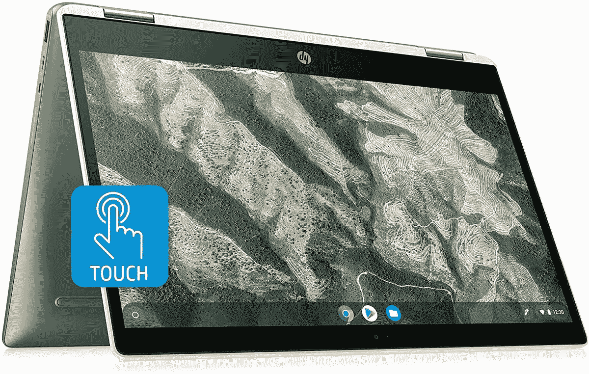

# 惠普 Chromebook 14 有触摸屏吗？

> 原文：<https://www.xda-developers.com/does-hp-chromebook-14-have-touchscreen/>

触摸屏在 Chromebooks 上相当常见。大多数现代 chrome book 都配有触摸屏，即使它们缺乏二合一功能。如果你正在购买一款广受欢迎的惠普 Chromebook 14，你可能需要缩小搜索范围，选择那些带触摸屏的机型。这是一个很好的特性，即使你不经常使用它。那些喜欢传统键盘和鼠标输入的人可能仍然喜欢触摸屏，如果他们的孩子偶尔使用家用 Chromebook 的话。让我们来看看所有型号的惠普 Chromebook 14 上的[触摸屏可用性](https://www.xda-developers.com/best-chromebooks-touchscreens/)。

惠普 Chromebook 14 的大多数当前型号都可以选择添加触摸屏。默认情况下，一些基本型号没有配备触摸屏，但你可以多花一点钱升级到触摸屏。触摸屏的质量取决于许多因素。Chromebook 14 的大多数高端型号都配备了 FHD 显示屏，具有出色的触摸响应能力。

一些较便宜的型号采用 720p 显示屏，触摸阵列精度稍低。Chromebook 14 的两个当前型号没有可选的触摸屏。这些型号是 14a-na0020nr 和 14-db0033dx，这是惠普提供的最具成本效益的两个选项。虽然两款设备都没有触摸屏，但价格都远低于 200 美元。

或许 Chromebook 14 系列中配备触摸屏的最佳选择是惠普 x360 14c(如下图)。

x360 14c 具有出色的 14 英寸对角线 FHD (1920 x 1080)显示屏，最大亮度为 250 尼特。几个铃铛和哨子也出现了，无缝金属盖，键盘座和音频由 Bang & Olufsen 调谐。x360 14c 不包含指纹传感器。

里面有第十代英特尔酷睿 i3 处理器，8 GB DDR4-2400 SDRAM 和 64GB eMMc 存储容量。使用 Wi-Fi 6 (2x2)和蓝牙 5.0 组合享受更流畅的无线体验。x360 具有与 Elite c1030 相同的端口，还包括快速充电功能，惠普宣称可在 90 分钟内充满 90%的电量。x360 14c 仅重 3.5 磅多一点，有点重，但放在背包里不会不舒服。

这里最重要的方面是价格 x360 14c 的价格不到 530 美元，几乎是 c1030 的一半。如果你需要顶级性能，但还不准备花 1000 美元买一台 Chromebook，这就是你的机器。总的来说，这是任何价位的最好的惠普 Chromebooks 之一。

 <picture></picture> 

HP x360

##### 惠普 x360

HP x360 以比 c1030 更低的价格提供了优质的 2 合 1 Chromebook 体验。