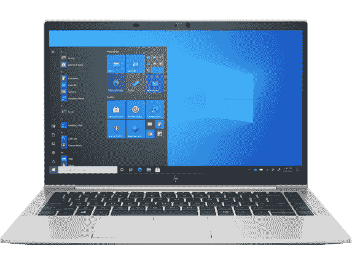

# 惠普 EliteBook 840 Aero 有 Windows Hello 吗？

> 原文：<https://www.xda-developers.com/does-hp-elitebook-840-aero-windows-hello/>

惠普 EliteBook 840 Aero 是一款面向[商业用户](https://www.xda-developers.com/best-business-laptops/)的出色[轻型笔记本电脑](https://www.xda-developers.com/best-lightweight-laptops/)。它的起始重量仅为 2.5 磅，最高可配置英特尔酷睿 i7 处理器、64GB 内存和 2TB 存储。您还可以获得显示屏、移动连接甚至 NFC 的配置选项。但是安全性呢？如果你担心这一点，你会很高兴地知道，你可以获得带有 Windows Hello 的 HP EliteBook 840 Aero。

确保笔记本电脑及其内容的安全变得越来越重要。密码和 pin 是确保只有你才能访问你的个人信息的常用方法，但每次都必须键入它们会很麻烦。生物认证是一种更方便的保护设备的方式，许多笔记本电脑都以 Windows Hello 的形式提供这种认证。HP EliteBook 840 Aero 就是其中之一，您实际上可以通过两种 Windows Hello 支持获得它。

## HP EliteBook 840 Aero 上的 Windows Hello

尽管它很重，但无论您选择什么配置，HP EliteBook 840 Aero 都至少带有一种形式的 Windows Hello。这款笔记本电脑的每个型号都在网络摄像头旁边配备了一个红外摄像头，这意味着您可以使用面部解锁笔记本电脑。使用红外摄像头比使用简单的网络摄像头更安全，因为它可以在 3D 中看到你的脸。如果你担心准确性，你可以查看微软对 Windows Hello 硬件的[最低要求。](https://docs.microsoft.com/en-us/windows-hardware/design/device-experiences/windows-hello-biometric-requirements)

Windows Hello 面部识别可以说是解锁 PC 最方便的方法。你需要做的就是打开笔记本电脑，看着它，一旦它识别出你的脸，它就会解锁，这是最无缝的，也可能是最快的解锁笔记本电脑的方法。但是如果你是那种在不使用网络摄像头的时候把它盖住的人，那么另一个选择就是指纹识别器。

HP EliteBook 840 Aero 还为 Windows Hello 提供了一个可选的指纹识别器插件。这将在基础价格的基础上增加 10 美元，这并不是一个很大的涨幅。不过指纹传感器位于键盘下方。一些笔记本电脑的电源按钮上有指纹传感器，所以只要你一开机，它们就能识别用户。这是不可能的，但如果你真的需要额外的便利，你可以随时使用红外相机。

这些是您可以内置到 HP EliteBook 840 Aero 中的 Windows Hello 形式。当然，从技术上讲，Windows Hello 还包含其他登录类型，比如物理安全密钥。假设你有一个，你也可以一直使用它们。

如果你还没有。您可以使用以下链接购买 HP EliteBook 840 Aero。如果你还在考虑其他选择，惠普制造了许多其他[优秀的笔记本电脑](https://www.xda-developers.com/best-hp-laptops/)，其中许多也包括某种形式的 Windows Hello 支持。

 <picture></picture> 

HP EliteBook 840 Aero G8

##### 惠普 EliteBook 840 Aero

HP EliteBook 840 Aero 是一款轻便的翻盖式笔记本电脑，具有大量配置选项，包括最高可配英特尔酷睿 i7-1185G7、64GB 内存、5G 移动连接和两种 Windows Hello 登录方法。