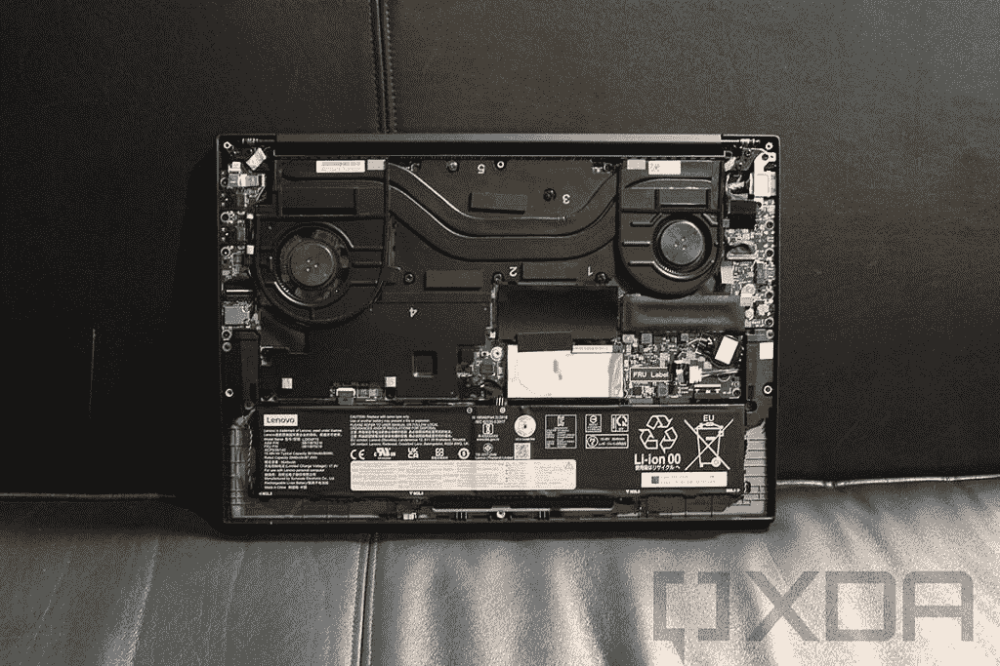
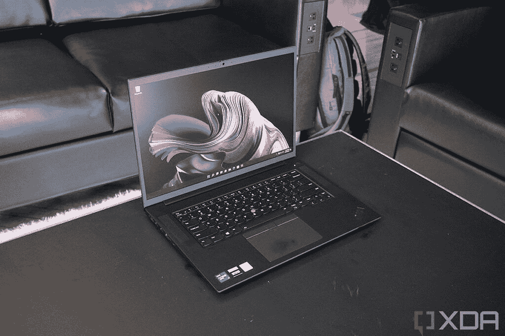

# 联想 ThinkPad X1 Extreme Gen 5 配 4G LTE 还是 5G？

> 原文：<https://www.xda-developers.com/does-lenovo-thinkpad-x1-extreme-gen-5-4g-lte-5g/>

商用笔记本电脑——比如[联想的 ThinkPad](https://www.xda-developers.com/best-thinkpads/)——有几个方面是众所周知的。他们通常采用更保守的设计来适应办公环境，他们拥有采用博锐技术的处理器、更多端口，而且很多时候还拥有蜂窝连接。这些都是选择商务笔记本电脑的好理由，但并不是每台笔记本电脑都一样。如果你想知道[联想 ThinkPad X1 Extreme Gen 5](https://www.xda-developers.com/lenovo-thinkpad-x1-extreme-gen-5/) 是否支持 4G LTE 或 5G 蜂窝网络，你会很高兴地知道，是的，它确实有一个蜂窝网络选项。

具体来说，你可以为 ThinkPad X1 Extreme Gen 5 配置由 Fibocom FM350-GL 调制解调器支持的 5G 支持。没有单独的 4G LTE 选项，考虑到极端的品牌化，这有一定的意义。然而，事情比这要复杂一点，并且有一些限制。

## 获得带 5G 的联想 ThinkPad X1 Extreme Gen 5

联想 ThinkPad X1 Extreme 提供了广泛的配置选项，这有时会影响获得其他升级选项的能力。对于 GPU 来说，这是最真实的。毕竟，笔记本电脑内部的空间是有限的，如果你选择像 Nvidia GeForce RTX 3060 或更高的强大 GPU，那将需要大量的空间来放置 GPU 本身和冷却系统。

联想 ThinkPad X1 Extreme Gen 5 上支持蜂窝连接的调制解调器使用 M.2 外形，类似于 SSD。然而，在这种情况下，当您选择 Nvidia GeForce RTX 3060 GPU 或更高版本时，模块将进入的插槽不可用。第 4 代型号与此类似，如下图所示 WWAN 模块应该位于编号为 4 的板的位置。

 <picture></picture> 

Internal components of the Lenovo ThinkPad X1 Extreme (Gen 4) with a WWAN module slot unavailable

这意味着如果你选择一个更强大的 GPU 选项，你就不能获得蜂窝连接，这也意味着你不能为笔记本电脑配置英特尔酷睿 i9 处理器。这样做会自动将 GPU 升级到 GeForce RTX 3080 Ti，所以如果你想要 5G 支持，你必须坚持使用 Core i7 型号并选择 GeForce RTX 3050 Ti。

事实上，这并不是 GPU 带来的唯一限制。还有第二个 SSD 插槽，用于存储，只有低端的 Nvidia GPU 才有。如果没有它，您最多只能获得 4TB 的存储，而不是 8TB。

## 需要 5G 吗？

至于为什么你可能首先需要 5G 支持，这完全是为了保持连接和安全。与 Wi-Fi 不同，蜂窝网络几乎可以在您去的任何地方使用，因此如果您正在旅行，并且不能离开工作，蜂窝连接可以帮助您在乘坐火车或外出时保持联系。

 <picture></picture> 

Lenovo ThinkPad X1 Extreme Gen 5

但这也关乎安全。即使你出门在外，在一家咖啡店停下来，你也许可以接入 Wi-Fi，但这些网络通常没有保护，并且与许多随机的人共享。一个心怀不轨的人可能会找到一种方法，在你在那里时查看你的互联网流量，并截获危及你安全的敏感数据。对于商业用户来说，这可能是一个巨大的风险。有了蜂窝数据，你不需要依赖不安全的 Wi-Fi 网络，这样你不仅可以保持连接，还可以抵御潜在的安全风险。

这些优势适用于任何蜂窝网络，因此即使笔记本电脑只支持 4G LTE，也仍然适用。与 4G LTE 相比，4G LTE 的优势在于，它旨在为越来越多的联网设备做好准备，提供更多带宽，以便每个人都可以随时保持连接。对于消费者来说，5G 的好处还没有完全显现出来，但随着时间的推移，它应该会发展成为一个更强大的网络，而且它可能会比 4G LTE 存在更长时间。

* * *

不管你是否想要 5G，你都可以使用下面的链接购买联想 ThinkPad X1 Fold Gen 5。不过，这并不是唯一一款支持 5G 的笔记本电脑，如果你想要更多选择，你可以看看[最佳 5G 笔记本电脑](https://www.xda-developers.com/best-5g-laptops/)。如果你根本不关心 5G，我们也有一个[最佳笔记本电脑](https://www.xda-developers.com/best-laptops/)的列表。你一定会在那里找到你喜欢的东西。