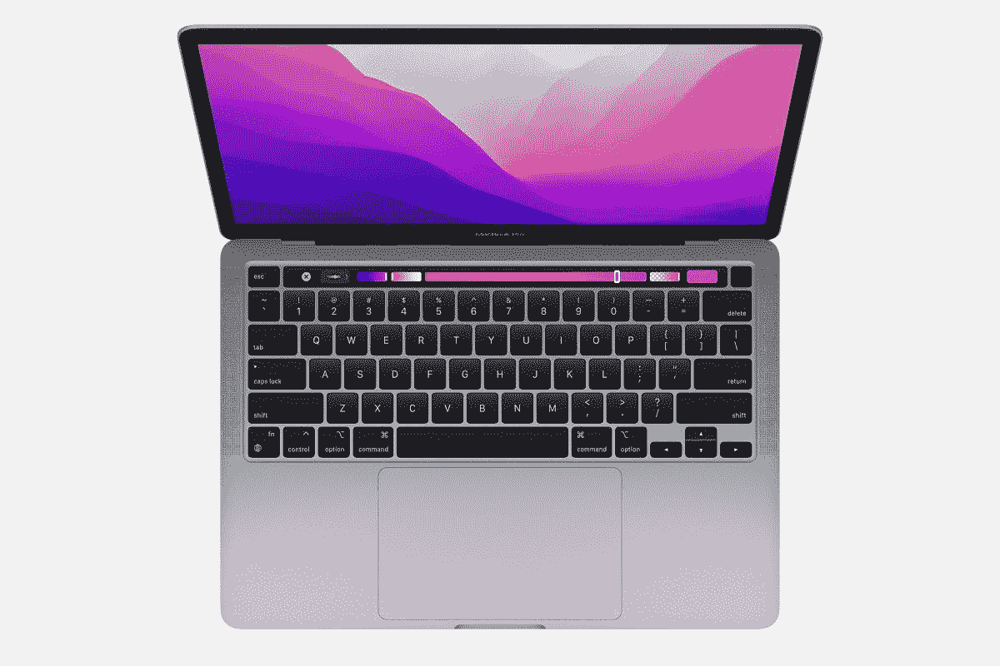

# MacBook Pro 13 (2022)续航好吗？

> 原文：<https://www.xda-developers.com/does-macbook-pro-13-2022-battery-life/>

MacBook Pro 13 (2022)型号刚公布的时候有点惊喜。与 MacBook 的兄弟产品相比，这款机型看起来像是一件古董，但它也采用了最新的苹果 M2 SoC。尽管它看起来很旧，但最新的 13 英寸 MacBook Pro 确实提供了意想不到的东西——16 英寸以下 MacBook 的最佳电池寿命**。**

 **## MacBook Pro 13 (2022)的续航时间有多少？

根据苹果的规格，MacBook Pro 13 (2022)可以提供长达 20 小时的 Apple TV 电影播放和长达 17 小时的无线网页浏览。那么这到底意味着什么呢？好吧，苹果声称它能够使用 2022 年 5 月测试的预生产模型来实现这些数字。测试的型号是 8 核 M2 SoC，具有 10 核 GPU、8GB 内存和 256GB 内部 SSD 存储。

Apple TV 应用程序通过播放一部 1080p 的电影进行测试，显示亮度设置为“距离最低设置八次点击”。无线网络测试浏览了 25 个使用无线互联网的流行网站，显示亮度再次设置为“从最低设置八次点击”。这个设置是 MacBook 最大亮度的 50 %,在最新型号上是 500 尼特。然而，苹果公司确实添加了一个免责声明，声明测试和结果可能会有所不同，但如果所有条件都满足，这通常是你可以预期的。

## 为什么电池寿命很重要？

最重要也是最容易被忽视的规格是产品的电池寿命。任何产品的电池寿命都决定了很多事情——你将如何使用它，你是否需要带充电器，等等。在 MacBook Pro 13 (2022)的情况下，如果你满足于能够在不需要充电的情况下上网冲浪 17 个小时，那么它可能是你的一个非常好的选择。如果你是一个电影爱好者，这可能也适用，因为它提供了苹果笔记本电脑中最长的运行时间之一，达到 20 小时。苹果没有列出许多其他电池规格，但它列出的是相当有效的，结果表明这款笔记本电脑提供了比正常电池更长的性能，这也适用于其他任务。

## MacBook Pro 13 (2022)如何实现超长续航？

MacBook Pro 13 (2022)能够获得出色的电池数量得益于多种因素。首先，M2 SoC 不仅是苹果的最新产品，也是最高效的。第二个因素是其 58.2 瓦时的锂聚合物电池。除了 14 英寸和 16 英寸的 MacBook Pros 之外，这在产品线中是相当大的。最后，它的所有组件完美和谐地结合在一起，尽可能提供最佳体验。

## MacBook Pro 13 (2022)与其他 MacBook 相比如何？

如前所述，最新的 13 英寸 MacBook Pro 的电池寿命是最高的。它配备了 58.2 瓦时的锂聚合物电池，与配备 49.9 瓦时锂聚合物电池的 MacBook Air M1 和配备 52.6 瓦时锂聚合物电池的 MacBook Air M2 相比，它要大得多。前两者的容量都更小，这也是 MacBook Pro 13 (2022)续航更好的一个很好的原因。

MacBook Pro 14 确实有更大的 70 瓦时锂聚合物电池，但它也有更强大的 SoC 和耗电的 120Hz 显示屏。但其 Apple TV 电影播放和无线网络冲浪统计数据低于 MacBook 13 (2022)。16 英寸的型号可以延长一个小时，但也装有更大的 100 瓦时锂聚合物电池。

苹果的 MacBook Pro 13 (2022)型号现在[可以预购](https://www.xda-developers.com/preorder-macbook-pro-m2-this-week/)，发布日期定在 6 月 24 日。尽管拥有[老款 MacBook Pro](https://www.xda-developers.com/macbook-pro-2021/) 的外观，但内部都是新的，令人惊讶的是，它还击败了传统上提供更长电池寿命的 MacBook Airs。如果你想购买 MacBook Pro 13 (2022)，一定要看看下面的链接。你也可以买到旧的[翻新型号](https://www.xda-developers.com/best-places-buy-refurb-macbook-pro/)的商品。

 <picture></picture> 

Apple MacBook Pro M2

##### 苹果 MacBook Pro 13 英寸(2022)

由 M2 SoC 驱动的最新苹果 MacBook Pro 13 (2022)。**