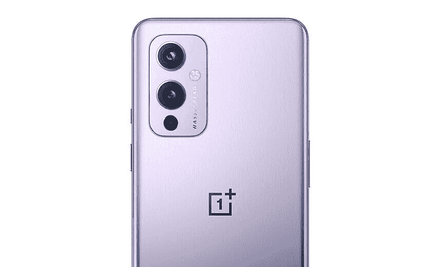
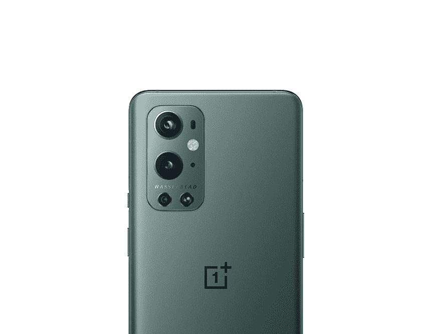
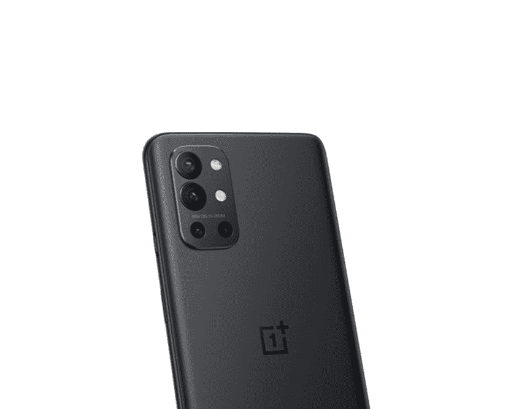

# 一加 9，一加 9 Pro，一加 9R 支持 5G 吗？

> 原文：<https://www.xda-developers.com/does-oneplus-9-support-5g/>

简单的答案是肯定的，[一加 9](https://www.xda-developers.com/oneplus-9) 系列的三款设备，包括一加 9R，都支持 [5G](https://www.xda-developers.com/5g/) 。但一如既往，细节决定成败。你的设备是否具备连接到*5G 基站所需的硬件是一回事，它是否支持运营商广播信号的相同 5G 频段则是另一回事。这一点比其他任何市场都更适用于美国，因为在允许新手机连接到他们的网络之前，这里的运营商往往需要一个繁琐的认证过程。如果你打算在美国购买一加 9 或一加 9 Pro，但不确定你是否能享受到运营商更快的 5G 速度，那你来对地方了。*

## 一加 9 和 5G 警告

在美国，一加 9 和一加 9 专业版可以直接从一加或通过 T-Mobile 购买。如果你选择无锁版本，你可以期待它在 T-Mobile 和威瑞森的 5G 网络上工作。然而，如果你是美国电话电报公司的订户，你就没那么幸运了。一加 9 和 9 Pro 不支持 AT&T 使用的 5G 频段。不过，你可以使用运营商的 LTE 网络。

**[一加终于把镜头对准了一加 9](https://www.xda-developers.com/oneplus-9-camera-review/)**

至于威瑞森，一加在发布会上承诺，它正在与该运营商合作，以认证一加 9 和 9 Pro。他们随后确实让两款手机获得了在威瑞森 5G 网络上工作的认证。但是有一个问题。

 <picture></picture> 

OnePlus 9

##### 一加 9

香草一加 9 是为那些谁想要旗舰性能，但不想支付最高美元。它提供了 6.5 英寸 120Hz AMOLED 显示屏，由哈苏调整的三摄像头设置，以及骁龙 888 SoC。

## 一加 9 Pro 给你最快的 5G 速度

虽然一加 9 和一加 9 Pro 支持威瑞森的全国 5G 网络，但只有 Pro 型号才能接入 Big Red 的超宽带 5G。这是威瑞森速度更快的毫米波 5G 网络，建立在高频毫米波频谱上，下行链路速度可达 2 Gbps 以上。超宽带网络只在美国的特定地区运行。尽管如此，如果你那里有，选择一加 9 Pro 是有意义的，因为它将为你提供最快的 5G 速度。

**[一加 9 Pro 巩固了一加的高端智能手机品牌](https://www.xda-developers.com/oneplus-9-pro-review/)**

值得一提的是，在所有四款全球机型中，北美的一加 9 Pro 是唯一支持毫米波无线电的机型。考虑到毫米波 5G 尚未在美国以外获得势头，这不是什么大问题。

 <picture></picture> 

OnePlus 9 Pro

##### 一加 9 专业版

凭借 6.7 英寸的大尺寸四高清有机发光二极管显示屏和智能 120Hz 刷新率，一加 9 Pro 可能拥有市场上最好的显示屏。与 Hasselblad 合作调整的相机可拍摄出出色的静态照片，并捕捉精彩的 4K 视频。

## 印度一加 9R 上的 5G 怎么样？

目前，印度的一加 9R 用户只能期望在两种情况下看到手机上的 5G 信号:在他们的梦里或当他们在部署 5G 网络的国外旅行时。在中国以外，一加 9R 仍然是印度的专属，印度的商用 5G 仍然需要几年时间。因此，虽然你已经做好了锁定 5G 蜂窝网站的一切准备，但你必须等待你的第一次 5G 体验。

总而言之，一加 9 和一加 9 Pro 将在除 AT&T 之外的所有美国运营商上支持某种形式的 5G。如果你想体验极快(但有时也不稳定)的毫米波 5G，一加 9 Pro 是你的最佳选择，也是一加 9 系列中唯一提供它的设备-其他两个只支持 5G 6 GHz 以下。至于印度独有的一加 9R:没有 5G 基础设施意味着现在没有 5G。

 <picture></picture> 

OnePlus 9R

##### 一加 9R

一加 9R 标志着一加重新进入平价旗舰领域。这款手机是去年一加 8T 的翻版，设计略有更新，采用了新的骁龙 870 芯片。遗憾的是，它目前仅限于印度市场。