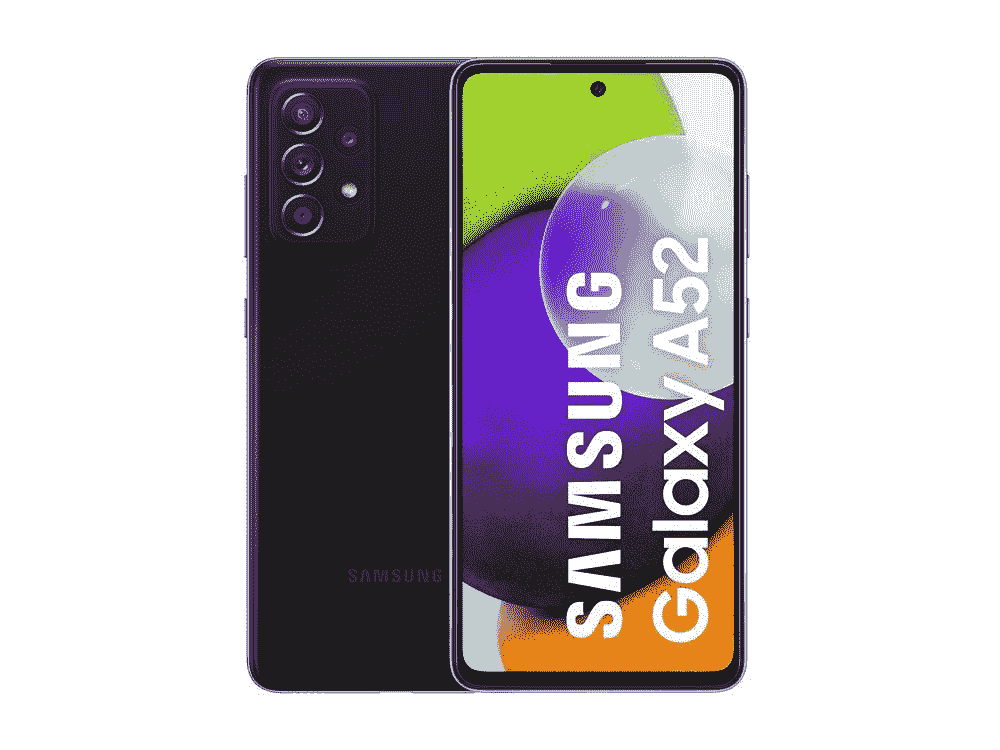
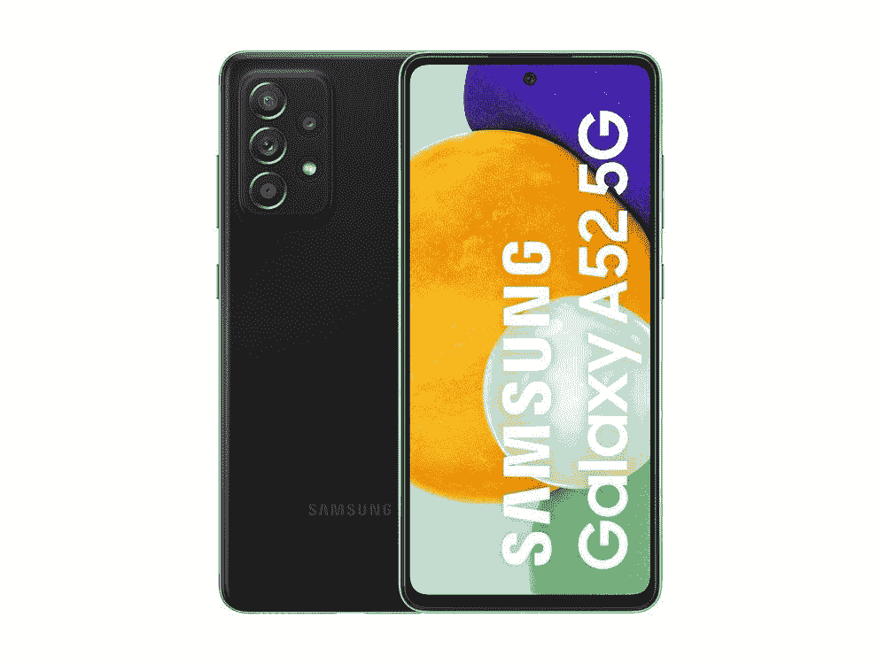

# 三星 Galaxy A52 支持 5G 吗？我应该买 5G 的还是 4G 的？

> 原文：<https://www.xda-developers.com/does-samsung-galaxy-a52-support-5g/>

问[三星 Galaxy A52](https://www.xda-developers.com/samsung-galaxy-a52/) 是否真的支持 5G 这个问题可能看起来很傻——毕竟，它甚至包含在名称中。但需要注意的是，并非所有 5G 设备都是一样的。虽然简单明了的答案是肯定的，它确实有 5G，但它有更多的细微差别。美国的大多数运营商将支持该设备并与之完美配合，但你可能需要调整你的预期，并期待不同的结果，而不是像你在高端旗舰设备中看到的那样看到千兆速度的下载。随着 A52 4G 星系的存在，情况变得更加复杂。我们对这两款手机都进行了广泛的测试，分别是 [Galaxy A52 5G(评测)](https://www.xda-developers.com/samsung-galaxy-a52-5g-review/)和 [Galaxy A52 4G(评测)](https://www.xda-developers.com/samsung-galaxy-a52-review/)，所以下面是这个简单问题背后的细微差别。

## 三星 Galaxy A52 支持 5G 吗？

是的，三星 Galaxy A52 **5G** 支持 5G。它拥有支持 6Ghz 以下网络所需的频段。然而，它不支持你经常看到运营商宣传的产生千兆下载速度的毫米波。快速浏览一下三星的网站，我们就知道 Galaxy A52 5G 支持哪些 5G 频段。

然而，谨慎的做法是检查你的手机版本，因为一些地区将省略 5G 品牌。还有一款三星 Galaxy A52 4G，它看起来完全一样，但配备了不同的 SoC，仅支持 4G。Galaxy A52 4G 只有 4G 频段，还有常见的 2G 和 3G。一定要检查运营商的网站，看看上市是否确实是你想买的型号。如果不清楚或者你不确定，最好联系销售该设备的运营商或公司，再次确认他们是否在销售你要找的设备。

如果你不知道 5G 到底是什么，并且想知道它是如何工作的，我们有一个很好的指南来解释你需要知道的关于 5G 的一切。

目前，所有美国运营商都支持上述一些 5G 频段，但和往常一样，你应该在购买之前与运营商核实一下，看看你可以在你的所在地获得什么速度和多可靠的服务。欧洲和亚洲也是如此。大多数国家都有支持其中一个或多个频段的服务提供商，但同样重要的是要注意 5G 仍未普及，尤其是在发展中国家。虽然许多大城市确实有，但小城市和不太繁忙、人口不多的城市可能没有。购买 5G 手机可以提高你的生产力，让你更快地完成任务，但 6GHz 以下的频段只能提供比 LTE 更快的速度，LTE 在大多数地方已经非常容易获得和可靠。

## Galaxy A52 4G 和 Galaxy A52 5G 有什么区别？

实际上，不是很多。5G 版本拥有更高等级的芯片组，包括骁龙 750G SoC，而 4G 版本拥有略低的骁龙 720G。差别不是很大，但它仍然存在。然而，最引人注目的是显示屏。5G 型号支持 120Hz 的刷新率，而 4G 型号仅限于 90Hz——差异就在纸上，当你将它们放在一起时，你可以发现这种变化。然而，90Hz 足以在导航设备和玩一些游戏时提供非常流畅的体验。幸运的是，这两种型号具有相同的尺寸，所以如果你正在寻找保护 Galaxy A52 的最佳保护套，我们已经为你准备好了。

差不多就是这样。5G 变种拥有更好的芯片组，处理和图形能力略好，响应更快的显示器，根据你决定选择的存储选项，它可能也有更多的 RAM。4G 版本的基础版本有 128GB 存储和 4GB 内存，而 5G 型号的基础版本有 128GB 存储和 6GB 内存。当然，不同之处还在于对 5G 的支持。

## Galaxy A52 应该买哪款？

许多地区将只销售由给定国家的主要运营商支持的设备。这很好，因为你——顾客——可以很容易地走进商店，拿起一个，然后忘记它。然而，作为一个专注于技术的网站，我们认为有必要告诉你这两种模式之间的主要区别，以及在下定决心并扣动其中一种设备的扳机之前你应该知道的事情。

有几种方法可以回答这个问题。首先，让我们从最简单的开始。如果只有 4G 型号在你的国家销售，这可能是一个好迹象，表明 5G 尚未广泛普及，或者可能需要更长时间才能获得像样和可用的覆盖，而你实际上可以利用这一点。在这种情况下，选择 4G 版本可能是一个更好的解决方案，但最好看看你的首选运营商在你所在的地区是否有 5G 更新。

 <picture></picture> 

Samsung Galaxy A52 4G

##### 三星 Galaxy A52 4G

Galaxy A52 4G 是三星的一款功能丰富的中型产品。它带来了一个巨大的 6.5 英寸 Super AMOLED 显示屏，90Hz 刷新率面板，骁龙 720G SoC，64MP 四摄像头，以及旗舰般的体验，价格实惠。

如果 4G 和 5G 型号都在你的地区销售，这可能意味着下一代移动网络已经可用。不一定代表本地支持，但这是个好现象。确保您的本地区域得到支持，如果您需要 5G 模式(与 4G 相比)稍快的速度和额外的好处，从长远来看，它可能会为您提供更好的服务。

由于市场营销和个人需求，5G 变体将主要只在对此类设备的需求普遍较高的国家销售。如果您所在的地区只提供 Galaxy A52 5G，这可能意味着覆盖范围足够好，网络运营商支持该设备提供可靠的服务。最好向您首选的网络运营商咨询您所在地区的覆盖范围、速度和限制。然而，4G 仍将得到支持，你可能会期待全面体面的速度。

 <picture></picture> 

Samsung Galaxy A52 5G

##### 三星 Galaxy A52 5G

三星 Galaxy A52 5G 是三星最新的中端产品，具有 6.5 英寸 Super AMOLED 显示屏，支持 120Hz 刷新率，骁龙 750G SoC，四摄像头设置和旗舰般的体验，价格实惠。

归根结底，这一切都取决于产品的可用性、个人需求、地点和预算。如果你知道你住的地方有很好的 5G 覆盖，想要体验更快的速度，并且有实际的需求，Galaxy A52 5G 可能会很好地为你服务。然而，如果你所在的地区还没有很好的低于 6Ghz 的覆盖范围，你想省钱，并对现有的 4G 速度感到满意，你不会错过太多，仍然会有一个非常棒的设备和整体体验。