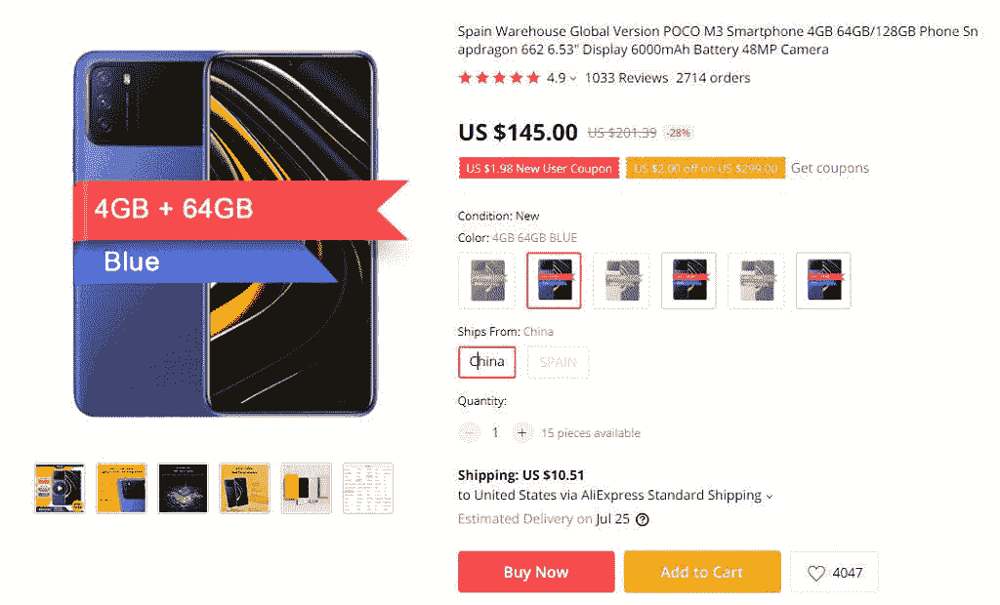
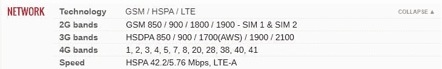
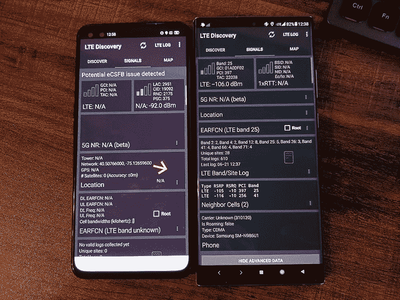
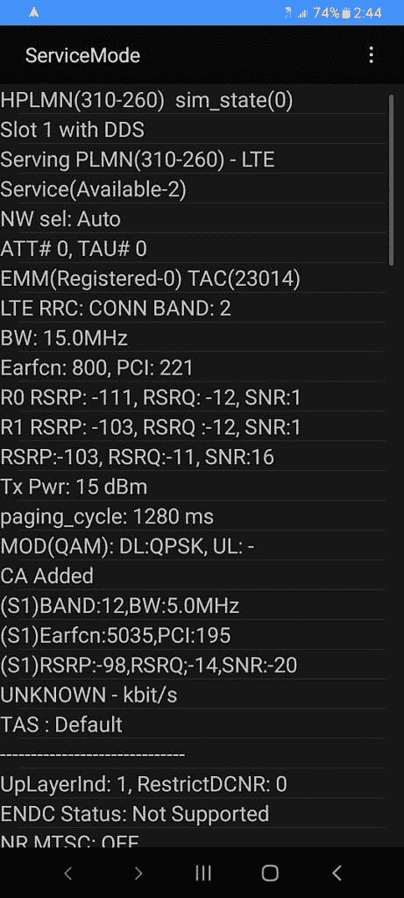

# 在将手机进口到美国之前，你需要知道什么

> 原文：<https://www.xda-developers.com/dont-import-phones-to-the-us/>

似乎每次有人在美国评论一部手机时，文章、视频或其他什么的一半评论都是关于这款手机有多贵。他们会说“在欧洲，没有人会买这款手机。我们可以用一半的价格买到一台做同样东西的小米！”

他们是对的。美国的电话市场不好。我们甚至为我们的高端设备支付了太多，低端和中档手机市场甚至更糟。鉴于美国的性价比如此之低，你可能会考虑是否要从海外进口一部手机。毕竟它们更便宜，对吧？它们比美国价格相似的期权要多得多。

不幸的是，将手机进口到美国并不总是一个好主意。以下是原因。

## 物流的问题

首先，让我们来谈谈进口物流:将一部手机从 A 点运到 b 点需要什么。这里涉及到很多问题，尤其是如果手机跨越国界的话。不同的国家和地区对什么可以进口和出口有不同的规定，以及不同的费用和税收。

美国也不例外。我们有自己的一套运输规则和相关费用。如果小米和 OPPO/Realme 这样的超值品牌正式在美国销售产品，那么，这篇文章就不会存在了。但是，他们还负责将设备运送到美国的所有物流，并将任何相关成本纳入他们的预算和不同设备的价格。

但是这些品牌并没有在美国正式销售设备。没有建立大规模的供应链来获得最新的 4K 显示器和 144Hz 刷新率的 Realme，这对这个国家来说需要 200 美元。所以，它必须通过第三方卖家非正式地完成。

如果我在易贝或全球速卖通搜索这款假想的 Realme 手机，我可能会找到大量关于它的列表，都是运往美国的，而且都来自非官方渠道。但这些卖家没有 Realme 那样的分销规模，而且如果 Realme 正式销售到美国，他们还必须应对与 Realme 相同的法规。

由于缺乏规模经济，这些卖家不得不略微提高价格(如果他们敢的话，可能会提高更多)，以弥补处理进口的成本。这还不包括卖家自己的利润率。最终，这款假设价值 200 美元的手机可能会卖到 300 美元甚至 400 美元。

此外，从第三方购买还有风险。如果你直接从一家公司或一个授权的卖家那里购买，你有一个合理的保证，你会得到你所支付的东西。如果你买了新的设备，它会密封完好地送到你手中。这并不适用于非官方卖家。你可以合理地确定一个高评价的卖家会给你想要的东西，但这远没有官方购买那么确定。

 <picture></picture> 

$145 is about the cheapest I can find the Poco M3 on AliExpress. Shipping time is a month, shipping costs $10.51, there will be tax on top of this, and the phone itself is supposed to retail for $129\. And that $145 comes after the sale and some new-user discounts.

就我个人而言，当我购买海外手机时，我会看到模糊的产品描述，最终与我实际收到的设备不太匹配。我也遇到过这样的问题，直到我拿到它，我才知道设备是从哪里来的。例如，我不久前买了一台进口的 Galaxy A51，后来又退了回去。描述一字不差地抄袭了 *GSMArena* ，包括 NFC 支持因地区而异的部分。我最终得到了菲律宾版的 Galaxy A51，它不支持 NFC，但我也可以很容易地得到英国版的，它支持 NFC。

这就是说从非官方卖家那里购买有风险。对一些人来说，这种风险可能是值得的，但对大多数人来说不是，尤其是如果这款手机在美国甚至不能正式作为手机使用。这就引出了我的下一个观点。

## 硬件支持

世界上每个国家或地区[都有自己的一套蜂窝频率](https://www.frequencycheck.com/)允许设备使用。这些频率通常被分成特定的频段，以便于讨论。

在本文中，我将只讨论 LTE。虽然相同的原则通常适用于 2G、3G 和 5G，但前两者目前正在全球范围内逐步淘汰，而后者仍处于最初的混乱推出阶段。

### 细胞带

总之，回到手机波段。作为区域频带使用的一个例子，欧盟或其附近的国家倾向于使用 LTE 频带 3、7 和 20。一些运营商可能不会使用所有三个频段，一些运营商可能会有一个或两个额外的次要频段，但在大多数情况下，这些频段是您将在欧洲看到的 LTE 频段。在中国，情况类似，只是 LTE 频段 3、39、40 和 41。

当一家公司决定向特定市场销售其手机时，它通常会确保该手机支持该目标市场中使用的大多数(如果不是全部)频段的硬件(和监管认证)。因此，销往欧洲的手机将至少支持频段 3、7 和 20，而在中国销售的手机将至少支持频段 3、39、40 和 41。

### 美国的蜂窝频段

现在让我们看看美国。美国在使用哪些波段以及由谁使用方面有点混乱。覆盖美国三大运营商:

*   [AT & T 使用 LTE 频段](https://www.anrdoezrs.net/links/100122946/type/dlg/sid/UUxdaUeUpU5182/https://www.att.com/support/article/wireless/KM1008740/) 2，4，5，12/17，29，30，66。
*   [T-Mobile 使用 LTE 频段](https://www.t-mobile.com/support/coverage/t-mobile-network) 2，4，5，12，66，71。
*   [威瑞森使用 LTE 频段](http://ipsnews.net/business/2020/06/30/cheat-sheet-which-4g-lte-bands-do-att-verizon-t-mobile-and-sprint-use-in-the-usa/) 2，4，5，13，46，48，66。

上面的频段可能不完全准确(运营商似乎很喜欢增加和淘汰次要频段)，但它传达了一个观点:与欧洲的 3 个主要频段和中国的 4 个主要频段相比，美国使用了大量的*频段*。

如果你仔细观察，你会注意到，即使不包括 Sprint 的网络，也有很多并非所有运营商都有的频段。你还会注意到，这些乐队没有一个能与欧洲的相比，而只有一个能与中国的相比。

### 国际乐队支持

如果手机只支持目标市场的频段，讨论就到此为止了。你根本无法在美国使用欧洲手机*，中国手机也不会好到哪里去。*

 *不过，人们会旅行。他们并不总是在国内旅行。因此，大多数手机，即使是非常便宜的手机，也至少支持其他地区的基本频段。例如，一部真正面向中国市场的廉价手机可能还支持至少一个欧洲频段和一个美国频段。

这样，一个人到这些地区旅行，至少可以在城市和其他多波段覆盖良好的地方使用他们的手机。比如说，他们可能无法使用频段 3，但如果他们在欧洲城市，只有很少的地方有频段 3 的覆盖。

 <picture></picture> 

The POCO M3 supports LTE bands 1, 2, 3, 4, 5, 7, 8, 20, 28, 38, 40, 41\. That's enough to work properly in Europe, India, and China. The Band 4 support means it'll also roam in most US cities. Data source: GSMArena.

同样的情况通常也适用于美国，即使是在乐队混乱的情况下。大多数美国手机，即使是廉价手机，也支持美国运营商使用的所有频段。唯一的例外是运营商专用设备，如 TCL One 5G UW(T1)，它只完全支持威瑞森。当然，即使是便宜的手机也会至少支持一些国际波段，所以它们可以在城市和其他受欢迎的国外目的地工作。

但是如果你想离开这个城市呢？如果你要去一个偏僻的农场呢？那么很有可能你大部分时间都没有服务。

(有趣的是，即使是廉价的美国手机对国际波段的支持也相当不错:比廉价的国际手机对美国波段的支持要好。但这有点离题了。)

这里的要点是，虽然大多数手机在其目标市场之外的地方至少有*有限的*硬件支持，但它们通常没有*良好的*支持，而且几乎从来没有*全面的*支持。

你还想进口一部不完全支持你所在国家网络的手机吗？在接下来的几节中，你可能不会。

### 新闻报道

让我们回顾一下美国使用的乐队。虽然其中一些没有被广泛使用，但是如果你想要一个好的体验，其中一些是非常重要的。

首先是覆盖率。在美国，就覆盖范围而言，LTE 频段 12/17、13、26 和 71 承担了大部分重任。它们是低频带(名义上是 600MHz-850MHz)，所以它们的覆盖范围很远，但代价是高速。

许多国际电话要么不支持这些频段，要么只支持其中的一些频段，尤其是那些较便宜的频段。他们为什么要这么做？他们的目标市场不使用他们。对于临时前往美国的旅游目的地来说，它们也不是非常有用，因为那里有其他乐队的大量报道。如果目标市场的人们几乎从来不需要这些频段，那么包括硬件和支付认证费用就没有经济意义。

但是，就像我之前提到的，一旦你离开人口密集的地区，运营商就会越来越依赖那些低频带。我住在偏僻的地方。我最好的信号强度来自 26 波段。大多数廉价、高价的国际电话在这里都收不到信号。

 <picture></picture> 

The Chinese Realme X50 Pro gets no signal at all while the U.S. Galaxy Note20 Ultra has a fair signal on band 25\. Both are using T-Mobile SIMs.

假设我住在一个城市里或附近。那是什么问题呢？这就是速度和可靠性的来源。

### 速度和可靠性

在美国使用的 LTE 频段列表中..频带 2、4、25、41 和 66 通常用于需要更高速度和容量的地方。与用于覆盖的频段相比，这些频段使用更高的频率(标称频率为 1700MHz-2500MHz)。这意味着以牺牲航程为代价获得更高的速度。

由于城市通常很密集，更高的频率在这里更有意义，所以这些频段通常是进口手机支持的。但是他们通常不会支持所有人。

根据您的运营商和您所在的位置，国际设备可能仅支持频段 4，而您的覆盖范围仅在频段 25、41 和 66。您可能会在频段 4 收到微弱的信号，但它太慢或不稳定，没有用。

还有一种潜在的情况，比如说，在频段 4、25 和 66 上有良好的覆盖，而您进口的手机只支持频段 4。听起来很棒，对吧？你不打算搬家，也从不离开这个地区，所以问题解决了！但是拥堵是存在的。如果有足够多的人和你在同一座塔上连接到 band 4，并且他们都在使用手机，速度将会下降。如果需要，支持该地区其他频段的手机可以切换到一个不太拥挤的频段。但是你的手机不行。它将被卡在频带 4 上，由于拥挤导致速度较慢。

## 软件支持和白名单

为了便于论证，我们假设以上都不适用于你。你在该地区有非常强的频段 4 覆盖，一点也不拥堵，你要进口的手机支持频段 4。

你还是会遇到问题。

### 白名单

第一个问题是设备白名单。[威瑞森](https://www.anrdoezrs.net/links/100122946/type/dlg/sid/UUxdaUeUpU5182/https://www.verizon.com/articles/switching-to-verizon/bring-your-own-device-top-questions-answered/)、 [AT & T](https://www.anrdoezrs.net/links/100122946/type/dlg/sid/UUxdaUeUpU5182/https://www.att.com/support/article/wireless/KM1008711/) 和 [Sprint](https://sprint.com/landings/bring-your-own-phone/index.html) (在并入 T-Mobile 之前)都有白名单，设备可以在他们的网络上激活。除非你的设备被明确批准(特别是如果设备没有完全的硬件支持，这是非常不可能的)，否则你将无法正式激活它。如果你把 SIM 卡放进去，它要么不能工作，要么不能正常工作。

当然，这些白名单有变通办法。例如，在美国电话电报公司上，你可以使用许可的设备激活 SIM 卡，然后将 SIM 卡移动到进口的手机上。但这还远远不是正式的，它随时都可能停止工作。

### LTE 语音

如果你对定制 rom 感兴趣，你可能还记得 Jio 在印度推出 LTE 服务的时候。XDA 论坛的帖子被支持 VoLTE 的请求和是否支持 VoLTE 的问题淹没了。

如果你不记得发生了什么，这里有一个关于 VoLTE 的快速解释，以及为什么它如此重要。在拥有 2G 和 3G 基础设施的网络上，当有人打电话时，可以通过 2G 或 3G。在 LTE 出现之前，这就已经是常态了。

通过 LTE 打电话有点复杂。[LTE 语音(VoLTE)](https://www.gsma.com/futurenetworks/ip_services/volte/) 是一种允许通过 LTE 而非 2G 或 3G 进行语音通话的技术。这不仅仅是即插即用。不同的运营商需要特定的配置，以便手机可以通过他们的 LTE 网络拨打电话。

由于 Jio 是仅支持 LTE 的运营商，他们要求在网络上激活的设备支持 VoLTE。否则，它们不会激活。

现在，同样的事情也适用于美国，至少在主要的航空公司。这三家公司都在逐步淘汰其 2G 和 3G 网络，依赖 LTE 和 5G。虽然到目前为止只有美国电话电报公司采取了重大行动，但所有运营商都[需要设备的 VoLTE 支持](https://www.xda-developers.com/t-mobile-att-require-volte-phone-calls-shut-down-3g/)。[如果你的手机没有 VoLTE](https://www.anrdoezrs.net/links/100122946/type/dlg/sid/UUxdaUeUpU5182/https://www.verizon.com/support/knowledge-base-218813/) ，他们不会激活它。

大多数国际电话不支持美国运营商的 VoLTE，至少不完全支持。如果你在美国网络上漫游，你仍然可以使用数据，但通话可能无法接通。就像乐队支持一样，在一个你的手机很少出现的市场上，没有多少理由完全支持 VoLTE。

(一般来说，VoLTE 使整个漫游变得更加复杂。以前，如果你去美国旅行，你可以回退到 2G 或 3G 网络。这不会工作太久，老实说，我不知道 VoLTE 支持未来会发生什么。)

当然，就像白名单一样，可以绕开这个要求。有多种方法可以激活不支持运营商 VoLTE 配置的设备。有时你甚至可以将运营商的特定配置安装在进口设备上，并让它们工作。但这并不能保证。如果是这样的话，像国际三星设备的美国运营商安装程序就不会存在了。如果你没有 VoLTE，你可能无法(在不久的将来也不会)打电话。

这有两个原因。首先，运营商开始关闭他们的 2G 和 3G 网络。另一个问题是威瑞森和 Sprint 在 2G 和 3G 中使用 CDMA。没有老网络的支持，没有 VoLTE 的支持，你就不能打电话。由于 CDMA 只在美国和中国使用(而且这两个国家都在逐步淘汰)，很少有手机支持它。支持威瑞森或斯普林特乐队的国际乐队就更少了。

### 载波聚合

载波聚合是一项了不起的技术。它可以让一部手机同时连接到多个发射塔和频段，并在连接之间实现流量负载平衡。它提供了更高的速度、更好的容量和更好的可靠性。(在这种情况下，“载波”指的是信号载波[即频率]，而不是蜂窝载波[如 T-Mobile]。)

 <picture></picture> 

An example of carrier aggregation on the T-Mobile Galaxy A32 5G. The screenshot shows the device simultaneously connection to bands 2 and 12.

但就像 VoLTE 一样，载波聚合需要软件支持。电话需要有正确的配置存在和启用。即使假设完全支持美国频段，您进口的手机也可能无法正确使用载波聚合。

这让我们回到了速度和可靠性。与单波段拥塞问题类似，进口手机的速度会比美国手机慢，即使是在同一个手机运营商和同一个位置。

## 保证

除了为什么你不应该进口手机到美国的技术方面，还有保修问题。

在美国，公司不必为他们的产品提供保修，即使他们正式在这里销售。如果他们*确实*提供担保，有规定他们能做什么和不能做什么，但是首先没有提供服务的要求。

根据定义，由于国际设备不在美国正式销售，该公司没有任何理由提供保修。如果你进口一部手机或者在美国买一部进口手机，你只能靠自己了。

如果你新进口的手机有缺陷，你也许可以把它退回给卖家，这取决于你是如何购买的，但你不可能直接走进 uBreakiFix 并免费修理。

当然，你可以自掏腰包支付修理费。但这可能会非常昂贵，这取决于需要修复什么。维修店不太可能有现成的零件，甚至没有办法买到。

你也可以支付保险费，但这和试图进行维修有很多相同的问题。

我知道保修对每个人来说都不是什么大事。大多数手机都没有缺陷，有些人对手机非常小心。但这就像解锁一个引导加载程序。你发现某件事(不)重要，并不意味着其他人都会同意。

## 结论

总的来说，看到评论指出一些小米手机在欧洲比最新的三星 Galaxy Note 在美国便宜，但提供了大部分相同的功能，这有点令人沮丧。如果可以的话，我们(科技评论者，科技爱好者，甚至其他一些节俭的消费者)会的！

我个人喜欢使用我作为日常司机得到的 Realme X3 超级变焦。我真的很喜欢它拍出的照片，在一个价值 500 美元的新东西上看到如此明亮的 120Hz 显示屏令人印象深刻。但我不能把它当作日常设备使用，因为它不支持 12、25、26、66 或 71 频段。

我知道在美国，我不是唯一一个拥有国际电话但却无法使用的人。

美国有一个混乱的手机市场，但是进口一个国际设备*并不是解决方案*，正如我们所希望的那样。*