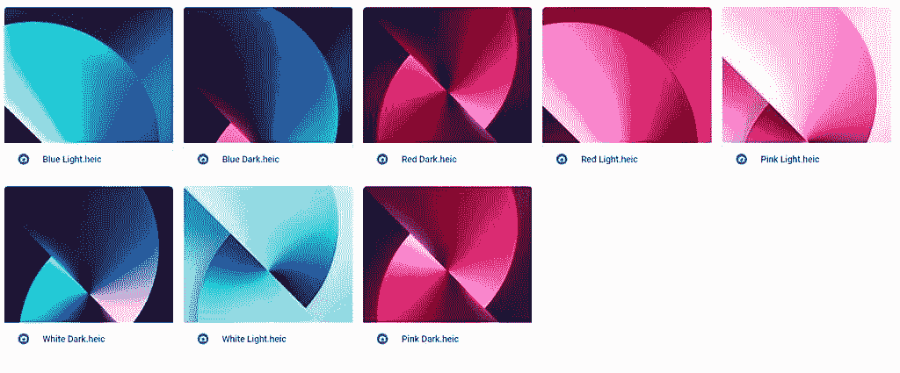
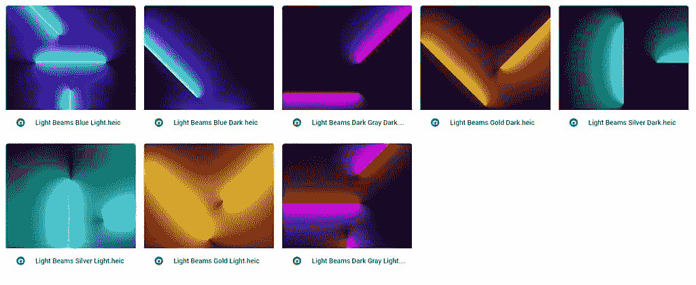

# 下载:这里是所有新的 iPhone 13 壁纸！

> 原文：<https://www.xda-developers.com/download-iphone-13-wallpapers/>

# 下载:这里是所有新的 iPhone 13 壁纸！

iPhone 13 系列带来了一些新的独家壁纸，但我们为你抓住了它们，所以它们不再是独家的了！

换个 iPhone 的壁纸可以让你的主屏幕有新鲜感。更新到 [iOS 15](http://xda-developers.com/ios-15) 之后更是如此，它带来了一些新的 UI 变化和功能，刷新了手机的整体感觉。选择新壁纸不仅会影响主屏幕和锁屏，还会影响一些第一方应用，如 Safari。 [iPhone 13](https://www.xda-developers.com/iphone-13/) 系列带来了一些新的壁纸，但如果你还没有购买，我们已经为你抓取了它们，所以它们不再是独家的了！

苹果在制作新的壁纸时，已经满足于随机的斑点和图形。在我看来，无论是每年新发布的 iOS 壁纸，还是随着新 iPhone 发布的壁纸，都不再那么有创意了。感觉苹果不再优先考虑包含高质量的照片。曾经令人惊叹的风景和空间照片现在只是奇怪的涂鸦。

 <picture></picture> 

iPhone 13 and 13 Mini wallpaper previews

尽管苹果最近的壁纸存在潜在的冗余，但在我们的主屏幕上设置新的壁纸仍然令人兴奋。当最新款的 iPhones 发布，而你又不打算升级到其中一款的时候，这一点尤其明显。iPhone 13 迷你版和 [iPhone 13](http://xda-developers.com/iphone-13) 带来了五颜六色的漩涡。另一方面， [iPhone 13 Pro](http://xda-developers.com/iphone-13-pro) 和 [iPhone 13 Pro Max](http://xda-developers.com/iphone-13-pro-max) 配有显示光束的深色壁纸。

 <picture></picture> 

iPhone 13 Pro and Pro Max wallpaper previews

iPhone 13 和 iPhone 13 Mini 提供了相同的四种漩涡壁纸，有亮暗两种模式变化。常规 13 款一共八张壁纸。iPhone 13 Pro 和 iPhone 13 Pro Max 也提供了相同的四种壁纸。它们是不同颜色光束的照片，也有暗和亮两种模式。因此，如果我们将亮暗模式版本作为单独的版本计算，我们总共可以从 iPhone 13 阵容中获得 16 种新壁纸。

**[从 Google Drive 下载 iPhone 13 壁纸](https://drive.google.com/drive/folders/159WpCX8L3IYgKd-1B9NLxV8ZqsCP-SG_?usp=sharing)**

十六个中你最喜欢哪一个？请在下面的评论区告诉我们！