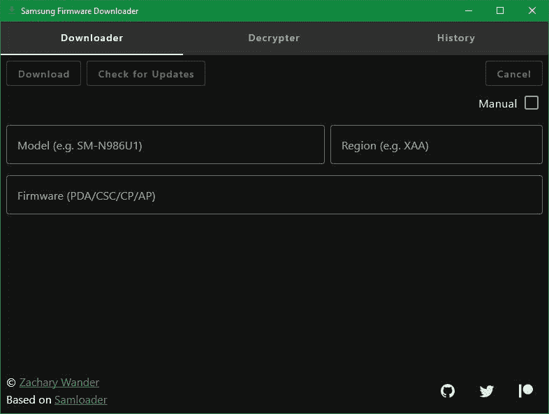
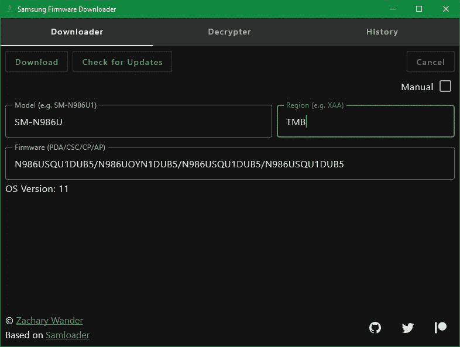
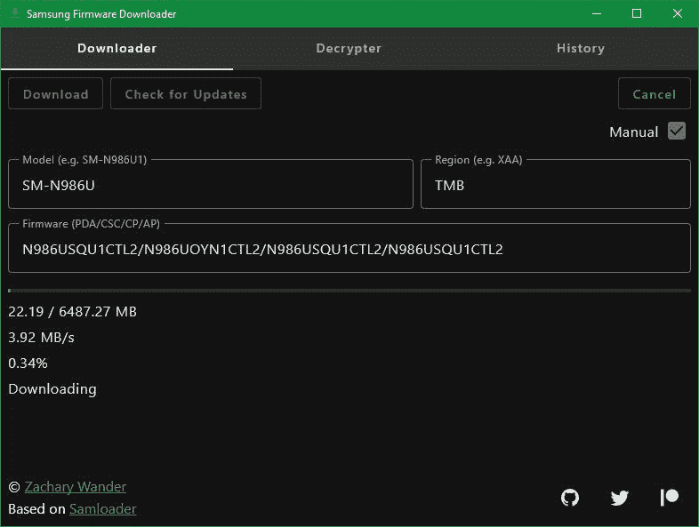
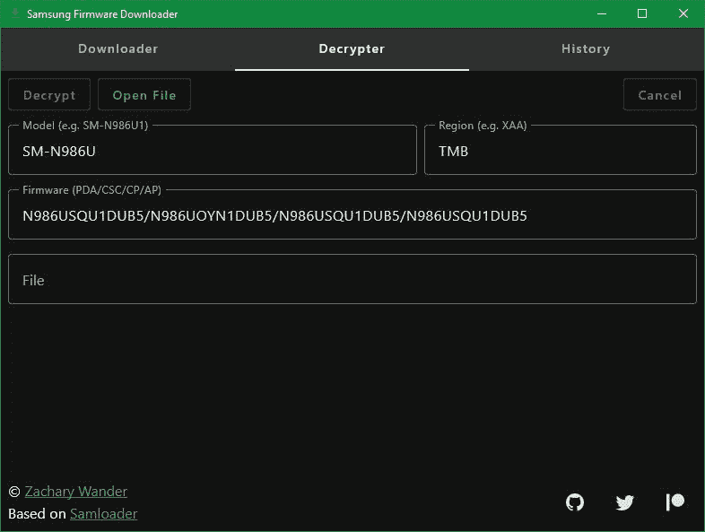
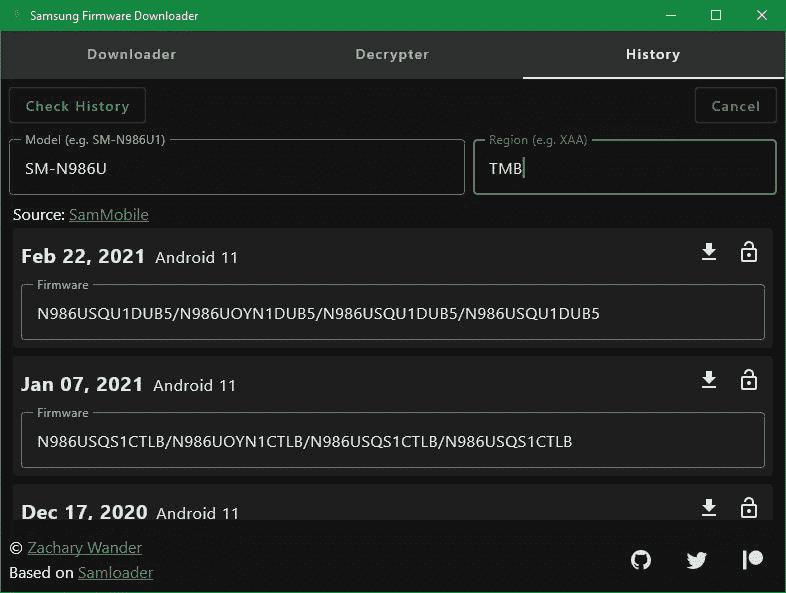

# 使用此工具下载三星 Galaxy 设备的软件更新

> 原文：<https://www.xda-developers.com/download-samsung-software-updates-samsung-firmware-downloader/>

手动为您的设备下载固件有很多原因。也许你试图根它，需要修改股票固件，然后再刷新它。或者你只是想早点下载软件更新。不幸的是，公司通常不容易以易于安装的方式下载固件。

## 下载三星固件的问题

三星特别喜欢让手动下载软件更新变得困难。首先，三星设备没有快速启动模式。要刷新固件，你必须进入下载模式，并使用三星专有的刷新工具 Odin。然后，您必须实际将固件文件闪存。如果你尝试直接从三星下载固件，它会被加密。

幸运的是，这种加密不是很强，直接从三星下载和解密固件的过程已经被多次重现。一个显著的例子是用于 Windows 的 [SamFirm 程序](https://www.xda-developers.com/download-stock-odin-firmware-samfirm/)。SamFirm 不再工作了，但是有替代品，像 [Frija](https://forum.xda-developers.com/t/tool-frija-samsung-firmware-downloader-checker.3910594/) ，仍然在工作。

这些下载器程序的唯一问题是它们都是针对 Windows 的。如果您想从 Mac 或 Linux PC 上下载 Galaxy 设备的软件更新，该怎么办？嗯，你可以使用其中一个固件下载网站。这些网站为几乎所有三星设备提供解密的三星固件。您可以按设备型号浏览固件，按地区过滤，甚至查看固件版本的历史记录。

但是存储所有这些文件成本很高。为了便于维护，大多数下载网站会限制下载速度，除非你付费购买一个帐户。由于三星的固件包相当大(最近的设备高达 7GiB)，在节流连接上下载可能相当烦人。你可以一直为无限的速度付费，但不是每个人都愿意这么做。

## 我的解决方案:三星固件下载器

所以回到起点。没有 Windows PC 怎么直接从三星下载固件？进入 Samloader ，这是一个命令行程序，可以在任何安装了 Python 3 的地方运行。只要知道正确的型号、地区和固件字符串，就可以使用 Samloader 来检查设备的最新更新、下载固件，甚至解密已经下载的固件。

Samloader 非常棒，因为它是下载三星固件的跨平台解决方案。但是并不是每个人都喜欢使用命令行。例如，试图在 macOS 上安装 Python 可能会令人困惑，并且跟踪所有需要的命令行参数可能会很棘手。

所以我做了一个 GUI。 *very* 原名[三星固件下载器](https://github.com/zacharee/SamloaderKotlin)是三星的跨平台图形化固件下载器。本质上，它是 Samloader 的图形化包装，但是所有的逻辑都用 Kotlin 重写了。还有一些附加功能。

 <picture></picture> 

Samsung Firmware Downloader is a cross-platform GUI program.

## 三星固件下载器功能

这是一个很大的引导，但希望它至少有所帮助。先说三星固件下载器，从名字开始。

### 命名

三星固件下载器是个很可怕的名字。它太普通了，也太长了。如果有人有建议，[我很想听听他们的意见](https://github.com/zacharee/SamloaderKotlin/issues/2)。

### 平台支持

就像我前面说的，三星固件下载器是跨平台的。这意味着它应该可以在 Windows、Linux、macOS 甚至 Android 上运行。为此，我结合使用了 Kotlin Multiplatform、Android 的 Jetpack Compose 和 JetBrains Compose for Desktop。Kotlin Multiplatform 和 JetBrains Compose 仍处于早期开发阶段，但对于简单的 GUI 来说，它们的功能已经足够了。

目前，JetBrains Compose 只能构建以构建平台为目标的可执行文件。这意味着我目前不能发布任何 macOS 版本，因为我无法访问 Mac。如果你有苹果电脑，并且你想帮忙，[让我知道](https://github.com/zacharee/SamloaderKotlin/issues/3)。最终，JetBrains Compose 应该让我从 Windows 机器上为 Mac 构建，但现在不是最终。

### 源代码

如果你点击了上面的任何链接，你可能已经注意到三星固件下载器是开源的。它得到了麻省理工学院的许可，可以完全自由地使用和修改。

### 特征

那么三星固件下载器能做什么呢？我在上面谈了一点，但这里有更多的细节。

#### 检查更新

把你的模型和地区放入下载视图中相应的区域，点击“检查更新”该应用程序将查询三星的服务器，并返回可用的最新固件版本，以及它是哪个版本的 Android。

 <picture></picture> 

You can check for the latest firmware for your device and region.

#### 下载软件更新

如果您刚刚在下载视图中检查了更新，那么您可以点击下载按钮开始下载固件。选择一个目的地，应用程序将自动下载并解密固件。

如果您知道要下载的固件，请切换“手动”复选框并输入它，以及型号和地区。然后你可以点击“下载”,应用程序会处理剩下的事情。

需要注意的一点是，加密的固件在解密后不会自动删除。你需要手动操作。

Samsung Firmware Downloader 还会稍微修改固件文件的名称，以包括固件版本、型号和它所代表的地区，但您可以根据需要将其设置为任何值。

最后，三星固件下载器将自动恢复下载。如果你的设备崩溃了，或者你不小心关闭了程序，只需再次输入详细信息，点击“下载”，选择同一个目录(确认任何潜在的替换提示)，你的下载将从停止的地方继续。

 <picture></picture> 

You can download any valid firmware using this tool.

#### 解释

如果您有加密的固件文件，您可以使用 Samsung Firmware Downloader 来解密。输入加密文件对应的型号、地区和固件版本，然后选择要解密的文件，点击“解密”按钮，应用程序会处理剩下的事情。

 <picture></picture> 

Decrypt pre-downloaded firmware.

#### 历史

这是一个实验性的特性，以后可能会被删除。历史视图显示给定型号和地区可用的固件版本的完整列表。然后它会显示给你看。

如果你想从列表中下载一个特定的固件，点击“下载”按钮。您将被重定向到下载视图，其中的信息已经填写完毕。然后你可以点击“下载”

如果你有一个文件要解密，你可以在这个列表中找到相应的固件，然后点击“解密”按钮。你将被重定向到解密视图，在这里你只需要选择正确的文件并点击“解密”

 <picture></picture> 

Samsung Firmware Downloader can list all available firmware versions for your device and region.

## 下载

那么如何获得三星固件下载器呢？查看 GitHub 资源库上的[发布页面](https://github.com/zacharee/SamloaderKotlin/releases)。每个版本都有适用于 Android、Windows 和 Linux(以及最终的 macOS)的资产。

在 Android 上，只需下载并安装 APK。在 Windows 上，下载 ZIP 文件，解压并运行 EXE。在 Linux 上，下载并解压 ZIP 文件，进入`bin`目录，打开终端，运行`./Samsung\ Firmware\ Downloader`。

* * *

希望三星固件下载器能让你下载软件更新更容易。我总是在寻找新功能的建议(在合理的范围内)，所以请务必前往[问题页面](https://github.com/zacharee/SamloaderKotlin/issues)请求一个功能或报告一个 bug，如果您还没有在那里看到它的话。