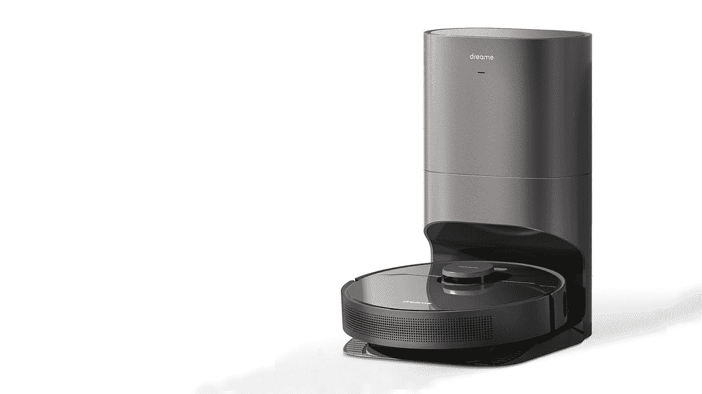

# Dreame Bot Z10 Pro vs iRobot i7+:买哪个机器人吸尘器？

> 原文：<https://www.xda-developers.com/dreame-bot-z10-pro-vs-irobot-i7/>

一台好的真空吸尘器是房子或办公室必不可少的一部分。灰尘和污垢堆积在地板或地毯上是正常的，吸尘器可以帮你清理。虽然你可以选择更传统的手持吸尘器，但这需要手工劳动。你将不得不在你的房子周围手动清洁每一个部分，这会变得又累又麻烦。这个问题的最佳解决方案是机器人吸尘器。

机器人吸尘器可以自动走遍你的房子，并通过绘制整个表面来清洁地板。你不必手动控制或操作任何东西，因为一切都是通过使用配套应用程序或语音指令来完成的。这是清洁地板最方便的方法之一。将这种便利带到下一个层次的是一个自动排空的真空。虽然传统的机器人吸尘器需要在每隔几个会话后清空它们的垃圾袋，但自动清空的机器人会自动将所有的垃圾倒入容器中。

Dreame Bot Z10 Pro 就是这样一款产品。这是一款自动清空的 2 合 1 智能吸尘器，具有一些与 iRobot 的 Roomba i7+竞争的出色功能。我们来对比一下两者，告诉你应该买哪个，为什么。如果你正在寻找一款手持式无绳吸尘器，我们也有[推荐](https://www.xda-developers.com/dreame-t30-vs-dyson-v11/)给你。

## 自动清空底座

由于这两款吸尘器都具有自动清空功能，它们的底座带有内置集尘袋，用于在清洁后清空所有灰尘。这两种真空吸尘器也有一些不同之处。

首先，Dreame Bot Z10 Pro 的尘埃袋容量高于 iRobot i7+。Dreame 的容量为 4L，而 Roomba 的容量为 2.5L。在实际使用中，这意味着 Dreame Z10 Pro 需要约 65 天的尘埃收集时间，Roomba i7+需要约 45 天的尘埃收集时间。Dreame 的底座也有两个进气口，用于吹气和吸气，而 iRobot i7+只有一个进气口。

## 测绘技术

Dreame Z10 Pro 和 iRobot i7+在开始清洁之前都会制作周围的虚拟地图。这有助于吸尘器决定它应该清洁房子的哪些区域，以及它可以无缝适应和清洁的所有可能的区域。用户还可以选择地图的特定部分，如果只有该区域需要清理或如果它需要排除。虽然映射过程发生在两个 vacuums 上，但是它们映射和导航的方式是不同的。

Dreame Bot Z10 Pro 使用了一种称为 LDS 的技术，该技术利用激光雷达进行导航。与 iRobot i7+上使用的 VSLAM 技术相比，这种技术更优越、更精确。VSLAM 使用相机而不是激光器或激光雷达，这导致在测绘和导航时精度较低。对于最终用户来说，这意味着 Dreame Z10 Pro 可以更准确地确定您家中的覆盖区域。Dreame 还提供了 Roomba 所没有的多层地图功能。

## 排除故障

这是任何机器人真空的另一个重要方面。有家具、墙壁、柱子等障碍物。在整个房子里，这些需要在清洁时避免。Dreame Bot Z10 Pro 使用红外线、3D 结构光和机械防撞技术来避开地板上的障碍物。另一方面，iRobot i7+仅使用红外和机械防撞，这意味着即使在这方面，Dreame Z10 Pro 也因其卓越的技术而更加准确。

## 洁化过程

机器人吸尘器的主要目的是清洁地板，这是影响你购买决定的主要因素之一。Dreame Bot Z10 Pro 和 iRobot i7+都可以清洁多种表面，如瓷砖地板或地毯地板。然而，Dreame Z10 Pro 有一个特殊的地毯增强模式，可以去除地毯上更细小的颗粒，这是 Roomba iRobot i7+所不能做到的。

不仅如此，这两款吸尘器清洁过程的主要区别在于 Dreame Bot Z10 Pro 是一款二合一设备，这意味着它既可以吸尘，也可以拖地。另一方面，Roomba iRobot i7+只能吸尘，你需要购买一台单独的机器来拖地，既不方便又昂贵。如果你有一个瓷砖地板，拖地是一个重要的方面，Dreame Z10 Pro 在这方面也包括你。

## 吸力

清洁的另一个重要方面是真空吸尘器吸入灰尘和污垢的能力。较高的吸力通常意味着与吸力较低的吸尘器相比，真空吸尘器可以清洁更多的灰尘。这也意味着更大的灰尘颗粒也可以很容易地被更高的吸力带走。

在这方面，Dreame Bot Z10 Pro 也比 iRobot i7+领先几英里。Dreame 的峰值吸力为 4,000Pa，是 iRobot i7+的 1,700Pa 吸力的两倍多。

## 运行时间

机器人吸尘器靠电池供电，需要每隔几个小时在扩展坞充电一次。不用说，电池电量越高，吸尘器清洁的时间就越长。Dreame Bot Z10 Pro 有一个 5200 毫安时的大电池，一次充电可以提供长达 150 分钟的运行时间，如果你有一个大房子，这是非常好的。iRobot i7+的运行时间只有 Dreame 的一半，仅为 75 分钟。对于一个相对较小的房子来说，它应该足够了，但是如果你打算在一个大的区域使用它，它可能不得不中途充电。

* * *

## Dreame Bot Z10 Pro vs iRobot i7+:更喜欢哪个机器人吸尘器？

这是 Dreame Bot Z10 Pro 和 Roomba iRobot i7+之间的一些差异。显然，Dreame Z10 Pro 具有更优越的功能，并提供比 iRobot i7+更好的价值。从映射到耐力，以及您可以在 Dreame 上吸尘和拖地的事实，使 Bot Z10 Pro 成为一款更好的产品，特别是如果您有瓷砖地板。

 <picture></picture> 

Dreame Bot Z10 Pro

##### 梦幻机器人 Z10 Pro

Dreame Bot Z10 Pro 是一款多功能吸尘器，可以在长达两个月的时间内自动清空其垃圾，让您的生活变得更加轻松。它有很大的吸力以及良好的电池寿命。

我们感谢 Dreame 赞助 XDA。我们的赞助商帮助我们支付与运行 XDA 相关的许多费用，包括服务器成本、全职开发人员、新闻撰稿人等等。