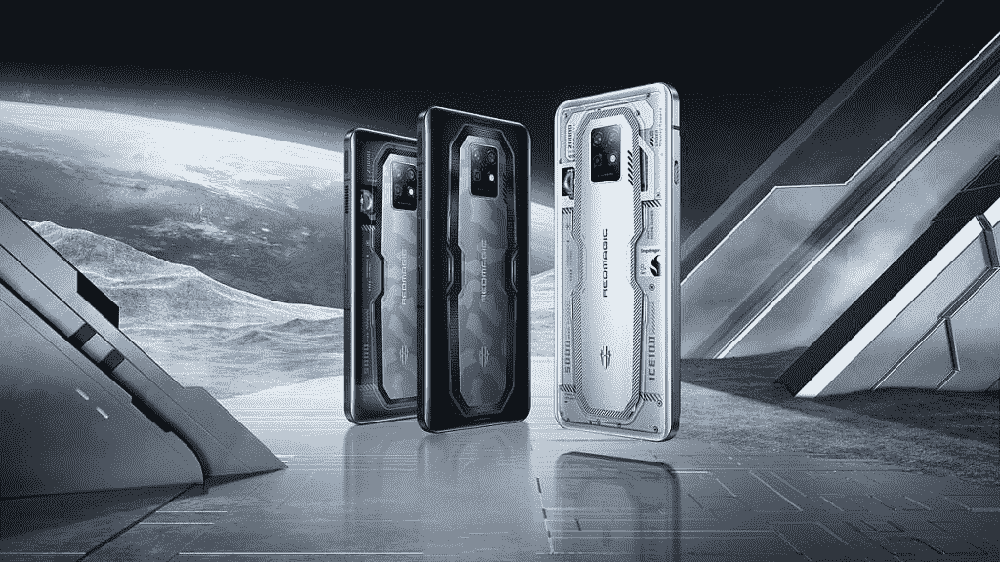

# 不要错过新款 REDMAGIC 7S Pro 的早期促销活动

> 原文：<https://www.xda-developers.com/early-bird-sale-redmagic-7s-pro/>

REDMAGIC 带着他们令人惊叹的游戏手机系列的另一个条目回来了。REDMAGIC S7 Pro 是最新发布的设备，采用骁龙 8+ Gen 1 芯片，真正的全屏显示器，游戏智能手机上最好的冷却系统，以及所有最好的游戏功能，带来无与伦比的游戏体验。

凭借将这款手机归入高端游戏设备类别的规格，该设计展现了与游戏美学相匹配的外观。忠于 REDMAGIC 主题，这款手机的口号是“为胜利而战”。REDMAGIC S7 Pro 设法将移动游戏的所有最佳功能整合到一台令人印象深刻的设备中。

[获得 REDMAGIC S7 Pro 的早期优惠——购买 1 美元优惠券，可享受 30 美元的折扣。](https://bit.ly/3ISp33h)

## REDMAGIC S7 专业装甲胜利

由于这款手机优先考虑性能，REDMAGIC 确保包括强大的骁龙 8+ Gen 1，从而在各个方面带来流畅的用户体验。除此之外，还包括一个名为 Red Core 1 的专用游戏芯片。这两种芯片的结合造就了一款将 Android 游戏推向极限的下一代设备。这是一部功能全面的手机。

设计选项包括超新星、水星和黑曜石。这些选项不仅颜色不同，而且每个型号都有完全不同的外观。

 <picture></picture> 

REDMAGIC S7 Pro in SUPERNOVA [left], OBSIDIAN [center], and MERCURY [right].

凭借零节流性能，您可以从包含的规格中获得绝对最大值。该系统包括一个强大的冷却解决方案，可以防止您的手机在长时间的游戏过程中变热。ICE 10.0

多维冷却系统负责维持低温。这使用了十层散热材料，以及超静音的 20，000 RPM 涡轮风扇。

虽然你的游戏在这样的设置下肯定会表现得很好，但在新的全屏无缺口显示下，它们会看起来更好。6.8 英寸、1080x2400 分辨率显示屏的刷新率高达 120Hz。自拍相机隐藏在显示器下方，提供中断的观看体验。

**REDMAGIC S7 Pro 选项:**

*   12GB RAM + 256GB (OBSIDIAN)
*   18GB 内存+ 512GB(水银)
*   18GB 内存+ 512GB (SUPERNOVA)

5,000mAh 电池采用快速充电技术，容量为 65W。这将使您一整天都充满活力，因为您可以享受许多游戏特有的功能，如双 x 轴线性电机、RGB 游戏灯、MAGIC GPU 和 520 Hz 肩部触发器。

## 上市日期和早鸟销售

这款手机将于 7 月 26 日正式发布，8 月 2 日开始接受订购。事实上，如果您在 2 号到 9 号之间下订单，您可以享受早鸟价格优惠！

早鸟销售开始时间:2022 年 8 月 2 日

公开销售开始时间:2022 年 8 月 9 日

[**REDMAGIC 7S Pro 产品页面**](https://bit.ly/3cm2TtP)

[**获取这里的早鸟销售**](https://bit.ly/3ISp33h)

我们感谢 REDMAGIC 赞助了这篇文章。我们的赞助商帮助我们支付与运行 XDA 相关的许多费用，包括服务器成本、全职开发人员、新闻撰稿人等等。虽然您可能会在门户内容旁边看到赞助内容(这些内容将始终被标记为赞助内容),但门户团队对这些帖子不承担任何责任。赞助内容、广告和 XDA 仓库完全由一个独立的团队管理。XDA 绝不会通过接受金钱来赞扬一家公司，或以任何方式改变我们的观点或看法，从而损害其新闻诚信。我们的意见不能被收买。