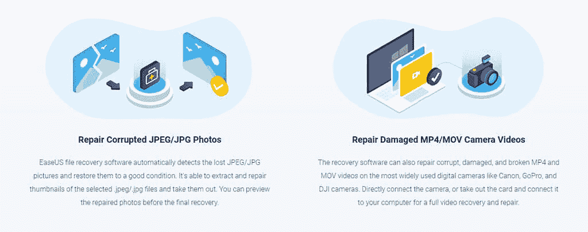

# 适用于 Windows、MAC、iOS 和 Android 的 EaseUS 数据恢复

> 原文：<https://www.xda-developers.com/easeus-data-recovery/>

没有人能免受数据丢失事件的影响。有许多不同的情况会导致您的文件被删除、损坏或丢失。如果这是你遇到的情况，没有必要惊慌。EaseUS 提供[免费的数据恢复软件](https://www.easeus.com/datarecoverywizard/free-data-recovery-software.htm)，可以帮助你起死回生。该软件易于使用，可以在 Windows、MAC、iOS 和 Android 上运行。所以 EaseUS 应该可以在这些平台上帮助你。

你可以开始免费使用 EaseUS 的 2GB 数据恢复能力。这是进行初步扫描的好方法，看看能否找到丢失的文件。该软件将能够扫描一个特定的驱动器或文件夹，并为您提供预览和文件名的数据丢失。这允许您选择要恢复的特定文件。

如果您有更大的文件需要恢复，如视频，您可以将您的计划升级到专业版。通过升级，您将能够恢复没有 2GB 数据限制的文件。

使用 [EaseUS 软件](https://www.easeus.com/data-recovery-software)恢复文件变得很简单，但是在尝试恢复之后，文件经常被破坏。这就是 EaseUS 包含照片和视频修复工具的原因。这将帮助您在恢复后修复文件，并使它们再次可用。该软件将自动检测 JPEG，JPG，MP4 或 MOV 文件，并开始修复它们。

 <picture></picture> 

EaseUS File Recovery

你可以相信 EaseUS 是最好的文件恢复解决方案之一，拥有数百万用户和对 20 种不同语言的支持。这是一款非常受欢迎的软件，被行业专业人士用于有效的数据恢复。该软件支持 1，000 多种不同文件类型的恢复。

*   **单据**
*   DOC/DOCX、XLS/XLSX、PPT/PPTX、PDF、CWK、HTML/HTM、INDD、EPS 等。
*   **图形**
*   JPG/JPEG、TIFF/TIF、PNG、BMP、GIF、PSD、CRW、CR2、NEF、ORF、SR2、MRW、DCR、WMF、RAW、SWF、SVG、RAF、DNG 等。
*   **视频**
*   AVI，MOV，MP4，M4V，3GP，3G2，WMV，MKV，ASF，FLV，SWF，MPG，RM/RMVB，MPEG 等。
*   **音频**
*   AIF/AIFF、M4A、MP3、WAV、WMA、APE、MID/MIDI、RealAudio、VQF、FLV、MKV、MPG、M4V、RM/RMVB、OGG、AAC、WMV、APE 等。
*   **电子邮件**
*   PST、DBX、EMLX 等。(来自 Outlook、Outlook Express 等。
*   **其他文件**
*   如档案(ZIP、RAR、SIT、ISO 等。)、exe、html、SITX 等。

[**Get EaseUS**](https://www.easeus.com/datarecoverywizard/free-data-recovery-software.htm)

###### 我们感谢 EaseUS 赞助了这篇文章。我们的赞助商帮助我们支付与运行 XDA 相关的许多费用，包括服务器成本、全职开发人员、新闻撰稿人等等。虽然您可能会在门户内容旁边看到赞助内容(这些内容将始终被标记为赞助内容),但门户团队对这些帖子不承担任何责任。赞助内容、广告和 XDA 仓库完全由一个独立的团队管理。XDA 绝不会通过接受金钱来赞扬一家公司，或以任何方式改变我们的观点或看法，从而损害其新闻诚信。我们的意见不能被收买。